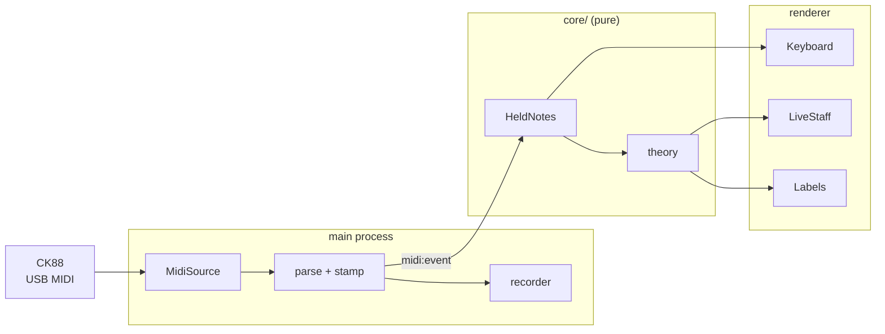
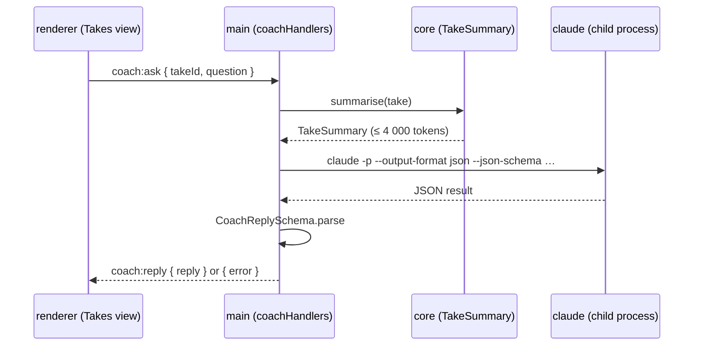
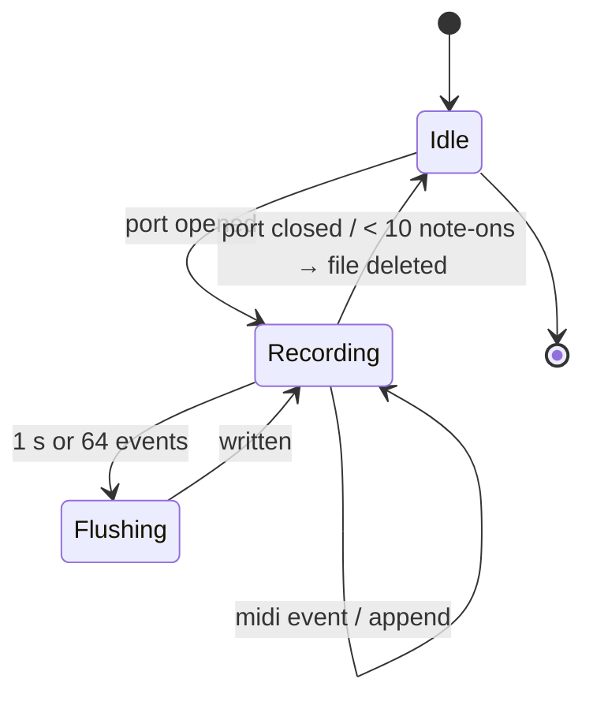

# Diagram examples — piano-tutor

Project-specific mermaid patterns. Copy one and adapt. Keep diagrams under about twelve nodes and
use `subgraph` to mark the process boundaries.

## Component / data-flow map

The canonical picture: instrument → main → IPC → renderer, with `core/` reducing and naming.

## Cross-process sequence (the coach)

Use a `sequenceDiagram` when the interesting thing is the order of calls across IPC and a child
process.

## Recorder lifecycle

Use `stateDiagram-v2` for things with explicit states.

