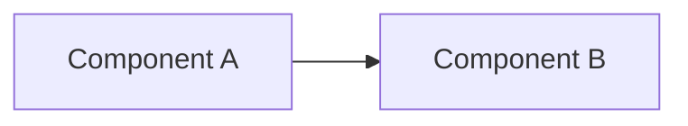

# NNNN — <short title>

> **Status:** draft | approved | in-progress | done | abandoned
> **Created:** YYYY-MM-DD
> **Owner skill(s):** <dev | human> (list all that appear in phase owner tags below)
> **Related ADRs:** ADR-NNNN (status), linked as `../adrs/NNNN-slug.md`, …
> **NFRs claimed:** the row numbers in `docs/nfr.md` (link it as `../nfr.md`) this plan's
> done-whens measure
> **Depends on:** Plan NNNN Phase N, if anything

## TL;DR

One paragraph. What we are building, why, and the first user-visible behaviour at the piano. A
reader who reads only this can restate the decision in a sentence.

## Context & problem

What forces drove this? Reference the user's request and the interview. Be specific about the
*problem*, not the chosen *solution*.

## Decision

The chosen approach in one paragraph, active voice. Name the rejected options in one sentence:
"We rejected B because … and C because …".

## Architecture diagram



## Implementation phases

Each phase ships as its own commit. `dev` runs every `dev` phase in one session; the architect
reviews the whole plan once, in a fresh session, at the end. The first phase shows something on
screen.

**Every phase MUST carry a single `**Owner skill:**` line** with exactly one value: `dev` (all
code) or `human` (a task only the user can do: sitting at the CK88, pasting a key, a product
call). The tag is machine-readable; `dev` branches on it. A missing tag fails Mode 4 review.

### Phase 1 — <name>
- **Owner skill:** <dev | human>
- **What:** One sentence on what this phase produces.
- **Files touched:** The list `dev` follows literally: `core/src/theory/chords.ts`,
  `renderer/components/Labels.tsx`, …
- **Notes for the implementer:** Library gotchas, the algorithm in two sentences, what to copy
  from where. Optional.
- **Done when:** Concrete acceptance. For a speed claim, the NFR row and how it is measured. For a
  test, the behavioural claim it defends ("C-E-G with E lowest names C/E"), not "the test passes".
  End with the gate line (ADR-0022): `npm run gate:fast` is green, plus each e2e spec file the
  phase's claim is asserted in (`npm run test:e2e -- e2e/<name>.spec.ts`). **Only the last `dev`
  phase says `npm run gate`**, which runs the whole suite.

### Phase 2 — <name>
…

## Data shapes

New types this plan introduces (an IPC payload, a file format, a `core/` record). Illustrative,
labelled as such; the Zod schema in `shared/` is what is real.

```ts
// illustrative — not the final interface
type Example = { kind: 'noteOn'; t: number; note: number; velocity: number }
```

## Risks & open questions

Bullets. Each: what could go wrong, what we would do about it. Name the latency and offline
hazards explicitly.

## What this plan does NOT do

Cut the scope explicitly. Reference the later plan by roadmap name where one exists.

## Implementation log

> Written by `dev`, one row per phase as that phase's commit lands, and the close block after the
> last one. **The phases above are the contract; everything here is what happened.**
> Observations, never conclusions: this says where to look, architect decides how it went. No
> per-criterion pass list, no self-assessment. A deviation from the plan or an unmet done-when is
> always disclosed. Stays shorter than `## Implementation phases`.

**Lane:** _(`main` directly, or the worktree path plus its branch — `WORK/pt-plan-NNNN` on
`plan-NNNN-<slug>`)_

| phase | owner | state | commit |
|---|---|---|---|
| 1 — <name> | <dev \| human> | <done \| not started \| abandoned> | `<sha>` |
| 2 — <name> | … | … | … |

### Measurements

_(one line per NFR row the plan claimed: the number, the machine, the phase that measured it)_

### Notes

_(deviations from the plan, with the commit and no justification; done-when criteria that could
not be satisfied as stated, with what was done instead; followups noticed and not acted on. One
line each. Empty is a valid answer and needs no sentence saying so.)_

### Close triggers

_(facts for architect to verify and decide from, no recommendations)_

- **What shipped:** _(feature / fix-only / docs-chore-only)_
- **User-visible docs touched:** _(`README.md`, `CLAUDE.md`, `docs/nfr.md`, or none)_
- **Full gate at the last phase:** _(`npm run gate` as run, its exit code, the e2e pass count and
  wall time, and every case that went red and passed on a rerun, by name)_
- **Outstanding `human` phases:** _(which, or none)_

## Followups (after this lands)

A list so they do not get lost. Empty at draft time is fine.
