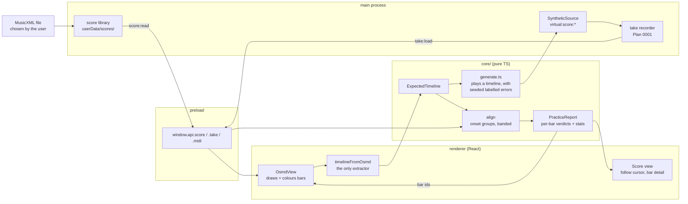

# 0002 — A piece is practised

> **Status:** draft
> **Created:** 2026-09-09
> **Owner skill(s):** dev, human
> **Related ADRs:** [0003](../adrs/0003-two-notation-engines-vexflow-for-the-live-staff-and-osmd-for-the-score.md) (proposed),
> [0004](../adrs/0004-the-app-plays-itself-virtual-ports-not-an-injection-channel.md) (proposed),
> [0005](../adrs/0005-the-expected-note-timeline-is-extracted-from-osmds-model.md) (proposed);
> [0001](../adrs/0001-an-electron-shell-in-typescript-around-a-pure-music-core.md) (proposed) governs
> the processes and the new `score:*` domain
> **NFRs claimed:** 3, 9, 11, 12 in [nfr.md](../nfr.md)
> **Depends on:** Plan [0001](done/0001-the-keyboard-shows-on-screen.md) Phases 1 to 6 — the take
> format, the `MidiSource` seam, the seeded generator and `npm run gate`

## TL;DR

You open a MusicXML file, it draws as a score, you play it, and when you stop the bars colour:
green where you played what was written, amber where the timing wandered, red where the notes did
not match — with the wrong, missing and extra notes named per bar. The alignment is a pure
function in `core/` over a finished take, so the whole feature is provable with generated takes
and no piano, and the report it produces is the input the coach plan reads.

## Context & problem

The interview on 2026-09-09 fixed practice-with-feedback as the second thing this application
does, and a follow-up on the same day fixed its shape: **feedback after the take, not live.** You
play the piece through with the score scrolling under a follow cursor and nothing being judged;
when you stop, the score colours and the numbers appear. Live bar-by-bar judgement is the harder
problem — incremental alignment with no lookahead, under a latency budget — and it is a plan of
its own on top of this one, if it is ever wanted. Building it first would put the hardest
algorithm in the project before there is any evidence the simple one is right.

Three problems sit under that. The first is **where the expected notes come from**, and it is
decided in ADR-0005: from the model OSMD has already parsed, through a thin renderer adapter,
because two independent parsers of one MusicXML file disagree about bar numbering in ways that
silently colour the wrong bar. The second is **alignment itself** — matching what was played
against what was written when the player rushes, drags, fumbles, adds a note or drops one, and
does it all without a metronome. The third is **how any of this gets tested**, and ADR-0004
answers it: the same seeded generator that plays scales can play a score, and it can play a score
*with deliberate, labelled mistakes*, which makes the ground truth exact. A generated take that
was built with one wrong pitch in bar 5 is the only kind of test input where "the aligner found
one wrong pitch in bar 5" is a real assertion rather than a plausible one.

The scope was cut in the same follow-up. **Repeats, first and second endings, da capo and segno
are not handled in v1**: the expected timeline is the score as written, top to bottom. A piece
with repeats still practises, played linearly. Repeat unfolding is a substantial algorithm over
OSMD's model and it is where score-alignment projects go to die; it is a named followup and it
lands, if at all, after alignment has been proved on linear pieces.

## Decision

We add a `score:*` IPC domain and a score library: main copies a chosen MusicXML file into
`userData/scores/` under a stable id, so a take can always be re-aligned later against the exact
bytes it was played against. The renderer draws the score with OSMD (ADR-0003) and extracts an
`ExpectedTimeline` from OSMD's own model (ADR-0005), indexed by OSMD's measure indices.

`core/` gains the timeline type, the aligner and the report. Alignment groups both sides into
**onset groups** — a chord in the score is one expected group, notes played within 50 ms of each
other are one played group — and matches the two sequences with a banded edit distance over
pitch sets, so an inserted or dropped note costs a step rather than derailing everything after
it. It is **tempo-free**: the costs use ordinal position, never absolute time. Timing is scored
*after* the match, by fitting one tempo over the matched pairs by least squares and reporting each
bar's deviation from that fit, which is what makes "you rushed bar 12" a statement about the
player rather than about the metronome they were not using.

The generator of ADR-0004 learns to play an `ExpectedTimeline` back as MIDI, with seeded,
labelled perturbations — a substituted pitch, a dropped note, an extra note, a rushed bar, a
global tempo scale, a stop halfway. Those are the plan's test oracle, and they arrive before the
aligner does, in their own phase, because a test oracle written after the thing it tests tends to
agree with it.

We rejected parsing MusicXML in `core/` (ADR-0005 Alternative A) and aligning against OSMD's
cursor (Alternative C), and we rejected a metronome-driven comparison because it would score a
player for not playing to a click they were never given.

## Architecture diagram



## Implementation phases

Each phase ships as its own commit. `dev` runs Phases 1 to 6 in one session; the architect
reviews the whole plan once, in a fresh session, after Phase 7. Every `dev` phase is checkable
with nothing plugged in (NFR 11); Phase 7 is the only one that needs the instrument.

### Phase 1 — A score appears on screen
- **Owner skill:** dev
- **What:** A new Score view. Main gains a `score:*` domain: import a file through a native open
  dialog, copy it into `userData/scores/<id>/` with a metadata file, list the library, read the
  bytes. The renderer draws the selected score with OSMD and can colour an arbitrary bar on
  command, which is the capability every later phase depends on.
- **Files touched:** `package.json` (add `opensheetmusicdisplay` 2.1.2, exact pin — verify the
  version at install and pin what installs), `electron/score/library.ts`,
  `electron/score/library.test.ts`, `electron/ipc/scoreHandlers.ts`,
  `electron/preload/api/score.ts`, `electron/preload/index.ts`, `shared/score.ts` (Zod:
  `ScoreId`, `ScoreMeta`), `shared/ipc-channels.ts`, `renderer/score/OsmdView.tsx` +
  `.module.css`, `renderer/views/Score.tsx` + `.module.css`, `renderer/hooks/useScore.ts`,
  `renderer/App.tsx` (navigation gains Score), `core/fixtures/scores/*.musicxml`, `README.md`.
- **Notes for the implementer:**
  - **Four fixture scores, hand-written, committed.** They are the ground truth for every later
    phase and hand-writing them avoids both a licensing question and a guess about what a file
    contains: (a) `scale-c-major.musicxml`, one voice, no accidentals, four bars; (b)
    `pickup-two-hands.musicxml`, **an anacrusis**, two staves, a chord in each hand — the pickup
    is the classic off-by-one and it must be in the fixtures from the first phase; (c)
    `key-and-time-change.musicxml`, a key change and a 4/4-to-3/4 change mid-piece; (d)
    `multi-rest-and-ties.musicxml`, a multi-measure rest and notes tied across a barline.
  - The library id is content-addressed (a hash of the bytes) so importing the same file twice is
    idempotent and a take's score reference cannot go stale. `ScoreMeta` carries the id, the
    original filename, the import timestamp and the title OSMD reports once it has parsed.
  - **OSMD is a non-React resource.** Construct it once in a `useEffect` against a container ref,
    `clear()` and drop it in the cleanup, and never let a React re-render recreate it. ADR-0001's
    disposal rule; the review checks this one specifically.
  - `score:import` uses `dialog.showOpenDialog` in main. The renderer never sees a filesystem
    path — it receives a `ScoreId` and asks for bytes by id.
  - Accept `.musicxml`, `.xml` and compressed `.mxl`. OSMD reads all three; the library stores
    whatever was imported, unmodified.
- **Done when:** with nothing plugged in, importing each of the four fixture scores draws it in
  the Score view; importing the same file twice yields one library entry; a bar-colour call from
  a test hook colours the bar OSMD drew and no other; and the e2e suite added in Plan 0001
  Phase 6 grows a Score-view case that passes with networking disabled (NFR 3).

### Phase 2 — The expected notes come off the score
- **Owner skill:** dev
- **What:** The adapter of ADR-0005. `core/` gains the `ExpectedTimeline` type and its helpers;
  the renderer gains the one function that turns a parsed `MusicSheet` into one. Each fixture
  score's timeline is committed as JSON, and an e2e test asserts that live extraction still
  matches it.
- **Files touched:** `core/src/score/timeline.ts`, `core/src/score/timeline.test.ts`,
  `shared/score.ts` (Zod: `ExpectedTimeline`, `ExpectedNote`), `renderer/score/timelineFromOsmd.ts`,
  `renderer/views/Score.tsx`, `core/fixtures/scores/*.timeline.json`,
  `e2e/score.spec.ts` (the fixture-freshness check), `scripts/regen-score-timelines.md` (a short
  note on how to regenerate a fixture and what a large diff means).
- **Notes for the implementer:**
  - The timeline is a flat, ordered list of `ExpectedNote`s plus a bar table. Onsets are in
    **quarter notes from the start of the piece**, never in seconds — the score has no tempo the
    player is obliged to keep, and everything downstream is tempo-free by construction.
  - **Bar indices are OSMD's `measureIndex`, verbatim.** Do not renumber, do not reconcile with
    `<measure number>` from the file, do not make the pickup bar 1 because it looks like bar 1.
    ADR-0005 exists because of this line.
  - Ties are collapsed: two tied notes are one `ExpectedNote` with the summed duration, because
    the player strikes the key once. Grace notes are marked and excluded from alignment scoring
    in this plan (a followup).
  - The adapter has no unit test — it needs a DOM. Its check is the e2e fixture comparison, and
    that check is not optional. If a fixture must be regenerated, the diff is read, not accepted.
- **Done when:** the committed timeline for `scale-c-major` has four bars and the pitches of a
  C major scale in order; the timeline for `pickup-two-hands` puts the anacrusis notes in the bar
  OSMD draws them in and the first full bar's index is one greater — the assertion is on the
  index relationship, not on a number that a renumbering would quietly satisfy;
  `multi-rest-and-ties` reports one `ExpectedNote` per tied pair and the bar table spans the
  multi-rest without gaps; and the e2e freshness check passes for all four scores.

### Phase 3 — The app plays the score, badly on purpose
- **Owner skill:** dev
- **What:** The generator of ADR-0004 learns to play an `ExpectedTimeline` back as MIDI, with
  seeded, labelled perturbations. These are the test oracle for Phases 4 and 5 and they are built
  before the aligner so the oracle cannot be written to agree with it.
- **Files touched:** `core/src/midi/generate.ts` (gains `playTimeline`),
  `core/src/midi/perturb.ts`, `core/src/midi/perturb.test.ts`,
  `core/src/midi/generate.test.ts`, `electron/midi/virtualPorts.ts` (the `virtual:score:<id>`
  family), `electron/midi/SyntheticSource.ts`.
- **Notes for the implementer:**
  - `playTimeline(timeline, { bpm, seed, perturbations })` returns `MidiEvent`s. Human-ish
    imperfection is part of the baseline: onsets and velocities jitter by a seeded amount small
    enough that a clean take must still score clean. State the jitter's bound in the code, and
    keep it well under the timing threshold Phase 4 uses, or the tests become flaky by design.
  - The perturbations, each carrying the bar and the note it applies to so the expected verdict
    is known exactly: `substitutePitch`, `dropNote`, `insertNote`, `rushBar` (a bar played at a
    given fraction of the fitted tempo), `tempoScale` (the whole piece slower or faster), and
    `stopAfterBar`.
  - **A perturbation describes its own expected verdict.** `perturb.ts` returns both the events
    and the list of verdicts a correct aligner must produce. Phase 4's tests compare the
    aligner's output to that list — not to a hand-written expectation copied from a failing run.
  - The `virtual:score:<id>` ports let the whole loop run through the app: open the port, the
    piece plays itself into the recorder, and a take exists to align.
- **Done when:** playing `scale-c-major`'s timeline with no perturbations and a fixed seed
  produces the same events twice and every note-on's pitch matches the timeline in order;
  `substitutePitch` at bar 2 changes exactly one note-on's pitch and nothing else;
  `dropNote` removes exactly one; `stopAfterBar(2)` emits no note-on with an onset in bar 3 or
  later; and `tempoScale(0.8)` scales every inter-onset gap by the same factor, checked as a
  ratio rather than against absolute times.

### Phase 4 — A take aligns to a score
- **Owner skill:** dev
- **What:** The aligner in `core/`: onset grouping, a banded edit distance over pitch sets, a
  fitted tempo, and a `PracticeReport` of per-note verdicts rolled up per bar.
- **Files touched:** `core/src/align/onsetGroups.ts`, `core/src/align/onsetGroups.test.ts`,
  `core/src/align/align.ts`, `core/src/align/align.test.ts`, `core/src/align/tempo.ts`,
  `core/src/align/tempo.test.ts`, `core/src/align/report.ts`, `core/src/align/report.test.ts`,
  `shared/score.ts` (Zod: `PracticeReport`, `BarVerdict`, `NoteVerdict`).
- **Notes for the implementer:**
  - **Onset grouping first, on both sides.** A chord in the score is one expected group; played
    note-ons within a 50 ms window are one played group. Aligning groups rather than notes is
    what makes a rolled chord one event instead of four timing errors.
  - **The match is a banded edit distance** over the two group sequences. Substitution cost comes
    from the symmetric difference of the two pitch sets; insertion is an extra group, deletion a
    missing one. The band keeps the cost linear in the number of played groups (NFR 12); state
    the band width and what happens when the true alignment leaves it — a take that falls out of
    the band reports as unalignable past that point rather than as a wall of errors.
  - **Nothing in the cost function reads a clock.** Ordinal position only. This is what "tempo-free"
    means and it is the property the tests defend.
  - **Tempo is fitted after the match**, by least squares over the matched pairs' (score onset,
    played time). Each bar's timing verdict is its deviation from that single fit. A bar is amber
    past a stated threshold; choose one, write it in the code with the reasoning, and let the
    tests assert the ordering of bars by badness rather than the threshold itself.
  - **Not attempted is not an error.** Bars after a `stopAfterBar` are `notAttempted`, a third
    state beside clean and wrong. A player who stops halfway must not see a red second half.
- **Done when**, with every input generated by Phase 3 and every expectation taken from the
  perturbation's own declared verdict: a clean take of each of the four fixture scores reports
  every bar clean, zero extra and zero missing; `substitutePitch` in bar 5 reports exactly one
  wrong-pitch verdict and it is in bar 5; `dropNote` in bar 9 reports exactly one missing note in
  bar 9; `insertNote` reports exactly one extra; `tempoScale(0.8)` on an otherwise clean take
  reports **zero** timing errors and a fitted tempo within a stated tolerance of 0.8 (this is the
  tempo-free property, and it is the single most important assertion in the plan); `rushBar(12)`
  ranks bar 12 worst by timing deviation; `stopAfterBar(4)` reports bars 5 onward as
  `notAttempted` and none of them as missing notes; and a clean two-hand take of
  `pickup-two-hands` attributes the anacrusis notes to the bar the timeline puts them in.

### Phase 5 — The score colours and the numbers show
- **Owner skill:** dev
- **What:** The player's side of it. After a take, the Score view colours each bar from its
  verdict, a bar detail panel names what went wrong in the selected bar, and the Takes view of
  Plan 0001 grows the per-take statistics: notes correct, wrong, missing, extra, the fitted
  tempo, and the worst bars.
- **Files touched:** `renderer/views/Score.tsx` + `.module.css`,
  `renderer/components/BarDetail.tsx` + `.module.css`,
  `renderer/components/PracticeStats.tsx` + `.module.css`, `renderer/score/OsmdView.tsx`
  (the colouring API), `renderer/views/Takes.tsx`, `renderer/hooks/usePracticeReport.ts`,
  `electron/take/takeFile.ts` (the header gains the score id it was played against),
  `shared/take.ts`, `e2e/practice.spec.ts`.
- **Notes for the implementer:**
  - **Colour is never the only carrier.** Each bar's state also reads in the bar detail panel and
    in the statistics list; a red bar carries a count, not just a hue. House rule, and the review
    checks it.
  - The take header gains `scoreId` (nullable — a free-play take has none). A take recorded while
    a score was open records it; this is what lets a take be re-aligned later, and what the coach
    plan reads to know what was being attempted.
  - `usePracticeReport` calls `core/`'s aligner in the renderer, off the MIDI path entirely, and
    times it for NFR 12. Report the milliseconds into the implementation log; do not assert them.
  - **`PracticeReport` is sized by bars, not by events.** A ten-minute take and a one-minute take
    of the same piece produce reports of the same order of size. This is the property that keeps
    the coach's token budget (NFR 7) reachable in Plan 0003, and it is asserted here, in `core/`,
    while it is cheap to guarantee.
- **Done when:** playing `virtual:score:pickup-two-hands` with a seeded `substitutePitch` in bar 3
  and then stopping colours bar 3 and only bar 3 as wrong, and the bar detail names the pitch
  played and the pitch written; the statistics row for that take shows the counts the report
  carries; a free-play take with no score still lists and replays as it did in Plan 0001; the
  serialised `PracticeReport` for a ten-minute generated take is within a small factor of the
  one-minute take's, asserted as a ratio; and the NFR 12 turnaround for that ten-minute take is
  written into the implementation log against this machine.

### Phase 6 — A MIDI file is a second-class score
- **Owner skill:** dev
- **What:** A `.mid` file imports into the library and produces an `ExpectedTimeline` through a
  second adapter, so it aligns and scores exactly like a MusicXML piece. There is no engraved
  score to draw, so the Score view falls back to a bar list with the same colouring and the same
  bar detail.
- **Files touched:** `package.json` (add `@tonejs/midi` 2.0.28, exact pin),
  `electron/score/midiImport.ts`, `electron/score/midiImport.test.ts`,
  `core/src/score/timelineFromMidi.ts`, `core/src/score/timelineFromMidi.test.ts`,
  `renderer/views/Score.tsx` (the no-engraving fallback),
  `renderer/components/BarList.tsx` + `.module.css`, `shared/score.ts`,
  `core/fixtures/scores/*.mid`.
- **Notes for the implementer:**
  - **This adapter belongs in `core/`, not the renderer**, and it is not a contradiction of
    ADR-0005: a MIDI file has no engraving and therefore no second parser to disagree with. Bars
    come from the file's time signature and PPQ, which is arithmetic, not layout.
  - Second-class is a promise about what it does not do: no engraved notation, no key or clef
    inference, no beaming, no spelling. It is a timeline and a bar grid.
  - Quantisation is stated, not implied: onsets snap to the nearest sixteenth by default and the
    setting is visible, because a MIDI file recorded from a performance has no grid of its own.
- **Done when:** a fixture `.mid` of the C major scale produces a timeline equal to the one
  `scale-c-major.musicxml` produces, pitch for pitch and bar for bar — the two adapters agreeing
  on the same music is the assertion that matters; a clean generated take of that MIDI timeline
  scores every bar clean; and the Score view shows the bar list with colours and bar detail when
  a MIDI-sourced score is selected.

### Phase 7 — At the piano, with a real piece
- **Owner skill:** human
- **What:** The user imports a real piece and practises it, writing the answers into the
  implementation log. This is the phase the harness cannot substitute for: every input above was
  generated, and generated playing is metronomic and evenly voiced in a way human playing is not.
- **Checklist:**
  1. Import a real MusicXML file you actually want to practise. Does it draw correctly? Anything
     OSMD renders wrongly or refuses?
  2. Play it through and stop. Do the coloured bars match your own sense of where you fumbled?
  3. **The false-start case.** Start a bar, stop, go back a bar and continue. What does the
     report say — does it recover, or does everything after it read as wrong? This is the known
     weak point of a single-pass alignment and the answer decides whether it needs a followup.
  4. Play deliberately rubato — rallentando at the end, a held fermata. Are those flagged as
     timing errors? They should be, given one fitted tempo; the question is whether it is
     annoying enough to warrant a followup.
  5. Roll a chord deliberately. Does the 50 ms onset window hold it together as one group?
  6. Play the same piece well and badly. Do the statistics tell the two takes apart in a way you
     would trust?
  7. NFR 12 by feel: after you stop, does the colouring appear at once or is there a wait?
- **Done when:** every line has an answer in the log, and anything that failed is a followup row
  rather than a fix made in this phase.
- **If this phase is deferred by an unattended run** (`dev` logs it and moves on, per the queue
  protocol in `CLAUDE.md`), the plan **cannot close.** Nothing above has been proved by a green
  gate, and item 3 in particular is a question the generator cannot ask.

## Data shapes

Illustrative; `shared/score.ts` holds the Zod schemas that are real.

```ts
// illustrative — core/src/score/timeline.ts
type ExpectedNote = {
  midi: number          // pitch
  onset: number         // quarter notes from the start of the piece — never seconds
  duration: number      // quarter notes
  bar: number           // OSMD's measureIndex, verbatim (ADR-0005)
  staff: number
  voice: number
  tied: boolean         // this note absorbed a tie; the player strikes once
}
type ExpectedTimeline = {
  scoreId: string
  notes: ExpectedNote[]           // ordered by onset
  bars: { index: number; onset: number; beats: number }[]
}

// illustrative — core/src/align/report.ts
type NoteVerdict =
  | { kind: 'correct'; expected: number; playedAt: number }
  | { kind: 'wrongPitch'; expected: number; played: number }
  | { kind: 'missing'; expected: number }
  | { kind: 'extra'; played: number }
type BarVerdict = {
  bar: number
  state: 'clean' | 'timing' | 'wrong' | 'notAttempted'
  notes: NoteVerdict[]
  timingDeviation: number        // relative to the one fitted tempo
}
type PracticeReport = {
  scoreId: string
  takeId: string
  bars: BarVerdict[]             // sized by bars, not by events — this is the NFR 7 lever
  fittedTempo: number            // quarter notes per minute
  counts: { correct: number; wrongPitch: number; missing: number; extra: number }
}
```

## Risks & open questions

- **The false start defeats a single-pass alignment.** A player who stops, backs up a bar and
  continues has played a sequence that is not a subsequence of the score. A banded edit distance
  will absorb a small backtrack as an insertion run and may fall out of the band on a large one.
  The plan's answer is honest reporting — unalignable past a point, rather than a wall of red —
  and Phase 7 item 3 is what decides whether a second pass earns its own plan.
- **Rubato reads as error.** One fitted tempo cannot describe a rallentando, so a musically
  correct ending will show as timing deviation. Accepted for v1 and put to the player directly in
  Phase 7 item 4; the fix, if wanted, is a piecewise tempo fit and it is a followup, not a
  scope creep.
- **OSMD renders a real file wrongly.** The four fixtures are hand-written and simple by design;
  real repertoire is not. Phase 7 item 1 is the first contact with a real file, and an OSMD
  rendering bug is a followup and possibly an upstream issue, never a reason to start parsing
  MusicXML ourselves — that is ADR-0005's rejected Alternative A arriving through the back door.
- **The 50 ms onset window is a guess.** It is the same order as the NFR 1 budget and it is
  defensible, but a deliberately rolled chord may exceed it. Phase 7 item 5 measures it against a
  real hand; if it moves, it moves as a named constant with a test, not as a tuning session.
- **Generated takes are too clean to be a real test.** The jitter in Phase 3 mitigates it and
  Phase 7 is the check. The standing risk from Plan 0001 applies here with more force: a
  threshold tuned against metronomic input can be wrong about a human by a wide margin.
- **A large score is slow to extract or to draw.** Extraction is on the renderer's main thread at
  load (ADR-0005). It is off the MIDI paint path, so NFR 1 and NFR 11 are unaffected, but a
  ten-minute orchestral file may take a visible moment. Measured in Phase 5, and the fallback is
  extraction in a worker, which is a followup.

## What this plan does NOT do

- **No live, bar-by-bar feedback while you play.** Decided in the interview: the score follows
  with a cursor, nothing is judged until you stop. Incremental alignment is its own plan.
- **No repeats, endings, da capo or segno.** The timeline is the score as written, top to bottom.
  A piece with repeats practises linearly. Unfolding is a followup.
- **No coach.** The `PracticeReport` this plan produces is what Plan 0003 summarises and sends;
  nothing here talks to a model, and NFR 7 is claimed there, not here.
- **No exercises.** Plan 0004 generates MusicXML and rides this path.
- **No grace-note or ornament scoring.** Marked in the timeline, excluded from alignment.
- **No score editing, no transposition, no page turning by pedal.** Later ideas, each its own
  short plan.
- **No fingering, no dynamics, no articulation scoring.** Pitch, bar and time only.

## Implementation log

> Written by `dev`, one row per phase as that phase's commit lands, and the close block after the
> last one. **The phases above are the contract; everything here is what happened.** Observations,
> never conclusions. A deviation from the plan or an unmet done-when is always disclosed.

**Lane:** _(main checkout or worktree path and branch)_

| phase | owner | state | commit |
|---|---|---|---|
| 1 — A score appears on screen | dev | not started | |
| 2 — The expected notes come off the score | dev | not started | |
| 3 — The app plays the score, badly on purpose | dev | not started | |
| 4 — A take aligns to a score | dev | not started | |
| 5 — The score colours and the numbers show | dev | not started | |
| 6 — A MIDI file is a second-class score | dev | not started | |
| 7 — At the piano, with a real piece | human | not started | |

### Measurements

- **NFR 12 (Phase 5):** stop to coloured score, _ ms for a _-minute generated take against
  `_` (_ bars), on _ (machine).
- **Score load and extraction (Phase 5):** _ ms for the largest fixture score.
- **NFR 11 (Phase 5):** frame delta unchanged from Plan 0001 with the Score view mounted? _

### Notes

_(deviations, unmet done-whens, followups noticed and not acted on; one line each)_

### Close triggers

_(facts for architect to verify and decide from, no recommendations)_

- **What shipped:** _(feature / fix-only / docs-chore-only)_
- **User-visible docs touched:** _
- **Full gate at the last phase:** _
- **Outstanding `human` phases:** _

## Followups (after this lands)

- **Repeat unfolding** — first and second endings, da capo, segno. The single largest thing this
  plan cut, and the one most likely to be asked for by real repertoire.
- **The false-start recovery**, if Phase 7 item 3 says the single pass is not enough.
- **A piecewise tempo fit**, if Phase 7 item 4 says rubato reads as error too often.
- **Live bar-by-bar feedback** as its own plan, on top of the aligner this one proves.
- **Grace notes and ornaments** scored rather than excluded.
- **Extraction in a worker** if a large score blocks the renderer at load.
- The `architect` review decides whether ADR-0003 and ADR-0005 move to `accepted`.
