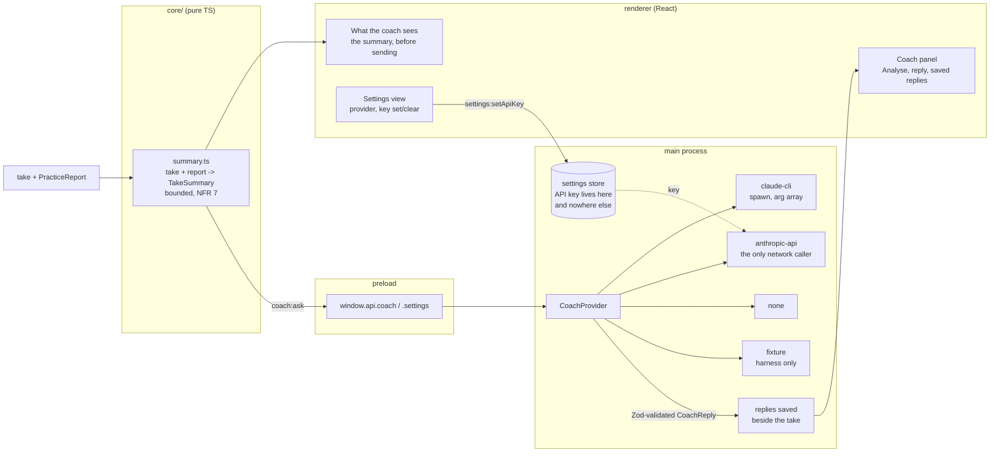

# 0003 — The coach speaks

> **Status:** approved
> **Created:** 2026-09-09
> **Owner skill(s):** dev, human
> **Related ADRs:** [0002](../adrs/0002-the-coach-is-a-provider-behind-one-interface-and-the-first-provider-is-the-claude-cli.md) (proposed)
> is the whole design of this plan;
> [0004](../adrs/0004-the-app-plays-itself-virtual-ports-not-an-injection-channel.md) (accepted)
> is the discipline it is built to;
> [0001](../adrs/0001-an-electron-shell-in-typescript-around-a-pure-music-core.md) (accepted)
> governs the processes, the secret, and the new `coach:*` and `settings:*` domains
> **NFRs claimed:** 3, 6, 7, 9, 11 in [nfr.md](../nfr.md)
> **Depends on:** Plan [0001](done/0001-the-keyboard-shows-on-screen.md) Phase 5 (takes) for the input.
> Plan [0002](0002-a-piece-is-practised.md) Phases 4 and 5 supply the per-bar half of the summary;
> without them the coach still works on free-play takes, with the practised half absent rather
> than empty.

## TL;DR

You finish a take, press Analyse, and read back what a teacher would say: how it went, the
problems ranked and anchored to bars, and what to practise next. The reply is saved beside the
take so you can reopen last week's advice. The model sees a compressed `TakeSummary` and nothing
else — you can look at exactly what it will see before you send it — and the API key, if you ever
set one, never leaves the main process.

## Context & problem

ADR-0002 decided the architecture in full: one `CoachProvider` interface in main, three
implementations (`claude-cli`, `anthropic-api`, `none`), the model receives a `TakeSummary` and
never raw MIDI, replies are validated against a Zod schema, and a failure is a one-line message
rather than a retry loop. This plan builds that and settles three things the ADR left open, fixed
in the interview on 2026-09-09.

**Analyse is one-shot.** No conversation, no `--resume`, no chat panel. The reply is a structured
object — an assessment, ranked issues each anchored to bars, practice suggestions — which is what
makes a single answer useful without a conversation around it. The reply carries an optional
follow-up question already, so the door stays open.

**Both kinds of take get analysed.** A practised take summarises to Plan 0002's per-bar report; a
free-play take summarises to what `core/` already knows without a score — chords, keys, range,
dynamics, pedal habits, timing evenness. One `TakeSummary` type, two populated shapes. This is
also what stops the coach being hostage to Plan 0002: if the practice path is not there yet, the
free-play half stands on its own.

**Replies are kept**, written beside the take. Reopening what you were told to practise last week
is most of the point of having a coach.

The problem this plan has that the others do not is that **its dependency is a subscription and a
binary on one machine**. ADR-0002 is explicit that the `claude-cli` path is a grey zone that may
break without notice, and whether the CLI on this machine is authenticated is not a fact any test
can establish. So the plan is built the way ADR-0004 built the MIDI path: every `dev` phase runs
against a **recorded fixture reply and a stub binary**, the provider logic is fully tested with no
subscription and no network, and the live invocation is a `human` phase. An unattended run gets
through all six `dev` phases and leaves one checklist.

## Decision

We add two IPC domains: `coach:*` (ask, load a saved reply) and `settings:*` (read and write the
provider choice; set and clear the API key, never read it back). `core/` gains
`TakeSummary` — a pure function from a take, plus an optional `PracticeReport`, to a bounded
summary — and the NFR 7 budget is asserted there, on the longest fixture take, as a property.

Providers live in `electron/coach/`. Beside ADR-0002's three we add a fourth, **harness-only**
row: a `fixture` provider that returns a recorded reply, enumerated only when
`app.isPackaged === false` or `PT_HARNESS=1`, exactly the gate ADR-0004 uses for virtual ports.
It is what makes Phases 3, 5 and the e2e suite runnable with nothing configured. *This extends
ADR-0002's provider table by one row; the close review decides whether ADR-0002 needs a dated
`Outcome` note recording it.*

The secret is handled once and narrowly. The API key lives in main's settings store, is written
by a `settings:setApiKey` call that returns nothing, is never sent to the renderer, never logged,
never written into a take or a saved reply, and never interpolated into a command line. The
settings view shows whether a key is set, and can set or clear it — it cannot read it.

We rejected a conversation in v1 because session state in main and an expired-session failure
mode buy little against a structured report, and we rejected analysing only practised takes
because it would make the coach useless before Plan 0002 lands and useless for anything played
without a score.

## Architecture diagram



## Implementation phases

Each phase ships as its own commit. `dev` runs Phases 1 to 5 in one session; the architect
reviews the whole plan once, in a fresh session, after Phase 6. Every `dev` phase is checkable
with no subscription, no API key and no network (NFR 3, NFR 11).

### Phase 1 — You can see what the coach would see
- **Owner skill:** dev
- **What:** `core/` compresses a take into a `TakeSummary`, and the Takes view shows it. No model
  yet. This is the first thing on screen, and it is also the trust surface ADR-0002 promises: the
  coach sees this and nothing else, and you can read it before anything is sent.
- **Files touched:** `core/src/take/summary.ts`, `core/src/take/summary.test.ts`,
  `core/src/take/freePlayStats.ts`, `core/src/take/freePlayStats.test.ts`,
  `shared/coach.ts` (Zod: `TakeSummary`, `CoachRequest`, `CoachReply`),
  `renderer/components/SummaryPeek.tsx` + `.module.css`, `renderer/views/Takes.tsx`,
  `core/fixtures/takes/` (the longest generated take, for the budget test).
- **Notes for the implementer:**
  - `summary(take, report?)` is pure and total. With a report it fills the practised half — per-bar
    verdicts condensed to the worst bars, counts, fitted tempo. Without one it fills the free-play
    half from `freePlayStats`: chord and key progression over time, pitch range, dynamic range and
    spread, pedal usage, and timing evenness measured as the spread of inter-onset intervals.
    Both halves are optional in the type; a summary with neither is not constructible.
  - **The budget is structural, not a truncation.** The summary's size is a function of the number
    of *bars or segments*, capped, never of the number of events. A ten-minute take and a
    one-minute take produce summaries of the same order. Truncating a too-long string at the end
    would satisfy the byte count and lose the last bars silently — do not.
  - Token counting: count with a documented approximation (characters per token, stated in the
    code) rather than pulling a tokeniser dependency in. The budget has a wide margin; NFR 7 is
    4 000 and the target should be well under it.
  - **Score titles and filenames are data, not instructions.** A summary that embeds a score title
    is embedding a string that came from a file the user imported. It goes in a labelled field
    that the prompt describes as user data; it never gets concatenated into the instruction part
    of the prompt.
- **Done when:** the serialised summary of the longest fixture take is under the NFR 7 budget by
  the documented approximation, and the summary of a take ten times longer is within a small
  constant factor of it — asserted as a ratio, which is the property that keeps the budget true
  for takes nobody has recorded yet; a free-play take of `virtual:ii-V-I-in-F` summarises with the
  chords named and no practised half; a practised take summarises with the practised half and its
  worst bars in order; and the panel shows the summary for a selected take with nothing plugged in.

### Phase 2 — The spike: what the CLI actually accepts
- **Owner skill:** dev
- **What:** Fix the exact `claude` invocation, which ADR-0002 deliberately left to this plan. Run
  the real binary with candidate flag combinations, record verbatim what worked and what did not,
  and commit an argument builder plus one recorded reply as a fixture.
- **Files touched:** `electron/coach/claudeCli.ts` (the argument builder only, this phase),
  `electron/coach/claudeCli.test.ts`, `core/fixtures/coach/reply-*.json` (recorded replies),
  `core/fixtures/coach/cli-transcript.md` (what was run, what came back, verbatim).
- **Notes for the implementer:**
  - The combinations ADR-0002 flags as unverified, and the question each answers: does
    `--output-format json` return one object or a stream of events? Does `--json-schema` constrain
    the result and what does a schema violation look like? Does `--system-prompt` replace or
    append? Does disabling tools work as ADR-0002 assumes, and what is the flag actually called in
    2.1.266? What is the exit code and the stderr shape when the CLI is not authenticated, which
    is the error path the user will most often hit?
  - **Run it, do not reason about it.** `claude --version` and `claude --help` first, then the
    candidates. Paste what came back into the transcript, including the failures. A flag that
    ADR-0002 assumed and that does not exist is a finding, not a problem — write it down.
  - **If the CLI is not on `PATH` or not authenticated:** record exactly that, commit the
    transcript with the finding, and continue. Every later phase runs against the fixture and the
    stub, so the plan does not stall — and Phase 6 is where a human settles it. Do not attempt to
    authenticate, and do not prompt for credentials.
  - The argument builder is a pure function from a request to a `string[]`. **Never a shell
    string.** No prompt text, no filename and no key is ever concatenated into a command line;
    the prompt goes over stdin or a temp file, whichever the spike shows works.
- **Done when:** `cli-transcript.md` answers each question above with what was actually run and
  what came back; at least one real reply is committed as a fixture, or the transcript records
  precisely why none could be obtained; and `claudeCli.test.ts` asserts the built argument array
  for a representative request, including that no element of it contains the prompt body.

### Phase 3 — A reply appears, and is kept
- **Owner skill:** dev
- **What:** The provider seam, the IPC, the panel and the storage — all of it end to end, driven
  by the fixture provider. The `claude-cli` provider is not wired yet; everything around it is,
  and is tested.
- **Files touched:** `electron/coach/CoachProvider.ts` (the interface),
  `electron/coach/noneProvider.ts`, `electron/coach/fixtureProvider.ts` (harness-gated),
  `electron/coach/prompt.ts` (the system prompt, versioned with the code),
  `electron/coach/replyStore.ts`, `electron/coach/replyStore.test.ts`,
  `electron/ipc/coachHandlers.ts`, `electron/preload/api/coach.ts`, `shared/ipc-channels.ts`,
  `renderer/components/CoachPanel.tsx` + `.module.css`, `renderer/hooks/useCoach.ts`,
  `renderer/views/Takes.tsx`, `e2e/coach.spec.ts`.
- **Notes for the implementer:**
  - **The reply is untrusted output.** It is parsed with its Zod schema on receive, once, in main.
    A reply that fails the schema is a provider error with a one-line message, never a
    half-rendered panel. In the renderer it is rendered as **text**: no `dangerouslySetInnerHTML`,
    no markdown renderer that passes HTML through, no link that opens without `shell.openExternal`.
  - The `fixture` provider is enumerated by the same gate as ADR-0004's virtual ports —
    `!app.isPackaged || PT_HARNESS=1` — and the same test applies: unsetting the variable in a
    packaged build must leave it unlistable.
  - Replies are saved as `reply-<timestamp>.json` inside the take's own folder, so deleting a take
    deletes its advice with it. The saved reply records which provider answered and the prompt
    version, because a reply from a different prompt is not comparable with one from this prompt.
  - The four async states are all real here and all visible: no provider configured, asking,
    answered, failed. `none` is not an error state — the Analyse button is simply absent, and the
    summary panel from Phase 1 still renders. NFR 3.
  - `useCoach` disposes its listener on unmount.
- **Done when:** with the fixture provider selected and no network, pressing Analyse on a take
  shows the reply's assessment, its ranked issues each naming a bar, and its practice
  suggestions; the reply is on disk in the take's folder and reopening the take shows it without
  asking again; a fixture deliberately violating the reply schema produces a one-line provider
  error and no partial render; a reply whose text contains HTML renders as visible characters and
  executes nothing; and with the `none` provider the Analyse button is absent while the summary
  panel still renders (NFR 3).

### Phase 4 — The real coach answers
- **Owner skill:** dev
- **What:** Wire the `claude-cli` provider using Phase 2's findings: spawn the binary, feed the
  prompt, parse and validate the reply, handle every failure the spike found. Tested against a
  **stub binary** — a small script that emits the recorded fixture — so the whole path is covered
  with no subscription.
- **Files touched:** `electron/coach/claudeCli.ts` (the provider itself),
  `electron/coach/claudeCli.test.ts`, `electron/coach/stub/claude-stub.mjs` (the test double),
  `electron/coach/CoachProvider.ts` (provider selection: CLI when present, else none).
- **Notes for the implementer:**
  - **Spawn with an argument array, never a shell string**, and never with `shell: true`. The
    prompt reaches the process the way Phase 2's transcript says works.
  - Every failure path the spike found gets a test against the stub: binary missing, not
    authenticated, non-zero exit, malformed JSON, valid JSON failing the reply schema, and a
    process that never returns. **A timeout is required** — pick one against NFR 6's 15 s p95,
    state it, and kill the child when it fires. A hung `claude` must not leave a zombie or a
    spinning panel.
  - **No retry loop.** ADR-0002 is explicit. One attempt, one message pointing at settings.
  - Detection of the binary is a `PATH` lookup at startup and on settings open, not per request.
- **Done when:** against the stub, a normal reply parses and renders; each failure above produces
  its own one-line message and leaves no child process running, verified by the test; the timeout
  fires and kills the child; and `npm run gate` is green with no `claude` binary reachable at all,
  which is the state a fresh clone is in.

### Phase 5 — Settings, and a key that never leaves main
- **Owner skill:** dev
- **What:** A Settings view: the provider choice, the API key field, and the sentence ADR-0002
  requires about subscription usage. The `anthropic-api` provider — the only code in this
  application that touches the network.
- **Files touched:** `package.json` (add `@anthropic-ai/sdk` 0.124.0, exact pin),
  `electron/settings/store.ts`, `electron/settings/store.test.ts`,
  `electron/ipc/settingsHandlers.ts`, `electron/preload/api/settings.ts`,
  `electron/coach/anthropicApi.ts`, `electron/coach/anthropicApi.test.ts`,
  `renderer/views/Settings.tsx` + `.module.css`, `renderer/App.tsx`, `shared/settings.ts`,
  `e2e/settings.spec.ts`.
- **Notes for the implementer:**
  - **The key is write-only across the boundary.** `settings:get` returns the provider choice and
    a boolean `hasApiKey`. There is no channel that returns the key. The field shows a masked
    placeholder when one is set; typing replaces it, a Clear button removes it. If a reviewer can
    find a path from the key to the renderer, the phase has failed.
  - **The key never appears in a log line, an error message, a take file, a saved reply or a
    command line.** Write a test that asserts the serialised settings the renderer receives
    contains no substring of a set key, and one that asserts a provider error message does not
    either.
  - `anthropicApi.ts` is tested against a stubbed SDK client, not the network. **`npm run gate`
    must never make a network call** — NFR 3 is checked by the e2e run with networking disabled,
    and this phase is the one most able to break it.
  - The renderer's CSP still has **no `connect-src`**. The network lives in main. If anything in
    this phase seems to want one, the code is in the wrong process.
  - Use the current Claude model id for the API provider and pin it in one named constant with a
    comment, so changing models is a one-line edit rather than a search.
- **Done when:** setting a key, restarting the app and reopening settings shows a key is set and
  never reveals it; the settings payload the renderer receives contains no substring of the key,
  asserted by a test; switching providers changes which one answers without a restart; `npm run
  gate` passes with networking disabled and makes no outbound request (NFR 3); and the settings
  view states in one sentence that the CLI provider spends subscription usage.

### Phase 6 — The coach at the piano
- **Owner skill:** human
- **What:** The user plays a real take and asks the real coach about it. This is the only phase
  where a model actually answers, and the only one that can judge whether the answer is any good.
- **Checklist:**
  1. Is the `claude` CLI on `PATH` and authenticated on this machine? If Phase 2 could not
     establish it, this is where it is settled.
  2. Play a free-play take. Press Analyse. **Is the reply worth reading?** Not "did it return" —
     does it say something a teacher would say, or something generic that would fit any take?
  3. Play a piece against a score, badly on purpose in one bar. Does the coach find that bar, or
     does it talk about something else?
  4. Read the summary panel before sending. Is it obvious what the model is being told, and is
     there anything in it you would not want to send?
  5. NFR 6: how long from Analyse to reply? Write the number in the log.
  6. Paste an API key, switch to `anthropic-api`, and ask the same question. Does the answer come
     back in the same shape, and how does the latency compare?
  7. Break it on purpose: rename the `claude` binary, or clear the key. Is the failure one clear
     line pointing at settings, or does something hang or spin?
- **Done when:** every line has an answer in the log, and anything that failed is a followup row
  rather than a fix made in this phase. Item 2 is a judgement only the user can make, and a "no"
  is a finding about the prompt, recorded here and fixed in a followup plan.
- **If this phase is deferred by an unattended run** (`dev` logs it and moves on, per the queue
  protocol in `CLAUDE.md`), the plan **cannot close.** A green gate here means the plumbing works
  against a fixture; it says nothing at all about whether the coaching is good.

## Data shapes

Illustrative; `shared/coach.ts` and `shared/settings.ts` hold the Zod schemas that are real.

```ts
// illustrative — shared/coach.ts
type TakeSummary = {
  takeId: string
  durationSec: number
  practised?: {                       // present when a PracticeReport was available (Plan 0002)
    scoreTitle: string                // user data, labelled as such in the prompt
    fittedTempo: number
    counts: { correct: number; wrongPitch: number; missing: number; extra: number }
    worstBars: { bar: number; state: string; detail: string }[]   // capped
  }
  freePlay?: {                        // present for any take, score or not
    keys: { key: string; fromSec: number }[]
    chords: { name: string; atSec: number }[]                     // capped, representative
    range: { lowest: number; highest: number }
    dynamics: { min: number; max: number; mean: number }
    pedal: { sustainFraction: number }
    evenness: number                  // spread of inter-onset intervals
  }
}
// Size is a function of bars and segments, capped — never of event count. That is what makes
// NFR 7 hold for a take nobody has recorded yet.

type CoachReply = {
  assessment: string
  issues: { title: string; bars: number[]; detail: string; severity: 'low' | 'medium' | 'high' }[]
  practice: { title: string; detail: string }[]
  followUp?: string
  meta: { provider: 'claude-cli' | 'anthropic-api' | 'fixture'; promptVersion: number; ms: number }
}

// illustrative — shared/settings.ts, what the renderer is allowed to know
type SettingsForRenderer = {
  provider: 'claude-cli' | 'anthropic-api' | 'none'
  hasApiKey: boolean                  // never the key itself; there is no channel that returns it
  cliAvailable: boolean
}
```

## Risks & open questions

- **The CLI path breaks without notice.** ADR-0002 says so plainly and this plan does not improve
  on it. The mitigations are the interface, the `anthropic-api` provider one settings toggle away,
  and a failure that is one line rather than a retry loop. If Phase 2 finds the flags have already
  moved in 2.1.266, that is a finding for the transcript, not a reason to stop.
- **The spike cannot run.** If the CLI is absent or unauthenticated, Phase 2 records it and the
  plan proceeds on fixtures. The cost is that Phase 4's provider is written against a stub whose
  behaviour was inferred rather than observed, and Phase 6 item 1 becomes load-bearing. Say so in
  the log if it happens; do not let it pass silently.
- **The reply is generic.** The most likely disappointment is not a crash but advice that would
  fit any take. That is a prompt problem and it is invisible to every test in this plan — Phase 6
  item 2 is the only thing that can catch it, and the fix is a followup with real takes to tune
  against.
- **The summary is the wrong summary.** What a teacher reacts to may not be what `core/` finds
  easy to compute. Phase 6 item 4 puts the actual summary in front of the user, which is the
  cheapest way to find this out.
- **A secret leaks by accident.** The exposure paths are a log line, an error message, a take
  file, a saved reply and a command line. Phase 5 tests the first two directly; the review checks
  all five. This is the one plan in the project where a mistake is not recoverable by editing a
  file, because a leaked key has to be rotated.
- **The fixture provider ships.** It is gated exactly like the virtual ports and tested the same
  way, but it is a second harness affordance inside the binary and the release plan should check
  for both, not just for virtual ports.

## What this plan does NOT do

- **No conversation.** One question, one structured report. `--resume`, session state and a chat
  panel are a followup, and the reply's `followUp` field is where that thread would start.
- **No live coaching while you play.** Deferred in the founding interview; NFR 6 is an on-demand
  budget and this plan does not touch the hot path at all.
- **No coach history view** across takes. Replies are saved per take and read from the take.
- **No local model.** ADR-0002 notes Ollama fits the same interface; nobody has asked for it.
- **No prompt tuning against real playing.** The prompt lands versioned and honest; making it
  good needs real takes, which arrive in Phase 6.
- **No automatic analysis.** Nothing is ever sent without the user pressing Analyse, and the
  summary panel exists so they can see what would be sent first.

## Implementation log

> Written by `dev`, one row per phase as that phase's commit lands, and the close block after the
> last one. **The phases above are the contract; everything here is what happened.** Observations,
> never conclusions. A deviation from the plan or an unmet done-when is always disclosed.

**Lane:** _(main checkout or worktree path and branch)_

| phase | owner | state | commit |
|---|---|---|---|
| 1 — You can see what the coach would see | dev | not started | |
| 2 — The spike: what the CLI actually accepts | dev | not started | |
| 3 — A reply appears, and is kept | dev | not started | |
| 4 — The real coach answers | dev | not started | |
| 5 — Settings, and a key that never leaves main | dev | not started | |
| 6 — The coach at the piano | human | not started | |

### Measurements

- **NFR 7 (Phase 1):** longest fixture take summarises to _ tokens by the documented
  approximation, against a budget of 4 000; the ten-times-longer take to _ .
- **CLI availability (Phase 2):** on `PATH`? _ Authenticated? _ Version _ .
- **NFR 6 (Phase 6), `claude-cli`:** Analyse to reply, _ s p95 over _ requests.
- **NFR 6 (Phase 6), `anthropic-api`:** _ s.

### Notes

_(deviations, unmet done-whens, followups noticed and not acted on; one line each)_

### Close triggers

_(facts for architect to verify and decide from, no recommendations)_

- **What shipped:** _(feature / fix-only / docs-chore-only)_
- **User-visible docs touched:** _
- **Full gate at the last phase:** _
- **Outstanding `human` phases:** _

## Followups (after this lands)

- **Prompt tuning against real takes**, if Phase 6 item 2 says the advice is generic. This is the
  most likely followup in the plan and the one that decides whether the feature is any good.
- **Follow-up questions** — `--resume`, conversation state in main, the panel becoming a thread.
- **A coach history view** across takes, once there are enough replies for it to be worth one.
- **Summary tuning**, if Phase 6 item 4 shows the model is being told the wrong things.
- **A local provider** (Ollama) as a fourth shipped row, if anyone wants offline coaching.
- **The inversion: an MCP server exposing takes and reports**, so the user's own Claude Code
  session in a terminal could ask about their playing ("what did I fumble most this week?")
  instead of the app asking a model. This plan's flow is app-calls-model and needs no MCP; that
  one is model-calls-app and is where MCP would be the right answer. Its own plan, and it would
  want an ADR: exposing practice data to a general agent session is a wider door than `coach:ask`.
- The `architect` review decides whether ADR-0002 moves to `accepted`, and whether the
  harness-only `fixture` provider warrants a dated `Outcome` note on it.
