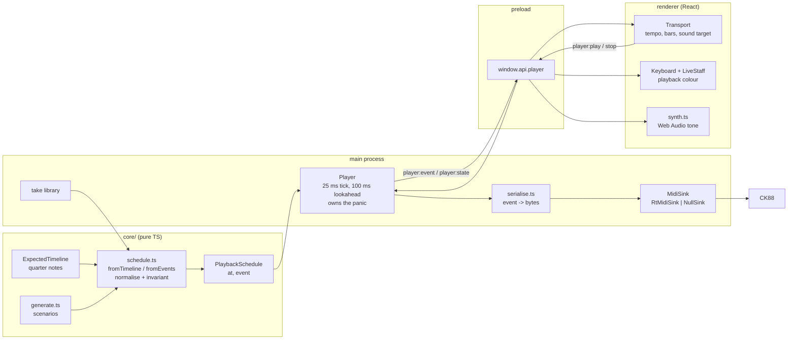

# 0004 — The app plays the piece

> **Status:** draft
> **Created:** 2026-09-10
> **Owner skill(s):** dev, human
> **Related ADRs:** [0007](../adrs/0007-playback-is-a-schedule-built-in-core-and-clocked-by-main-behind-a-midisink.md) (proposed)
> and [0008](../adrs/0008-the-app-may-sound-what-it-plays-a-synthesised-fallback-voice-no-samples.md) (proposed),
> which are this plan's whole design;
> [0005](../adrs/0005-the-expected-note-timeline-is-extracted-from-osmds-model.md) (proposed) supplies the
> notes; [0004](../adrs/0004-the-app-plays-itself-virtual-ports-not-an-injection-channel.md) (accepted)
> supplies the scenarios and the headless rule; [0006](../adrs/0006-listing-ports-does-not-touch-the-device.md)
> (proposed) governs the new output port list; [0001](../adrs/0001-an-electron-shell-in-typescript-around-a-pure-music-core.md)
> (accepted) governs the processes and the new `player:*` domain
> **NFRs claimed:** 3, 9, 11, 13 in [nfr.md](../nfr.md)
> **Depends on:** Plan [0002](0002-a-piece-is-practised.md) Phases 1 and 2 — the score library and the
> `ExpectedTimeline`. Phases 1 and 2 of this plan depend on neither and can run before it lands.

## TL;DR

You press play and the piece plays itself: notes go out of the USB port and the CK88 sounds them,
the on-screen keyboard and staff light up in a colour that is not yours, and a bar range plays as
readily as the whole piece. With nothing plugged in it still plays, through a plain synthesised
tone in the app that never pretends to be a piano. Stop always stops, everywhere, including when
the window closes mid-chord — that property, not the tempo, is what this plan is actually about.

## Context & problem

The user asked on 2026-09-10 for the app to be able to play music by itself, "and maybe piano if
it is possible". It is possible and it is cheap: the CK88's USB "TO HOST" port is bidirectional
class-compliant MIDI, and `@julusian/midi` — pinned since Plan 0001 for the input half — ships an
`Output` beside its `Input`. Nothing new gets installed. The roadmap has carried the stub since
the first interview ("MIDI out to demonstrate a passage through the CK88") and this is it.

The interview the same day fixed the scope tightly. **Demonstration, not accompaniment.** You
press play, you listen, it stops. The app does not play the left hand while you play the right,
and it does not follow your tempo — score following is real-time alignment, a substantially harder
algorithm than the after-the-fact alignment Plan 0002 is still proving, and putting it in the same
plan as the first output the application has ever had would risk both.

Three things become true at once, and only one of them is easy. The output is easy. **The clock is
not**: a player is a scheduler, and a scheduler accurate enough to be musical is the part of this
feature that can actually be got wrong — at 120 bpm a semiquaver is 125 ms, so a 25 ms scheduling
error is audible smear rather than a rounding difference. **The third is a hazard rather than a
problem**: for the first time this application can leave a note sounding on hardware in the room.
A dropped note-off is not a glitch that repaints; it is a chord that keeps ringing on the CK88
until the player finds the switch. ADR-0007 chooses the design around that hazard more than
around accuracy, which is why the schedule is a value in `core/` with an asserted invariant and the
clock is in main, the process that cannot be throttled by a hidden window.

The fourth force is the one that reversed a standing decision. The user asked for a fallback that
works with nothing plugged in, which reverses `docs/nfr.md`'s "Audio" non-requirement and qualifies
a premise in ADR-0001's Context. ADR-0008 records that with its price: a synthesised tone, no
samples, no bytes shipped, no network, sounding only what the app itself plays and only when the
instrument is not doing it.

One shape constraint comes from ADR-0005 and is worth stating plainly, because it is where the
tempo comes from. The `ExpectedTimeline` is deliberately **tempo-free** — quarter notes, never
seconds — and it carries no dynamics either. Playback is the first feature that must supply both.
It supplies them honestly: a tempo the player sets, and a fixed velocity, neither inferred from a
score that does not state them.

## Decision

We add a `player:*` IPC domain and a `MidiSink` seam, the mirror of `MidiSource`, with two
implementations: `RtMidiSink` over `@julusian/midi`'s `Output` and `NullSink` for when no output
port is selected — which is the ordinary case of a player who is watching, not an error.

`core/` gains `PlaybackSchedule`: an immutable ordered list of `{ at, event }` in milliseconds from
the start, and the builders that produce one from a recorded take, from a seeded scenario, and from
an `ExpectedTimeline` plus a tempo. Every schedule passes a normaliser that enforces the invariant
this plan exists to protect: **every note-on is matched by a later note-off and nothing is sounding
when the schedule ends.** A take truncated by a crash gets its open notes closed here, not on the
instrument.

Main runs the clock: a 25 ms tick that arms an individual timer for each event due in the next
100 ms, writes it to the sink, and pushes it to the renderer on `player:event` — a channel the
recorder never sees, so a take can never contain notes the player did not play. The renderer draws
those events on the keyboard and staff in a distinct colour, so you can always tell your hands from
the app's, and may sound them through the Web Audio tone of ADR-0008 when no hardware output is
open.

We rejected making the renderer the player (ADR-0007 Alternative A: a backgrounded window strands
note-offs on real hardware) and two synchronised clocks (Alternative B: drift and a flaky
synchronisation test, bought for a fallback tone that does not need the accuracy). We rejected a
sampled piano voice (ADR-0008 Alternatives A and B: install size and a redistributed licence for
tone in the one case where tone matters least) and every CDN-backed soundfont (Alternative C: NFR 3
and a CSP with no `connect-src`).

## Architecture diagram



## Implementation phases

Each phase ships as its own commit. `dev` runs Phases 1 to 6 in one session; the architect reviews
the whole plan once, in a fresh session, after Phase 7. Every `dev` phase is checkable with nothing
plugged in (NFR 11) — the observable is the renderer's view of `player:event`, exactly as ADR-0004
intends, plus a faked `@julusian/midi` `Output` at the sink's unit test. Phase 7 is the only one
that needs the instrument.

### Phase 1 — The app plays a scale into the room
- **Owner skill:** dev
- **What:** The whole spine, end to end, on the cheapest input. `core/` gains the schedule type,
  `scheduleFromEvents` (a take's or a scenario's `MidiEvent[]` is already millisecond-stamped, so
  this is a normalisation rather than a computation) and the normaliser that enforces the
  note-off invariant. Main gains the `MidiSink` seam, `RtMidiSink`, `NullSink`, the event-to-bytes
  serialiser and the `Player`. The Ports view gains an output-port list and a button that plays
  `virtual:c-major-scale`; the keyboard lights up in the playback colour as it goes.
- **Files touched:** `core/src/player/schedule.ts`, `core/src/player/schedule.test.ts`,
  `shared/player.ts`, `shared/ipc-channels.ts`, `electron/midi/MidiSink.ts`,
  `electron/midi/RtMidiSink.ts`, `electron/midi/RtMidiSink.test.ts`, `electron/midi/NullSink.ts`,
  `electron/midi/serialise.ts`, `electron/midi/serialise.test.ts`, `electron/player/Player.ts`,
  `electron/player/Player.test.ts`, `electron/ipc/playerHandlers.ts`,
  `electron/preload/api/player.ts`, `electron/preload/index.ts`, `electron/main.ts`,
  `renderer/hooks/usePlayer.ts`, `renderer/views/Ports.tsx`, `renderer/views/Ports.module.css`,
  `renderer/components/Keyboard.tsx`, `renderer/components/Keyboard.module.css`,
  `renderer/styles.css`
- **Notes for the implementer:** Output ports enumerate as `out:<index>` and follow ADR-0006 —
  `listPorts` opens no handle, and `busy` is only ever set by an open that failed. `RtMidiSink`
  fakes the same way `RtMidiSource.test.ts` already fakes `@julusian/midi`; assert on the byte
  arrays handed to the fake `Output`. The serialiser is the inverse of `electron/midi/parse.ts`
  and gets a round-trip test rather than a table of expected bytes. The tick is
  `setInterval(25)`, and inside it every event whose `at` falls in the next 100 ms gets its own
  `setTimeout` — do not dispatch on the tick boundary itself, that is the audible smear. Playback
  events must not reach `electron/take/Recorder.ts`; the recorder subscribes to the source, so
  the way to keep that true is not to wire the player into it at all.
- **Done when:** Selecting the C major scale and pressing play, with no instrument attached and
  no output port selected, lights the on-screen keyboard through two octaves up and down in the
  playback colour and leaves no key lit at the end; the same run with the output port list showing
  a faked device writes, in order, exactly the byte sequence the schedule describes. A `core/`
  test asserts that a `MidiEvent[]` ending mid-note — a note-on with no note-off, as a take
  truncated by a crash produces — normalises into a schedule whose last event releases that note.
  Pressing stop halfway leaves no key lit and writes a note-off for every note then sounding.
  `npm run gate` is green.

### Phase 2 — A tempo, a velocity, and a range of bars
- **Owner skill:** dev
- **What:** `scheduleFromTimeline`: quarter notes to milliseconds at a chosen tempo, a fixed
  velocity, a bar range, and the small decisions a score does not make for you.
- **Files touched:** `core/src/player/schedule.ts`, `core/src/player/schedule.test.ts`,
  `core/fixtures/` (a timeline fixture with a tie, a grace note, an anacrusis and a chord),
  `shared/player.ts`
- **Notes for the implementer:** Milliseconds are `quarterNotes * 60000 / bpm`; the default tempo
  is 80 bpm, adjustable between 30 and 240, and the default velocity is 72 — all three are stated
  here because the timeline states none of them (ADR-0005) and inventing them silently is how a
  score gets a tempo it never had. A note-off goes at `onset + duration` minus a release gap of
  `min(30 ms, 20% of the note's duration)`, so a repeated note retriggers instead of merging into
  its neighbour; at 80 bpm a quarter note is 750 ms and the gap is the full 30 ms, at 160 bpm a
  semiquaver is 94 ms and the gap is 19 ms. A tied note is already summed by the timeline and is
  one note-on. A grace note with zero duration gets 60 ms. A bar range is clipped by
  `ExpectedBar.onset`, and the schedule is rebased so the first note of the range is at `at: 0`.
- **Done when:** A `core/` test asserts that a two-bar 4/4 fixture at 120 bpm produces a schedule
  whose final note-off is at 4000 ms; that the same fixture at 60 bpm produces exactly twice every
  `at`; that a chord's three notes share one `at`; that a tied pair produces one note-on and one
  note-off spanning both halves; and that asking for bars 2 to 3 of a five-bar fixture yields only
  those bars' notes with the first at `at: 0`. Every schedule the suite builds satisfies the
  note-off invariant. `npm run gate` is green.

### Phase 3 — The Score view plays the piece
- **Owner skill:** dev
- **What:** A transport in the Score view: play, stop, tempo, and a bar range taken from the bars
  the user clicks. The renderer hands main the `ExpectedTimeline` it already extracted from OSMD;
  the currently sounding bar highlights as `player:state` reports the position.
- **Files touched:** `renderer/components/Transport.tsx`, `renderer/components/Transport.module.css`,
  `renderer/views/Score.tsx`, `renderer/views/Score.module.css`, `renderer/hooks/usePlayer.ts`,
  `shared/player.ts`, `electron/ipc/playerHandlers.ts`, `e2e/player.spec.ts`
- **Notes for the implementer:** `player:play` takes a discriminated union —
  `{ kind: 'timeline', timeline, bpm, fromBar, toBar }`, `{ kind: 'take', takeId, speed }`,
  `{ kind: 'scenario', id }` — validated once with Zod on receive, and main calls the same `core/`
  builder in all three cases. The timeline crosses IPC once per play, not per event; a 200-bar
  score is a few hundred kilobytes and this is not a hot path. Reuse the bar-colouring capability
  Plan 0002 Phase 1 built rather than adding a second way to mark a bar.
- **Done when:** With a score open and no instrument attached, choosing bars and pressing play
  walks the highlight bar by bar in time with the on-screen keyboard, and the highlight lands on
  the last chosen bar and stops. An e2e run on a generated score asserts that the count of
  `player:event` note-ons equals the count of notes the timeline holds for that bar range, and
  that no key is lit once playback ends. `npm run gate` is green.

### Phase 4 — A take plays back out to the instrument
- **Owner skill:** dev
- **What:** The Takes view can send a recorded take to the output. This is not the existing
  `take:replay`, and the interface says so.
- **Files touched:** `renderer/views/Takes.tsx`, `renderer/views/Takes.module.css`,
  `renderer/components/Transport.tsx`, `electron/ipc/playerHandlers.ts`
- **Notes for the implementer:** `take:replay` feeds a take into the app's *input* pipeline as if
  it were being played, which is a testing capability (Plan 0001 Phase 5); `player:play` sends it
  *out* to the instrument. Two verbs, both of which look like "play", so label them for what they
  do — "Replay into the app" and "Play on the piano" — rather than picking one word and hoping.
  A take loaded from disk is Zod-parsed at the reader as it already is; the schedule builder
  trusts it from there.
- **Done when:** A generated take plays out with the same note count and ordering it was recorded
  with, verified through `player:event` with nothing attached; a take whose file ends mid-note
  plays without leaving a key lit. Both verbs are present in the Takes view and neither triggers
  the other. `npm run gate` is green.

### Phase 5 — You can hear it with nothing plugged in
- **Owner skill:** dev
- **What:** The Web Audio voice of ADR-0008 and the sound-target control.
- **Files touched:** `renderer/audio/synth.ts`, `renderer/audio/synth.test.ts`,
  `renderer/hooks/usePlayer.ts`, `renderer/components/Transport.tsx`,
  `renderer/components/Transport.module.css`
- **Notes for the implementer:** Two detuned oscillators per note, a fast attack and an exponential
  decay scaled by velocity, a lowpass whose cutoff opens with velocity, and a short release that
  is held while CC 64 is down. The `AudioContext` is constructed on the click that starts playback
  — autoplay policy will not let it start itself — and closed when the owning view unmounts, along
  with every voice, node and timer it created. The sound target is one choice: the instrument,
  this computer, or silent, defaulting to the instrument when an output port is open and to this
  computer when none is, so the two paths never double the same note unless asked. No sample, no
  audio file, no fetch — ADR-0008 forbids all three, and NFR 3's CSP would refuse the third anyway.
- **Done when:** With no output port selected, playing a scale produces audible notes through the
  computer's speakers and the target control reads "this computer"; selecting an output port flips
  the default to the instrument and the app falls silent. A test asserts that unmounting the view
  closes the `AudioContext` and leaves no voice running. `renderer/` contains no `node:*`,
  `electron`, `fs` or `fetch` import and the CSP still has no `connect-src` (NFR 3).
  `npm run gate` is green.

### Phase 6 — Stop always stops
- **Owner skill:** dev
- **What:** The panic path, hardened across every way playback can end that is not the schedule
  running out: stop, an output change mid-play, a second play over a running one, window close,
  app quit, and a throw inside the tick.
- **Files touched:** `electron/player/Player.ts`, `electron/player/Player.test.ts`,
  `electron/midi/RtMidiSink.ts`, `electron/midi/RtMidiSink.test.ts`, `electron/main.ts`,
  `e2e/player.spec.ts`
- **Notes for the implementer:** The sink tracks what it has sounded with `core/src/midi/HeldNotes.ts`
  rather than a second bookkeeping structure. A release is note-offs for the held set, then All
  Notes Off (CC 123) and sustain-up (CC 64, value 0) on every channel it has touched — the
  controllers are the belt and the explicit note-offs are the braces, because a CC 123 that some
  device ignores must not be the only thing standing between the user and a ringing chord. The
  tick's body is wrapped so that a throw releases before it propagates.
- **Done when:** A unit test asserts, for each of stop, output change, second play, window close,
  app quit and a thrown error inside the tick, that the faked `Output` receives a note-off for
  every note then sounding, followed by All Notes Off and sustain-up on every channel used. An
  e2e run closes the window mid-playback and the process exits without an error. `npm run gate`
  is green.

### Phase 7 — At the piano
- **Owner skill:** human
- **What:** The only evidence that any of this works. Plug in the CK88 and answer the questions
  no generated run can.
- **Files touched:** the plan's implementation log
- **Done when:** all of the following are recorded in the log:
  1. The CK88 appears in the **output** port list, and opening it while its input port is already
     open succeeds — the two halves of one USB device, in one process, at the same time.
  2. The instrument sounds notes sent to it, on MIDI channel 1. If it does not, the channel it
     does respond on is recorded; a selective instrument means the transport gains a channel
     selector, which is a followup, not a redesign (ADR-0007).
  3. A piece plays through with the sustain pedal messages included and sounds musically right —
     the user's judgement, which is the point of this row.
  4. **NFR 13 measured:** onset error over a 500-event schedule, p50 / p95 / max, on this machine.
     Windows' default 15.6 ms timer granularity is the known hazard; a figure that misses the
     target is a finding to record, not something to tune around silently.
  5. No stuck note after: stop mid-chord, closing the window mid-chord, quitting mid-chord, and
     **unplugging the USB cable mid-chord**. The last one is the case no software can fix and the
     log should say what actually happens.
  6. The synthesised fallback judged with the instrument unplugged: tolerable as a reference tone,
     or not — a product call, and the only thing that decides whether ADR-0008's negative was
     priced correctly.

## Data shapes

```ts
// illustrative — the Zod schemas in shared/player.ts are what is real

/** Milliseconds from the start of playback. Ordered by `at`; note-offs before
 *  note-ons at an equal `at`, so a repeated note releases before it restrikes. */
type ScheduledEvent = { at: number; event: MidiEvent }

type PlaybackSchedule = {
  source:
    | { kind: 'timeline'; scoreId: string; fromBar: number; toBar: number; bpm: number }
    | { kind: 'take'; takeId: string; speed: number }
    | { kind: 'scenario'; id: string }
  durationMs: number
  events: readonly ScheduledEvent[]
}

/** What the renderer asks main to play. Validated once, on receive. */
type PlayRequest =
  | { kind: 'timeline'; timeline: ExpectedTimeline; bpm: number; fromBar: number; toBar: number }
  | { kind: 'take'; takeId: string; speed: number }
  | { kind: 'scenario'; id: string }

/** Pushed on `player:state`, not per event: a few times a second. */
type PlayerState =
  | { state: 'idle' }
  | { state: 'playing'; positionMs: number; durationMs: number; bar: number | null }

/** The sink: the mirror of MidiSource. `send` is on the hot path — synchronous,
 *  and it never throws, because a throw here strands a note on the instrument. */
interface MidiSink {
  listPorts(): Promise<MidiPort[]>   // `out:<index>`; ADR-0006 applies
  open(portId: string): Promise<void>
  close(): Promise<void>
  send(event: MidiEvent): void
}
```

## Risks & open questions

- **Windows timer granularity misses NFR 13.** The default system tick is 15.6 ms, and if the
  Electron main process is not holding a high-resolution timer while playback runs, the per-event
  `setTimeout` cannot land inside a 10 ms budget. Phase 7 measures it. If it misses: the honest
  responses are to revise NFR 13 by ADR against what the platform actually gives, or to shorten
  the lookahead and spin the last millisecond, which costs CPU against NFR 5. Not to quietly
  accept a smeared semiquaver.
- **Two ways to play a take is a confusing interface**, and labelling them well (Phase 4) may not
  be enough. If the user finds it muddled at review, the resolution is a product call about which
  one a person actually wants, not more code.
- **A stale `out:<index>`** aims the output at whatever device took that slot. Louder than the same
  weakness on the input side, where a wrong port merely shows nothing. Mitigated by not persisting
  the selection across launches in this plan; a name-matched selection is a followup.
- **The CK88 may not respond on channel 1.** Unknown and not documented anywhere this project has.
  Phase 7 item 2 settles it; a channel selector is the fallback.
- **Doubled sound.** With the instrument connected and the fallback on, every note plays twice a
  few milliseconds apart. The default rule in Phase 5 prevents it; a user who overrides the default
  gets what they asked for.
- **Offline (NFR 3) is a live risk in Phase 5 specifically.** Every convenient soundfont library
  fetches samples at runtime. ADR-0008 forbids samples outright partly so that this cannot be
  reintroduced by a helpful dependency; the CSP is the backstop and the phase's done-when checks it.
- **No new dependency (NFR 9).** This plan adds none. If Phase 5 turns out to want an audio helper,
  that is a signal the voice grew past what ADR-0008 authorised.

## What this plan does NOT do

- **No accompaniment and no score following.** The app does not play one hand while you play the
  other, and it does not wait for you or match your tempo. Decided in the 2026-09-10 interview.
  Score following would be a plan of its own on top of Plan 0002's aligner.
- **No sampled instrument.** ADR-0008; a real piano voice needs a superseding ADR that argues
  NFR 10.
- **No metronome, no count-in, no looping a passage.** All natural next asks, none of them in this
  plan; each is small once the transport exists.
- **No dynamics from the score.** Velocity is fixed. The `ExpectedTimeline` carries no dynamics,
  and inventing them from OSMD's markings is a change to ADR-0005's extractor.
- **No repeats.** Playback follows the timeline as written, top to bottom, inheriting Plan 0002's
  cut exactly.
- **No tempo persisted per score.** The tempo is set per play and forgotten.
- **No playback while the player is playing.** Nothing stops it technically, but nothing in this
  plan coordinates the two either.

## Implementation log

> Written by `dev`, one row per phase as that phase's commit lands, and the close block after the
> last one. **The phases above are the contract; everything here is what happened.**

**Lane:** _(to be filled by `dev`)_

| phase | owner | state | commit |
|---|---|---|---|
| 1 — The app plays a scale into the room | dev | not started | |
| 2 — A tempo, a velocity, and a range of bars | dev | not started | |
| 3 — The Score view plays the piece | dev | not started | |
| 4 — A take plays back out to the instrument | dev | not started | |
| 5 — You can hear it with nothing plugged in | dev | not started | |
| 6 — Stop always stops | dev | not started | |
| 7 — At the piano | human | not started | |

### Measurements

_(NFR 13: onset error p50 / p95 / max, the machine, the phase)_

### Notes

### Close triggers

- **What shipped:**
- **User-visible docs touched:**
- **Full gate at the last phase:**
- **Outstanding `human` phases:**

## Followups (after this lands)

- A metronome and a count-in, once there is a transport to hang them on.
- Loop a bar range while practising it.
- Play one hand only — the timeline already carries `staff`, so this is a filter, not a feature.
  It was offered in the interview and not chosen; it becomes interesting the day accompaniment is.
- Remember the output port by name rather than by index, so a selection survives a replug.
- A channel selector, if Phase 7 finds the CK88 selective about what it receives.
