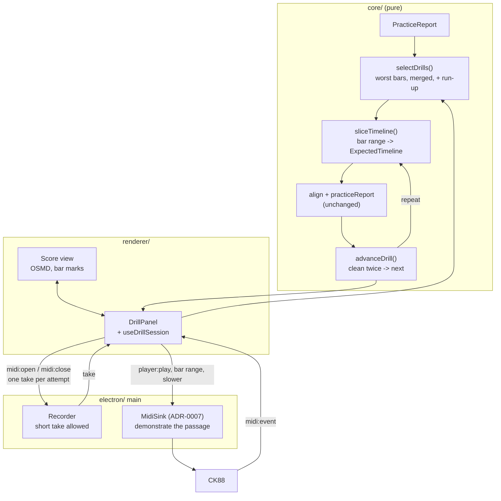

# 0005 — The practice loop

> **Status:** draft
> **Created:** 2026-09-10
> **Owner skill(s):** dev, human
> **Related ADRs:** [0011](../adrs/0011-an-attempt-is-a-take-the-loop-repeats-through-the-recorder.md) (proposed)
> is this plan's whole design;
> [0005](../adrs/0005-the-expected-note-timeline-is-extracted-from-osmds-model.md) (accepted) supplies
> the timeline a drill slices; [0009](../adrs/0009-an-ornament-is-optional-a-grace-note-is-scored-neither-way.md)
> (accepted) is why a drilled ornament does not fail an attempt;
> [0004](../adrs/0004-the-app-plays-itself-virtual-ports-not-an-injection-channel.md) (accepted)
> is the discipline every phase is checked by;
> [0007](../adrs/0007-playback-is-a-schedule-built-in-core-and-clocked-by-main-behind-a-midisink.md)
> (proposed) is what demonstrates a drill in Phase 5;
> [0001](../adrs/0001-an-electron-shell-in-typescript-around-a-pure-music-core.md) (accepted)
> governs the processes
> **NFRs claimed:** 3, 9, 11 in [nfr.md](../nfr.md)
> **Depends on:** Plan [0002](0002-a-piece-is-practised.md) Phases 4 and 5 — the aligner, the
> `PracticeReport` and the bar-marked Score view. Phase 5 of this plan additionally needs Plan
> [0004](0004-the-app-plays-the-piece.md) Phase 3; every other phase needs nothing from it.

## TL;DR

You finish a piece, and instead of a page of colours you are handed a short list: the three bars
you played worst. You pick one and the app drills it — it marks that bar plus a bar of run-up on
the score, plays the passage to you slowly, records you playing it back, and says clean or not.
Two clean attempts in a row and it moves to the next bar. When the list is empty it asks you to
play the whole passage again in context, so the thing you fixed is tested where it lives. It is
what a teacher does with the thirty seconds after you stop playing, and every part of it is
already reachable: a drill is a bar range of the score you already imported, scored by the aligner
that already exists.

## Context & problem

Plan 0002 built the diagnosis and stopped there. `barsByTiming` ranks a take's bars, the score
colours, the bar detail names the wrong and missing notes — and then the player is alone with a
page of information and no move to make. The roadmap calls this item 4 and calls it "the highest
teaching value the existing seams already reach", which is exactly right: nothing here needs a new
store, a new expectation shape, a new notation path or a new dependency. What it needs is the
loop closed.

Two problems stand between the report and the loop, and both were resolved in the 2026-09-10
interview.

**Repetition has nowhere to live.** `align` matches one played stream against one timeline. A
player who loops two bars six times into one take gets one pass matched and five passes counted as
extra notes. ADR-0011 settles this: each attempt is its own take, the loop starts and stops the
recorder around it, and the aligner is untouched. The cost is a re-arm between repetitions and a
pile of small files; the alternatives — segmenting a continuous take, or teaching `align` to loop
— were rejected there and the reasons are recorded.

**"Worst" is not what the app currently ranks.** `barsByTiming` sorts by distance from the fitted
tempo and nothing else, so a bar in which the player hit three wrong notes but hit them steadily
ranks below a bar that was merely rushed. That is fine as a statistic and useless as a drill
queue. This plan adds a severity ordering that puts note errors above timing errors, and leaves
`barsByTiming` alone because the Score view's "furthest from your own tempo" list is a different
question with a right answer already.

One thing is deliberately absent: a tempo target. Alignment is tempo-free, so "slower" in this
plan is an instruction on screen and a speed the *demonstration* plays at — never a threshold an
attempt is judged by. The tempo ladder, and judging against a click, are Plan
[0006](0006-the-metronome-and-the-score-follows.md); the interview put the loop first on purpose,
so that each plan is useful on its own.

## Decision

We build the loop as a mode of the existing Score view, driven by three new pure functions in
`core/` and no new IPC domain, no new file format and no new dependency.

`selectDrills` turns a `PracticeReport` into an ordered list of bar ranges, worst first, merging
adjacent bad bars and prefixing each with a bar of run-up. `sliceTimeline` turns a bar range into
an `ExpectedTimeline` that is valid on its own terms, so a drill aligns, reports, colours and
plays back through paths that never learn drills exist. `advanceDrill` is a pure state machine
over (session, attempt verdict) that applies the pass rule — every bar in the range verdicts
`clean`, twice consecutively — and decides repeat, next drill, or the closing in-context re-test.

We rejected drills as generated material because it reopens ADR-0005's deferred question and buys
nothing a slice does not already give; we rejected a persisted drill queue because the roadmap's
decision 2 puts the store in item 5 and a session-scoped loop needs no schedule; and we rejected a
separate Drill view because the Score view already owns the OSMD instance, the bar marking and the
report, and a second one would duplicate all three.

## Architecture diagram



## Implementation phases

### Phase 1 — The worst bars become a list you can act on
- **Owner skill:** dev
- **What:** After a take, the Score view shows an ordered "Work on these" list — the worst bars,
  merged where adjacent, each with its run-up bar — and selecting one marks that range on the
  score. No recording yet; this is the queue made visible.
- **Files touched:** `core/src/drill/select.ts`, `core/src/drill/select.test.ts`,
  `core/src/drill/types.ts`, `core/index.ts`, `renderer/components/DrillPanel.tsx`,
  `renderer/components/DrillPanel.module.css`, `renderer/views/Score.tsx`,
  `renderer/views/Score.module.css`, `e2e/drill.spec.ts`
- **Notes for the implementer:** Severity ordering, worst first: a bar with any note verdict other
  than `correct` outranks every bar whose only fault is timing; within the note-error group order
  by the count of faulty notes, and within the timing group by `|timingDeviation|`. `notAttempted`
  and `unalignable` bars are never drilled — the player did not play them, so there is nothing to
  work on. Merge bars that are adjacent *after* selection, then prefix one bar of run-up, clamped
  at bar 0; a merge that swallows the run-up of the next drill is one drill, not two. Leave
  `barsByTiming` exactly as it is: the Score view's existing tempo list is a different question.
- **Done when:** `selectDrills` over a report whose bars 5 and 6 are `wrong` and whose bar 2 is
  `timing` returns bar 5 to 6 with a run-up from bar 4 first, and bar 2 with a run-up from bar 1
  second. A report whose bars are all `clean` returns an empty list and the panel says so rather
  than showing an empty box. A report with a `notAttempted` tail offers no drill from that tail.
  A drill on bar 0 has no run-up and does not produce a negative bar index. End to end on
  `virtual:score:pickup-two-hands` with a wrong-note perturbation: a take is played, the panel
  lists the perturbed bar, clicking it marks the range on the drawn score.

### Phase 2 — A drill is a bar range of the score, and the aligner cannot tell
- **Owner skill:** dev
- **What:** `sliceTimeline` produces an `ExpectedTimeline` for a bar range that is valid on its own
  terms, so aligning a passage against a drill uses the unmodified aligner.
- **Files touched:** `core/src/drill/sliceTimeline.ts`, `core/src/drill/sliceTimeline.test.ts`,
  `core/src/score/timeline.ts`, `core/index.ts`
- **Notes for the implementer:** The slice re-bases quarter positions so the range starts at zero,
  keeps each note's original bar index in a field the report can name back to the player, and
  keeps the parent's `scoreId` with the range appended so two drills of one score are
  distinguishable. Grace notes attached to a note inside the range come with it (ADR-0009 keeps
  them optional either way); a grace note attached across the boundary is dropped with its parent.
  A tie that begins before the range starts sounds nothing new inside it and so contributes no
  expected onset.
- **Done when:** `barTableProblems` and `noteBarProblems` both return empty for the slice of every
  committed fixture timeline, over every bar range from length one to the whole score.
  `timelineFingerprint` of a slice differs from its parent's, and the slice of the full range has
  the same scored notes in the same order as the parent. Aligning a take generated from a slice
  against that slice scores every bar `clean` with zero wrong, missing and extra. Aligning the
  same take against the **parent** timeline does not — which is the assertion that the slice is
  doing real work.

### Phase 3 — You play the passage and it says clean or not
- **Owner skill:** dev
- **What:** One attempt, end to end: the loop arms the recorder, you play the passage, it stops,
  aligns against the slice and shows a verdict — including when the attempt is only eight notes
  long.
- **Files touched:** `electron/take/Recorder.ts`, `electron/take/Recorder.test.ts`,
  `shared/midi.ts`, `shared/take.ts`, `electron/ipc/midiHandlers.ts`,
  `electron/preload/api/midi.ts`, `renderer/types/global.d.ts`,
  `renderer/hooks/useDrillSession.ts`, `renderer/hooks/useDrillSession.test.ts`,
  `renderer/components/DrillPanel.tsx`, `electron/midi/virtualPorts.ts`,
  `electron/midi/virtualPorts.test.ts`, `e2e/drill.spec.ts`, `e2e/harness.ts`
- **Notes for the implementer:** `MINIMUM_NOTE_ONS` stays 10 for ordinary takes; `midi:open` gains
  an optional flag saying a short take is expected, and the loop sets it (ADR-0011). Validate the
  flag in the payload schema like everything else. The attempt's take id must be the one the
  session wrote, not the newest take of that score — the Plan 0002 close review found exactly that
  defect in `Score.tsx` and it would return here otherwise. For the headless path add a
  `virtual:drill:<slug>:<from>-<to>` port family that plays only that bar range of a fixture
  timeline, cleanly or under a named perturbation, so an attempt can be driven with nothing
  plugged in (ADR-0004). The gap between attempts is real: make the armed state unmistakable on
  screen before the player can start the next one.
- **Done when:** A four-note take recorded with the short-take flag set is written and reads back;
  the same take without the flag is still discarded and still says so. An attempt driven from
  `virtual:drill:pickup-two-hands:1-2` playing the range cleanly reports every bar of the drill
  `clean`; the same range under a wrong-note perturbation reports that bar `wrong` and names the
  substituted pitch. The attempt's report cites the take the attempt just wrote, asserted by id.
  NFR 11: the whole phase is checkable with no instrument attached, and the e2e run proves it.

### Phase 4 — Two clean in a row, and the loop moves on
- **Owner skill:** dev
- **What:** The loop itself: attempt, verdict, repeat or advance, and the closing in-context
  re-test when the queue empties.
- **Files touched:** `core/src/drill/session.ts`, `core/src/drill/session.test.ts`,
  `core/index.ts`, `renderer/hooks/useDrillSession.ts`,
  `renderer/hooks/useDrillSession.test.ts`, `renderer/components/DrillPanel.tsx`,
  `renderer/components/DrillPanel.module.css`, `e2e/drill.spec.ts`
- **Notes for the implementer:** `advanceDrill(session, attempt)` is a pure function and the whole
  rule lives in it; the hook holds no branching of its own. An attempt counts as clean when every
  bar in the drill's range verdicts `clean` — `timing` does not pass, `unalignable` and
  `notAttempted` never pass, and a bar outside the range cannot affect it because the slice has no
  such bars. The streak resets to zero on any non-clean attempt rather than decrementing. The
  player can skip a drill and can end the session; both are transitions in the machine, not
  escapes from it. The closing re-test aligns against the **parent** timeline, which is the whole
  reason it exists.
- **Done when:** Given a drill list of two, the machine advances only on the second consecutive
  clean attempt and a clean-then-wrong-then-clean sequence leaves it on the first drill with a
  streak of one. A `timing` verdict does not advance. Skipping the first drill moves to the
  second with the first recorded as skipped, not passed. When the last drill passes, the session
  enters the in-context re-test and that re-test is scored against the full score's timeline, not
  a slice. End to end: a drill port that plays the range wrongly, then cleanly, then cleanly
  drives the panel from "again" to the next drill.

### Phase 5 — The app demonstrates the passage, slowly
- **Owner skill:** dev
- **What:** A Listen control on the drill: the passage plays out to the instrument at a reduced
  tempo before you attempt it.
- **Files touched:** `renderer/components/DrillPanel.tsx`, `renderer/hooks/useDrillSession.ts`,
  `renderer/views/Score.tsx`, `e2e/drill.spec.ts`
- **Notes for the implementer:** This is Plan 0004's transport called with the drill's bar range
  and a tempo multiplier; nothing new is scheduled and nothing new is sounded. The reduced tempo
  is a property of the demonstration only — no attempt is judged against it, and the aligner stays
  tempo-free. Listening must not arm the recorder, and stopping a demonstration must leave nothing
  sounding (NFR 13, which Plan 0004 asserts and this phase must not undermine).
- **Done when:** Listen on a drill covering bars 4 to 6 emits `player:event` for the notes of bars
  4 to 6 and for no others, and at half the written tempo the last onset falls at twice the
  written offset. Listening does not create a take. Stop during a demonstration leaves zero notes
  sounding, asserted the way Plan 0004 asserts it.

### Phase 6 — At the piano, with a passage you actually cannot play
- **Owner skill:** human
- **What:** The user runs the loop on real repertoire and answers what the generator cannot ask.
- **Files touched:** this plan's `## Implementation log`
- **Done when:** all seven answered in the log.
  1. Does the "work on these" list name the bars you would have chosen yourself?
  2. Is one bar of run-up enough to get into the passage, or do you want two?
  3. Does the re-arm between attempts break the rhythm of practising? This is ADR-0011's accepted
     cost and this is where it is judged.
  4. Is "clean twice running" the right bar — too easy, too strict, or right?
  5. Does the in-context re-test at the end feel like it tested the right thing?
  6. Does the slow demonstration help, or do you skip it?
  7. After a real session: how many take files did it leave, and does that bother you?

## Data shapes

```ts
// illustrative — the Zod schemas in shared/ are what is real

/** A bar range of one score, worst first. Produced by selectDrills. */
type Drill = {
  /** Inclusive, in the parent timeline's bar indices. Includes the run-up. */
  fromBar: number
  toBar: number
  /** The bars that earned the drill, excluding the run-up. */
  targetBars: readonly number[]
  /** Why it was picked, for the panel to say out loud. */
  reason: 'notes' | 'timing'
}

/** The loop's whole state. Session-scoped; nothing is written to disk. */
type DrillSession = {
  scoreId: string
  drills: readonly Drill[]
  index: number
  /** Consecutive clean attempts on the current drill. Resets to 0, never decrements. */
  streak: number
  attempts: readonly { drillIndex: number; takeId: string; clean: boolean }[]
  phase: 'idle' | 'listening' | 'armed' | 'recording' | 'verdict' | 'inContext' | 'done'
}

const CLEAN_STREAK_TO_ADVANCE = 2 // a tunable of this plan, not of ADR-0011
```

## Risks & open questions

- **The re-arm gap eats the first notes of the next attempt.** The recorder must close a file and
  open another, and a player in a rhythm will start before it is ready. Mitigation: the armed
  state is unmistakable on screen (Phase 3) and the machine will not accept events until it is
  armed. Phase 6 item 3 is where we find out whether that is enough; if it is not, the answer is
  the rejected Alternative A of ADR-0011 and it needs a superseding record, not a tweak.
- **A drill's report has no context**, so a player who is early into the drill's first bar because
  of what preceded it is told nothing. This is ADR-0011's named cost and the in-context re-test is
  the recovery. If Phase 6 item 5 says the re-test does not catch it, a two-bar run-up (item 2) is
  the cheaper fix than context-aware scoring.
- **"Clean twice running" may be unreachable on a hard passage** and turn the loop into a wall.
  `CLEAN_STREAK_TO_ADVANCE` is one constant and the panel always offers Skip, so the failure mode
  is annoyance rather than a trap. Phase 6 item 4 sets the number.
- **Take file proliferation.** Twenty attempts is twenty files and nothing prunes them. No
  mitigation in this plan by decision; Phase 6 item 7 decides whether it needs one.
- **Offline (NFR 3) and pins (NFR 9) are untouched** — this plan adds no dependency and makes no
  network call. Latency is not on this plan's path either: nothing here is in the key-to-pixel
  route, and the alignment turnaround (NFR 12) can only improve, since a drill's timeline is a few
  bars rather than a few hundred.

## What this plan does NOT do

- **No tempo target, no click, no ladder.** Judging against a beat is Plan
  [0006](0006-the-metronome-and-the-score-follows.md). "Slower" here means the demonstration plays
  slower and nothing else.
- **No store and no scheduling.** The session dies with the view. Spaced repetition, due dates and
  the "seen" ledger are roadmap item 5, and the backlog's decision 2 is why they are not here.
- **No new drill material.** A drill is a range of a score you imported. Generated exercises are
  roadmap item 5, and they wait on the question ADR-0005 reopened.
- **No live feedback during an attempt.** The verdict arrives when the attempt ends, exactly as
  Plan 0002 established. Live bar-by-bar feedback remains that plan's followup.
- **No repeat unfolding.** Inherited from Plan 0002: a drill on a bar inside a repeat is a drill
  on the bar as written once.

## Implementation log

> Written by `dev`, one row per phase as that phase's commit lands, and the close block after the
> last one. **The phases above are the contract; everything here is what happened.** Observations,
> never conclusions. A deviation from the plan or an unmet done-when is always disclosed.

**Lane:** _(`main` directly, or the worktree path plus its branch)_

| phase | owner | state | commit |
|---|---|---|---|
| 1 — The worst bars become a list you can act on | dev | not started | |
| 2 — A drill is a bar range of the score | dev | not started | |
| 3 — You play the passage and it says clean or not | dev | not started | |
| 4 — Two clean in a row, and the loop moves on | dev | not started | |
| 5 — The app demonstrates the passage, slowly | dev | not started | |
| 6 — At the piano, with a passage you actually cannot play | human | not started | |

### Measurements

_(NFR 11: frames and the reported millisecond distribution, per phase that ran the gate)_

### Notes

_(deviations, unmet done-whens, followups noticed and not acted on; one line each)_

### Close triggers

- **What shipped:** _(feature / fix-only / docs-chore-only)_
- **User-visible docs touched:** _
- **Full gate at the last phase:** _
- **Outstanding `human` phases:** _

## Followups (after this lands)

- **Pruning drill takes**, if Phase 6 item 7 says the pile bothers the player. The cheapest form
  is a retention rule in the Takes view, not a new store.
- **A two-bar run-up**, if Phase 6 item 2 asks for it. One constant.
- **The drill queue surviving a restart**, which is the first thing that genuinely needs roadmap
  item 5's store and should not be retrofitted before it.
- **Drilling from the coach's advice** rather than from the report — Plan
  [0003](0003-the-coach-speaks.md) names bars in prose, and turning "work on the left hand in bar
  12" into a drill is a small bridge between the two plans.
- **Interleaving the queue** rather than draining it worst-first, which the backlog's evidence
  says tests worse in the session and better a week later. It needs the store to be worth
  measuring.
- The `architect` review decides whether ADR-0011 moves to `accepted`.
