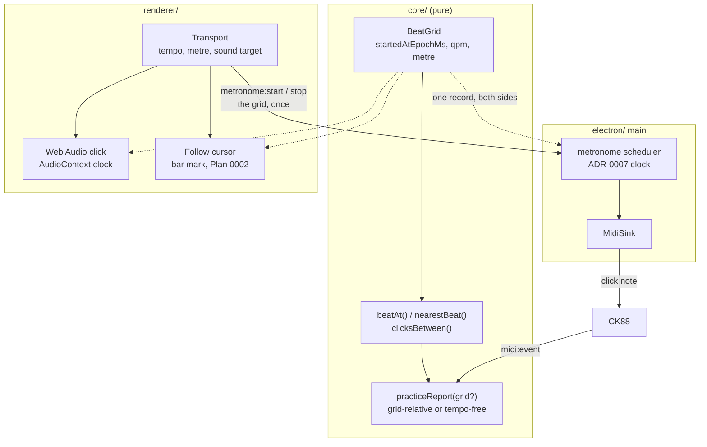

# 0006 — The metronome, and the score follows

> **Status:** approved
> **Created:** 2026-09-10
> **Owner skill(s):** dev, human
> **Related ADRs:** [0012](../adrs/0012-the-metronome-is-a-shared-grid-and-the-timing-reference-when-it-runs.md)
> (proposed) is this plan's whole design;
> [0008](../adrs/0008-the-app-may-sound-what-it-plays-a-synthesised-fallback-voice-no-samples.md)
> (proposed) is the bound it widens and supplies the Web Audio voice;
> [0007](../adrs/0007-playback-is-a-schedule-built-in-core-and-clocked-by-main-behind-a-midisink.md)
> (proposed) supplies the sink and the clock the MIDI click uses;
> [0005](../adrs/0005-the-expected-note-timeline-is-extracted-from-osmds-model.md) (accepted)
> supplies the metre and the bar positions the cursor walks;
> [0004](../adrs/0004-the-app-plays-itself-virtual-ports-not-an-injection-channel.md) (accepted)
> is the discipline every phase is checked by;
> [0001](../adrs/0001-an-electron-shell-in-typescript-around-a-pure-music-core.md) (accepted)
> governs the processes and the new `metronome:*` domain
> **NFRs claimed:** 3, 9, 11, 13 in [nfr.md](../nfr.md)
> **Depends on:** Plan [0004](done/0004-the-app-plays-the-piece.md) Phases 1, 5 and 6 — the `MidiSink`
> and its clock, the Web Audio voice, and the stop path. Plan
> [0002](done/0002-a-piece-is-practised.md) Phases 4 and 5 supply the aligner and the bar marking the
> cursor reuses.

## TL;DR

You set a tempo and hear a click — out of the CK88 when it is plugged in, out of the computer when
it is not — and the score highlights the bar the click is in as it goes. Play along and the app
judges your timing against the click instead of against a tempo it guessed from your own playing,
so rushing the whole passage evenly is finally reported as rushing rather than as a slightly
faster performance. The click is one shared description of the beat that both processes schedule
from, which is what keeps the sound, the highlight and the judgement talking about the same beat
three.

## Context & problem

The user asked for this on 2026-09-10 after using the app, and Plan 0002's followup fixed four
things about it at the time: the click is audio the app produces, timing is judged against the
click when one runs, follow mode highlights the current bar reusing Plan 0002's bar marking, and
it is a plan of its own rather than extra phases on that one. Three of those four survive intact.
The fourth — that the click must be Web Audio, because a MIDI click "needs a MIDI-output path,
which is its own roadmap item" — expired the day ADR-0007 built the `MidiSink`, and the 2026-09-10
interview reopened it and chose both voices.

Three problems underlie the feature.

**Scoring today has no target.** `fitTempo` derives a tempo from the take itself and
`practiceReport` measures each bar's deviation from that fit. It is the right default and it is
what makes the whole feature work with no configuration — but it cannot tell a player who rushed
uniformly that they rushed, because a uniformly faster performance fits a faster tempo and reports
as clean. Plan 0002's Phase 7 hit the mirror image of this from real use: an exploratory take
scored every bar `timing` with deviations near a second, because one fitted tempo cannot describe
a run in which the player is finding the notes. A click gives the player something outside their
own playing to be measured against, which is the only way that particular ambiguity resolves.

**The app promised a cursor and never built one.** Plan 0002's prose says "the score follows with
a cursor, nothing is judged until you stop" in two places and no phase carried a done-when for it.
That plan's own followup records the gap honestly. A cursor needs a wall clock rather than a
position derived from what was played — you cannot follow a player who has stopped — and a running
metronome is exactly that wall clock.

**A click cannot be built the obvious way.** ADR-0008 bounded the app's audio to notes it is
playing back and forbade opening a device while merely listening, and a click breaks both
sentences. It is also, unlike a reference pitch, a thing the player synchronises their body to and
is then judged by, so jitter in it is jitter in both halves. ADR-0012 answers all of that: the
metronome is a grid, not a stream of ticks — one immutable epoch-anchored description of the beat
that each process schedules its own clicks from, with the same pure `core/` arithmetic underneath
the sound, the cursor and the score.

## Decision

We add a `BeatGrid` to `core/` — start epoch, quarters per minute, metre — with pure arithmetic
over it, and a `metronome:*` IPC domain that carries the grid once at start and once at stop, and
nothing per beat. Main schedules MIDI clicks from the grid on ADR-0007's clock; the renderer
schedules Web Audio clicks from the same grid on the `AudioContext` clock and walks the cursor
from it; `core/` scores against it when one is running. The transport's existing sound target
(ADR-0008: the instrument, this computer, silent) chooses the click's voice, and a MIDI click is
preferred whenever a hardware output is open, so the room hears only the CK88 when the CK88 is
there.

We rejected a per-beat tick over IPC because it puts the reference the player synchronises to at
the mercy of the event loop on a platform whose 15.6 ms timer granularity NFR 13 already names;
we rejected a Web-Audio-only click because it forfeits the voice that comes out of the instrument
the player is already listening to; we rejected a MIDI-only click because it is silent with
nothing plugged in and every `dev` done-when here is written to be checkable that way (ADR-0004);
and we rejected keeping scoring tempo-free with a click running because that makes the click
decorative. Those rejections are recorded in ADR-0012.

## Architecture diagram



## Implementation phases

### Phase 1 — A tempo you can set and a beat you can hear
- **Owner skill:** dev
- **What:** The grid in `core/`, the transport control, and a Web Audio click you can start, hear
  and stop.
- **Files touched:** `core/src/time/beatGrid.ts`, `core/src/time/beatGrid.test.ts`,
  `core/index.ts`, `shared/metronome.ts`, `shared/ipc-channels.ts`,
  `renderer/components/Transport.tsx`, `renderer/components/Transport.module.css`,
  `renderer/audio/click.ts`, `renderer/audio/click.test.ts`, `renderer/views/Score.tsx`,
  `e2e/metronome.spec.ts`
- **Notes for the implementer:** The grid is a record and the arithmetic is pure — no clock read
  inside `core/`, which the lint rule already enforces. Schedule Web Audio clicks a fixed lookahead
  ahead of the audio clock rather than one per `setTimeout`; the standard shape is a short
  scheduling window refreshed on a coarse timer. The downbeat is audibly different from the other
  beats and that difference is the metre made real. Reuse ADR-0008's `AudioContext` lifecycle
  exactly: created on the gesture that starts the click, closed when the view unmounts. The
  end-to-end run asserts that the context exists and is disposed, never that anything was heard.
- **Done when:** `beatAt(grid, t)` returns beat 0 at the grid's start, beat 4 one bar later in
  4/4 at 60 qpm, and a half-integer never — beats are indices. `nearestBeat` of a timestamp 20 ms
  after beat 3 returns beat 3 with +20 ms, and of one 20 ms before beat 4 returns beat 4 with
  -20 ms, so the sign convention is early-is-negative, matching `timingDeviation`. Starting the
  click at 120 qpm in 4/4 and stopping it leaves no `AudioContext` open, asserted in the e2e run.
  NFR 3: no network request and no `connect-src`, unchanged.

### Phase 2 — The click comes out of the instrument
- **Owner skill:** dev
- **What:** The same grid scheduled in main and sent to the CK88 as MIDI, chosen automatically
  whenever a hardware output is open.
- **Files touched:** `electron/metronome/scheduler.ts`, `electron/metronome/scheduler.test.ts`,
  `electron/ipc/metronomeHandlers.ts`, `electron/preload/api/metronome.ts`,
  `renderer/types/global.d.ts`, `shared/metronome.ts`, `electron/main.ts`,
  `renderer/components/Transport.tsx`, `e2e/metronome.spec.ts`
- **Notes for the implementer:** Validate the grid payload with its Zod schema on receive, once.
  Schedule from ADR-0007's clock so the click and playback cannot drift; do not start a second
  timer. The click is a short note-on/note-off pair, downbeat distinguished by pitch or velocity,
  on a channel the transport exposes so Phase 5 can change it if the CK88 is selective. Stopping
  must leave nothing sounding — this is NFR 13's property and the panic path Plan 0004 Phase 6
  builds is the one to reuse, not a new one. Exactly one voice sounds at a time: when a hardware
  output is open the Web Audio click is silent, and the two never double.
- **Done when:** Against a faked `Output`, starting a grid at 120 qpm in 4/4 for four bars hands
  over sixteen note-on/note-off pairs, in order, with the four downbeats distinguishable from the
  twelve others, and zero notes left sounding after stop. Selecting "this computer" as the sound
  target while an output port is open silences the MIDI click and sounds the Web Audio one, and
  never both — asserted by counting both paths in one run. NFR 13 measurement: click onset error
  p50/p95/max against the schedule, on the development machine, reported into the log.

### Phase 3 — The score follows the click
- **Owner skill:** dev
- **What:** Follow mode: with a grid running, the bar the click is in is highlighted on the drawn
  score, in real time, whether or not anyone is playing.
- **Files touched:** `core/src/time/barAtBeat.ts`, `core/src/time/barAtBeat.test.ts`,
  `core/index.ts`, `renderer/hooks/useFollowCursor.ts`,
  `renderer/hooks/useFollowCursor.test.ts`, `renderer/score/OsmdView.tsx`,
  `renderer/views/Score.tsx`, `renderer/views/Score.module.css`, `e2e/metronome.spec.ts`
- **Notes for the implementer:** This is the cursor Plan 0002's prose promised and no phase built.
  Map beat to bar through the timeline's own bar table, so a pickup bar and a metre change are
  handled by the data rather than by arithmetic in the hook — `key-and-time-change` is the fixture
  that proves it. Reuse Plan 0002's bar-marking mechanism; do not add a second way to mark a bar,
  and do not reach for OSMD's own cursor (considered and not chosen in Plan 0002's followup).
  Drive the repaint from `requestAnimationFrame` against the grid, not from a per-beat timer, and
  cancel it in the effect's cleanup. Highlighting a bar must not disturb NFR 11's paint path.
- **Done when:** With a grid running over `key-and-time-change`, the highlighted bar advances at
  the written metre and lands on the correct bar across the metre change, asserted over the
  timeline rather than by eye. A score with a pickup bar highlights the pickup first. Stopping the
  grid clears the highlight and cancels the animation frame, with no listener or frame left after
  unmount. NFR 11 unchanged: frames p50/p95/max over 500 note-ons with follow mode running, in the
  gate run, reported into the log.

### Phase 4 — Timing is judged against the click
- **Owner skill:** dev
- **What:** The second scoring path: when a grid was running during a take, each bar's timing is
  measured against the grid instead of against a tempo fitted from the take.
- **Files touched:** `core/src/align/report.ts`, `core/src/align/report.test.ts`,
  `core/src/align/gridTiming.ts`, `core/src/align/gridTiming.test.ts`, `shared/score.ts`,
  `shared/take.ts`, `electron/take/Recorder.ts`, `electron/take/takeFile.ts`,
  `electron/take/Recorder.test.ts`, `renderer/hooks/usePracticeReport.ts`,
  `renderer/views/Score.tsx`, `core/index.ts`, `e2e/metronome.spec.ts`
- **Notes for the implementer:** `practiceReport` takes an optional grid; absent, every existing
  test describes the behaviour unchanged, and that is the property to protect. The take header
  records the grid that was running, so a report can be recomputed later from the file alone —
  additive and defaulting to null, so takes already on disk still read and `TAKE_FORMAT_VERSION`
  does not move, the same reasoning Plan 0002 applied to `scoreId`. `fittedTempo` in the report
  stays populated even when a grid is used, because the difference between the two is itself the
  interesting number and the panel should be able to say it. `TIMING_THRESHOLD_MS` is shared by
  both paths until evidence says otherwise.
- **Done when:** A generated take played 12 % fast throughout against a grid at the written tempo
  reports every bar `timing` and early; the same take with no grid reports every bar `clean`,
  because the fit absorbs the rush. That pair is the whole point of the phase and both halves are
  asserted. A take recorded with a grid reads back from disk with the grid intact and recomputes
  the identical report. Every existing timing test in `core/src/align/` passes untouched.

### Phase 5 — At the piano, with a click
- **Owner skill:** human
- **What:** The user plays to the click at the CK88 and answers what no generated take can.
- **Files touched:** this plan's `## Implementation log`
- **Done when:** all six answered in the log.
  1. Is the MIDI click audible and usable on the CK88 — right channel, right sound, right
     loudness? This is the one thing that decides whether the MIDI voice ships as the default.
  2. Does the click feel steady, or can you hear it wobble? NFR 13's Windows timer hazard is the
     suspect if it does.
  3. Do the click and the highlighted bar agree with each other, by eye and ear, over a few
     minutes? Drift between them is the failure the grid design exists to prevent.
  4. Playing a piece deliberately rushed against the click: does the report now say so?
  5. Playing a piece with genuine rubato against no click: is the tempo-free path still the better
     one for that? This is Plan 0002 Phase 7 item 4 revisited with a second option in hand.
  6. Does follow mode help you keep your place, or is the moving highlight a distraction?

## Data shapes

```ts
// illustrative — the Zod schemas in shared/ are what is real

/** One immutable description of the beat. Sent once at start, never per beat. */
type BeatGrid = {
  /** performance.timeOrigin + performance.now() at beat 0 — the anchor NFR 1 relies on. */
  startedAtEpochMs: number
  /** Quarter notes per minute. */
  qpm: number
  /** Beats per bar and the beat unit, e.g. 4 and 4 for common time. */
  beatsPerBar: number
  beatUnit: number
  /** Which voice is sounding it. Follows the transport's sound target (ADR-0008). */
  voice: 'instrument' | 'computer' | 'silent'
}

/** Added to the take header. Additive, null by default; TAKE_FORMAT_VERSION does not move. */
type TakeHeaderAddition = { grid: BeatGrid | null }
```

## Risks & open questions

- **The click wobbles on Windows.** NFR 13 names the 15.6 ms timer granularity as the known
  hazard, and a metronome is where it would be audible. Mitigation is the design — a lookahead
  window scheduled from a grid, on each process's best clock, with no IPC per beat. If Phase 5
  item 2 says it still wobbles, NFR 13 says the row is revised by ADR rather than tuned around,
  and that applies here.
- **The two voices disagree.** They are two implementations of one behaviour on two clocks, and
  only the MIDI one is observable end to end. Phase 5 item 3 is the check; if they drift, the
  suspect is an epoch anchor taken twice rather than shared, which is exactly what ADR-0012 fixes
  and what the test should therefore assert directly.
- **Grid-relative scoring will look like a regression.** The same take can be `clean` tempo-free
  and `timing` against a grid, and that is correct. The panel must always say which reference it
  used, or the player will read it as the app changing its mind.
- **A constant grid cannot express a written tempo change.** ADR-0012's named cost. A piece with a
  real accelerando gets a click that is wrong for part of it; the grid is replaced rather than
  bent, and nothing scores across the replacement. No mitigation in this plan.
- **ADR-0008's bound is widened**, which is the erosion that ADR warned about. The widening is
  narrow and named — a click the app generates, while listening, nothing else — and Phase 2's
  done-when asserting that exactly one voice sounds is what keeps it narrow in the code as well as
  in the prose.
- **Offline (NFR 3) and pins (NFR 9) are untouched:** no dependency, no network, no `connect-src`,
  and Web Audio needs none of them.

## What this plan does NOT do

- **No count-in.** It is the obvious next control and it belongs with the transport, not with the
  grid; deliberately cut to keep Phase 1 a walking skeleton.
- **No thinning click.** Every beat, then 2 and 4, then bar 1, then silence is a mask over this
  grid and needs no new decision, but its value is comparing drift across the four stages, which
  wants the store roadmap item 5 builds. It stays in [`../backlog.md`](../backlog.md).
- **No tempo ladder.** Raising the target after a clean pass is a rule over sessions, and a rule
  over sessions needs somewhere to remember them. Roadmap item 5.
- **No score following.** The cursor follows the *click*, not the player. Following the player is
  the backlog item cut from Plan [0004](done/0004-the-app-plays-the-piece.md) and it is a different
  problem.
- **No look-ahead curtain and no no-look mode.** Both want this wall-clock cursor and neither is
  drafted; they stay in the backlog under sight reading.
- **No swing.** A swung grid is the same beat-grid question the backlog calls "one beat grid,
  three symptoms", and it waits for jazz.

## Implementation log

> Written by `dev`, one row per phase as that phase's commit lands, and the close block after the
> last one. **The phases above are the contract; everything here is what happened.** Observations,
> never conclusions. A deviation from the plan or an unmet done-when is always disclosed.

**Lane:** _(`main` directly, or the worktree path plus its branch)_

| phase | owner | state | commit |
|---|---|---|---|
| 1 — A tempo you can set and a beat you can hear | dev | not started | |
| 2 — The click comes out of the instrument | dev | not started | |
| 3 — The score follows the click | dev | not started | |
| 4 — Timing is judged against the click | dev | not started | |
| 5 — At the piano, with a click | human | not started | |

### Measurements

- **NFR 13 (Phase 2):** click onset error p50 _ / p95 _ / max _ ms, development machine.
- **NFR 11 (Phase 3):** frames p50 _ / p95 _ / max _ over 500 note-ons with follow mode running.

### Notes

_(deviations, unmet done-whens, followups noticed and not acted on; one line each)_

### Close triggers

- **What shipped:** _(feature / fix-only / docs-chore-only)_
- **User-visible docs touched:** _
- **Full gate at the last phase:** _
- **Outstanding `human` phases:** _

## Followups (after this lands)

- **A count-in**, cut from Phase 1 and the first thing anyone will ask for.
- **The thinning click**, once there is somewhere to record drift across its four stages.
- **The tempo ladder**, which is this plan's grid plus roadmap item 5's store and nothing else.
- **The look-ahead curtain and no-look mode**, which now have the wall-clock cursor they needed.
- **A piecewise grid** for pieces with written tempo changes, if real repertoire makes ADR-0012's
  constant-tempo cost bite. It is the same shape as Plan 0002's piecewise-tempo-fit followup and
  the two should be drafted together.
- **A per-metrical-position report** — "you rush every offbeat eighth" rather than "30 ms late".
  The signed distribution is in the data the moment there is a grid to position against, and
  `TIMING_THRESHOLD_MS` currently collapses it. This is the cheapest genuinely new teaching output
  the grid unlocks.
- The `architect` review decides whether ADR-0012 moves to `accepted`, and whether ADR-0008 needs
  a dated `Outcome` note recording that its bound was widened.
