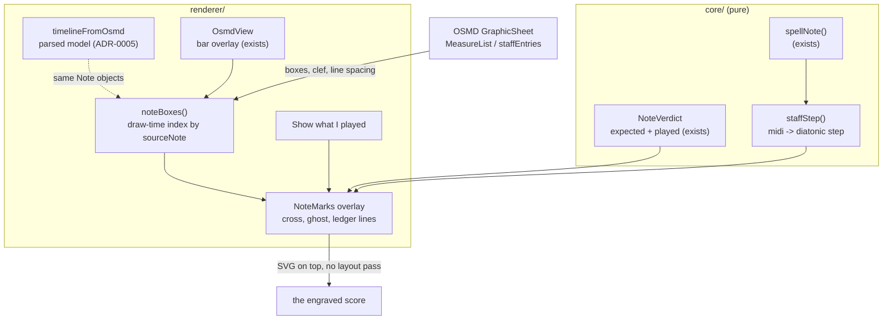

# 0007 — What you played, drawn on the score

> **Status:** draft
> **Created:** 2026-09-10
> **Owner skill(s):** dev, human
> **Related ADRs:** [0013](../adrs/0013-what-you-played-is-drawn-over-the-engraving-never-into-it.md)
> (proposed) is this plan's whole design;
> [0003](../adrs/0003-two-notation-engines-vexflow-for-the-live-staff-and-osmd-for-the-score.md)
> (accepted) is the boundary it adds a third surface between;
> [0005](../adrs/0005-the-expected-note-timeline-is-extracted-from-osmds-model.md) (accepted) is
> why the drawn-note lookup is built at draw time and never committed to a fixture;
> [0009](../adrs/0009-an-ornament-is-optional-a-grace-note-is-scored-neither-way.md) (accepted) is
> why an ornament is never marked either way;
> [0004](../adrs/0004-the-app-plays-itself-virtual-ports-not-an-injection-channel.md) (accepted)
> is the discipline every phase is checked by;
> [0001](../adrs/0001-an-electron-shell-in-typescript-around-a-pure-music-core.md) (accepted)
> governs the processes
> **NFRs claimed:** 3, 9, 11 in [nfr.md](../nfr.md)
> **Depends on:** Plan [0002](0002-a-piece-is-practised.md) Phases 2, 4 and 5 — the extraction, the
> aligner's `NoteVerdict`s and the bar-mark overlay this plan deepens. Nothing else.

## TL;DR

You play a piece, you stop, and the bar you fumbled shows you exactly what happened: the written
note you missed is crossed in red where it stands on the stave, and the note you actually hit is
drawn beside it as a hollow ghost notehead at its own pitch — right accidental, right ledger
lines, same stave. A note you played with nothing written for it appears on its own. One toggle
shows or hides the lot. No panel, no letter names to decode, no counting along the bar to find
which of nine notes the app meant: the answer is drawn where the question is.

## Context & problem

Plan 0002 delivered the diagnosis as colour plus prose. A bar turns red and a panel says "E2 was
played but not written". The user's judgement after using it at the piano on 2026-09-10: that is
not enough — *"I need to see where and what I've played wrong"*. The complaint is exact and it is
about form rather than content. A bar is four to twelve notes wide, so naming the bar localises
the error to somewhere between four and twelve places; naming a pitch as a letter asks the player
to convert a name back into a position on a stave they are already reading with effort. The app
holds positional information and delivers it as text, and the player does the join.

Nothing is missing from the data. `NoteVerdict` already carries both sides of the error —
`wrongPitch` holds `expected` and `played` in the same record (`shared/score.ts:157`), `missing`
holds the written pitch, `extra` holds the played one. What is missing is a way to put a mark on a
notehead and a way to draw a pitch the score does not contain.

Both turn out to be near at hand. `renderer/score/OsmdView.tsx` already positions an overlay from
OSMD's graphical model at bar granularity, and its own comment says why that shape was chosen: a
mark "cannot land anywhere except on the bar OSMD drew", and it "costs no layout pass". Note
granularity is the same structure one level deeper — `staffEntries[].graphicalVoiceEntries[].notes[]`
— and each graphical note carries the `sourceNote` object that `timelineFromOsmd` already walked,
so a verdict can reach its notehead by object identity rather than by re-matching on bar, onset
and pitch. And the diatonic step of an arbitrary MIDI pitch falls out of `spellNote`, which
`core/src/theory/staffLayout.ts` already uses to place notes on the live staff.

The one genuinely new thing is drawing a symbol the document does not contain, and ADR-0013
settles it: our own SVG overlay, positioned from OSMD, never merged into it. The alternatives —
a VexFlow "what you played" stave beneath each system, recolouring OSMD's own noteheads, and
re-engraving a modified sheet — are rejected there with reasons.

One constraint has to be respected rather than discovered. ADR-0005 extracts the timeline from
OSMD's **parsed** model, which is why that unit test runs under jsdom and why the committed
fixture timelines are layout-independent and hash-stable. The correspondence to a *drawn* notehead
is a renderer-only, draw-time index and must never reach a fixture.

## Decision

We deepen the existing overlay from boxes to glyphs. A draw-time index maps each expected note to
the notehead OSMD drew for it, by `sourceNote` identity; a pure `core/` function gives the
diatonic step of any MIDI pitch; and the clef reference and staff-line spacing are read from
OSMD's graphical staff so a mid-piece clef change is handled by the data. Three faults are drawn —
`wrongPitch`, `missing` and `extra` — and `timing` is not, because Plan 0002's real-use finding was
that an exploratory take scores almost every bar on timing and a page of timing marks would carry
no signal. One toggle over the whole score shows or hides every mark, defaulting to on.

We rejected the VexFlow stave beneath each system because it moves the eye's join rather than
removing it; we rejected recolouring OSMD's noteheads because it can say *where* but is
structurally incapable of saying *what*; and we rejected re-engraving a modified sheet because it
spends a layout pass, invents durations the aligner does not produce, and puts something on screen
that is no longer the score the composer wrote. Those rejections live in ADR-0013.

## Architecture diagram



## Implementation phases

### Phase 1 — The score can point at one written note
- **Owner skill:** dev
- **What:** A draw-time index from expected note to drawn notehead, and a mark placed on a single
  written note — proving the correspondence before anything is drawn from a report.
- **Files touched:** `renderer/score/noteBoxes.ts`, `renderer/score/noteBoxes.test.ts`,
  `renderer/score/OsmdView.tsx`, `renderer/score/OsmdView.module.css`,
  `renderer/views/Score.tsx`, `e2e/score.spec.ts`
- **Notes for the implementer:** Walk `GraphicSheet.MeasureList[bar][staff].staffEntries[]
  .graphicalVoiceEntries[].notes[]` and key the index on the `sourceNote` object, which is the
  same `Note` instance `timelineFromOsmd` walked in `sheet.SourceMeasures` — **verify that
  identity holds before building on it**, and if it does not, key on
  (bar, staff, voice, onset, midi) and say so in the log, because everything after this depends on
  which it is. Convert boxes with the unit conversion `OsmdView` already uses
  (`UNIT_IN_PIXELS * osmd.zoom`); do not invent a second one. Rebuild the index on the same
  triggers the bar overlay already rebuilds on — re-render, resize, zoom — and cache it between
  them. The reuse of the "What the app read" disclosure Plan 0002 built is the cheapest way to
  make this observable end to end without a test hook (ADR-0004).
- **Done when:** For every committed fixture score, every scored note in the timeline resolves to
  exactly one drawn notehead, and the count of resolved notes equals the count of scored notes —
  asserted end to end, in the real app, since OSMD does not lay out under jsdom. A mark placed on
  the third note of bar 2 of `pickup-two-hands` sits over that notehead and not over its
  neighbours, asserted by comparing the mark's box to the notehead's. Resizing the window moves
  the mark with the note. Grace notes resolve too but are excluded from the scored count
  (ADR-0009).

### Phase 2 — A pitch the score does not contain can be drawn
- **Owner skill:** dev
- **What:** The ghost notehead: any MIDI pitch drawn at its correct position on a given stave,
  with its accidental and whatever ledger lines it needs.
- **Files touched:** `core/src/theory/staffLayout.ts`, `core/src/theory/staffLayout.test.ts`,
  `core/index.ts`, `renderer/score/GhostNote.tsx`, `renderer/score/GhostNote.module.css`,
  `renderer/score/noteBoxes.ts`, `e2e/score.spec.ts`
- **Notes for the implementer:** `staffStep(midi, spelling)` is pure and belongs beside
  `layoutStaff`, which already derives letter, accidental and octave through `spellNote`; a step is
  `octave * 7 + letterIndex`, so the whole function is that plus parsing what `spellNote` returns.
  Pixels are the renderer's half: read the clef and the staff-line spacing from the graphical
  staff OSMD drew rather than assuming treble and bass, so `key-and-time-change` and any clef
  change are handled by the data. Ledger lines are drawn for every step beyond the stave, at the
  stave's own line spacing. The ghost is visibly an annotation — hollow, offset horizontally from
  the written note by a fixed amount, never engraving-quality (ADR-0013).
- **Done when:** `staffStep` places C4 and C5 exactly seven steps apart, places E4 and F4 one step
  apart, and gives E#4 and F4 — enharmonic, different letters — different steps, which is the
  assertion that it is diatonic rather than chromatic. A ghost at C4 on a treble stave sits one
  ledger line below the stave; the same pitch on a bass stave sits within it. A ghost at A0 and
  one at C8 both render with the ledger lines they need and neither is clipped out of the overlay.
  An accidental is drawn when the spelling has one and omitted when it does not.

### Phase 3 — The three faults appear on the score
- **Owner skill:** dev
- **What:** The report drives the overlay: written notes crossed where they were missed or
  mis-struck, ghosts at what was played, and extras standing alone.
- **Files touched:** `renderer/score/NoteMarks.tsx`, `renderer/score/NoteMarks.module.css`,
  `renderer/score/noteMarksFromReport.ts`, `renderer/score/noteMarksFromReport.test.ts`,
  `renderer/score/OsmdView.tsx`, `renderer/views/Score.tsx`, `e2e/score.spec.ts`
- **Notes for the implementer:** `wrongPitch` draws both — a cross on the written notehead and a
  ghost at `played`. `missing` draws the cross alone; there is no played pitch. `extra` draws the
  ghost alone, positioned horizontally between the written notes it fell between — that inference
  is ADR-0013's named weak point, so keep the rule simple and state it in the log rather than
  tuning it. `timing` draws nothing. A bar the report called `notAttempted` or `unalignable` draws
  nothing either: the player did not play it, and marking it would be the confident lie the
  `unalignable` state exists to avoid. Colour is never the only carrier — every mark carries text
  a screen reader reaches, exactly as `BarMark` already does.
- **Done when:** Driven from `virtual:score:pickup-two-hands` with a `substitutePitch`
  perturbation, the substituted bar shows a cross on the written notehead and a ghost at the pitch
  the perturbation actually played, and the ghost's staff position matches that pitch. A
  `dropNote` perturbation shows a cross and no ghost. A take with an added note shows a ghost and
  no cross. A clean take shows no marks at all. A `notAttempted` tail shows no marks. Each mark's
  accessible name states both pitches for a `wrongPitch`, asserted in the e2e run.

### Phase 4 — One toggle, and the marks stay out of the way
- **Owner skill:** dev
- **What:** The show/hide control over the whole score, defaulting to on, plus the cross-link
  between a mark and the bar detail Plan 0002 already built.
- **Files touched:** `renderer/views/Score.tsx`, `renderer/views/Score.module.css`,
  `renderer/score/NoteMarks.tsx`, `renderer/score/OsmdView.tsx`, `e2e/score.spec.ts`
- **Notes for the implementer:** One control for the whole score, not per bar — the interview
  chose it over an on-demand-per-bar reveal. Hiding must remove the marks from the accessibility
  tree, not merely make them invisible. Every SVG element, observer and listener the overlay
  creates is destroyed on unmount; the bar overlay's existing cleanup is the pattern to follow and
  not to duplicate. Marking must not touch the paint path NFR 11 defends — the Live view is a
  separate tab and stays that way, but the gate's frame measurement is the check that nothing
  regressed.
- **Done when:** Toggling off removes every mark from the DOM and from the accessible name of the
  score; toggling on restores them without a re-layout, asserted by the score's own bar boxes
  being unchanged across the toggle. Clicking a mark selects its bar and opens that bar's existing
  detail. Unmounting the Score view leaves no overlay element, observer or listener behind. NFR 11
  in the gate run: frames p50/p95/max over 500 note-ons unchanged from the previous plan, reported
  into the log.

### Phase 5 — At the piano, on a piece you actually fumble
- **Owner skill:** human
- **What:** The user plays real repertoire and judges whether the marks say what they need to say.
- **Files touched:** this plan's `## Implementation log`
- **Done when:** all six answered in the log.
  1. On a bar you know you fumbled, do the cross and the ghost tell you what you did — at a glance,
     without reading the panel? This is the whole plan and it is the only question that matters.
  2. Are the ghosts legible against the engraving, or do they collide with stems, beams and
     neighbouring noteheads? ADR-0013 names collision as unresolved by design.
  3. Do the `extra` ghosts land somewhere that makes sense, or do they point at the wrong place?
     This is the plan's known weak inference.
  4. On a busy take, is the marked-up page useful or is it noise? If it is noise, the on-demand
     per-bar reveal rejected in the interview is the fix.
  5. Is leaving `timing` unmarked right, or do you want the rushed notes shown too?
  6. Does anything render wrongly on a real score — very high or low pitches, double accidentals,
     a clef change, a dense chord?

## Data shapes

```ts
// illustrative — nothing here crosses IPC, so there is no Zod schema; these are renderer types

/** Built at draw time from OSMD's GraphicSheet. Never committed to a fixture (ADR-0005). */
type NoteBox = {
  bar: number
  staff: number
  midi: number
  /** Pixels, in the same overlay space the bar marks already use. */
  left: number
  top: number
  width: number
  height: number
  /** Read from the graphical staff, so a clef change is handled by the data. */
  clef: 'treble' | 'bass' | 'other'
  staffLineSpacing: number
  staffTopStep: number
}

/** What the overlay draws. One per fault; `timing` produces none. */
type NoteMark =
  | { kind: 'missed'; at: NoteBox; label: string }
  | { kind: 'wrong'; at: NoteBox; played: number; label: string }
  | { kind: 'extra'; nearBar: number; staff: number; played: number; label: string }
```

```ts
// core/src/theory/staffLayout.ts — pure, beside layoutStaff
/** Diatonic step, so E#4 and F4 differ. Reference is arbitrary but fixed. */
export function staffStep(midi: number, spelling: Spelling): number
```

## Risks & open questions

- **`sourceNote` identity may not hold**, in which case Phase 1 falls back to matching on
  (bar, staff, voice, onset, midi). That is a weaker link — a unison between two voices is the case
  it can get wrong — and the phase's done-when is written to detect it rather than to assume it.
  This is the single riskiest fact in the plan and it is resolved in the first phase on purpose.
- **The overlay reaches one level deeper into OSMD's internals** than the bar marks, so an OSMD
  upgrade can break note positioning where it could not break a measure box. ADR-0013 accepts this;
  the exact pin (NFR 9) makes it a known cost at upgrade time.
- **Glyph collision is unresolved by design.** A ghost a step from the written note in a dense
  chord will overlap something. Phase 5 item 2 judges whether the fixed offset is enough; if it is
  not, the fix is a collision rule, not an engraver.
- **`extra` has no honest horizontal anchor.** Its position is inferred from the notes it fell
  between. Phase 5 item 3 is the check, and the rule is deliberately simple so that a wrong answer
  is legible rather than mysterious.
- **A busy take could become an unreadable page.** The toggle is the mitigation and the interview
  chose it over per-bar reveal; Phase 5 item 4 revisits that if it was the wrong call.
- **Offline (NFR 3) and pins (NFR 9) are untouched** — no dependency, no network. NFR 12 is
  untouched too: this is drawing after alignment, not alignment.

## What this plan does NOT do

- **No rhythm.** The marks say which pitch, not when. Seeing *when* you played something is the
  VexFlow stave rejected in ADR-0013, and it stays a followup until rhythm is the complaint.
- **No timing marks.** Deliberate: Plan 0002 found that an exploratory take scores almost every
  bar on timing, so drawing them would bury the pitch errors this plan exists to surface.
- **No live marking.** The overlay is drawn from a finished report, exactly as the bar colours are.
  Live bar-by-bar feedback remains Plan 0002's followup.
- **No editing.** Nothing here writes to the score, and the engraving on screen stays what the
  composer wrote (ADR-0013).
- **No fingering, hand-position or curtain annotations**, though the surface this plan builds is
  the one they would use. Sight-reading mechanics stay in [`../backlog.md`](../backlog.md).

## Implementation log

> Written by `dev`, one row per phase as that phase's commit lands, and the close block after the
> last one. **The phases above are the contract; everything here is what happened.** Observations,
> never conclusions. A deviation from the plan or an unmet done-when is always disclosed.

**Lane:** _(`main` directly, or the worktree path plus its branch)_

| phase | owner | state | commit |
|---|---|---|---|
| 1 — The score can point at one written note | dev | not started | |
| 2 — A pitch the score does not contain can be drawn | dev | not started | |
| 3 — The three faults appear on the score | dev | not started | |
| 4 — One toggle, and the marks stay out of the way | dev | not started | |
| 5 — At the piano, on a piece you actually fumble | human | not started | |

### Measurements

- **NFR 11 (Phase 4):** frames p50 _ / p95 _ / max _ over 500 note-ons, with the overlay drawn.

### Notes

_(deviations, unmet done-whens, followups noticed and not acted on; one line each. **Phase 1 must
record whether `sourceNote` identity held**, because the rest of the plan reads differently
depending on the answer.)_

### Close triggers

- **What shipped:** _(feature / fix-only / docs-chore-only)_
- **User-visible docs touched:** _
- **Full gate at the last phase:** _
- **Outstanding `human` phases:** _

## Followups (after this lands)

- **The "what you played" stave**, ADR-0013's Alternative A, the day rhythm rather than pitch is
  what the player needs to see. It is a real transcription and it answers extras and timing
  naturally; it was rejected for this plan, not forever.
- **Timing marks**, if Phase 5 item 5 asks for them — most likely as a per-note nudge rather than
  a mark, and better once Plan [0006](0006-the-metronome-and-the-score-follows.md) gives timing a
  reference outside the player's own take.
- **Per-bar reveal instead of a global toggle**, if Phase 5 item 4 says a busy page is noise.
- **A collision rule** for ghosts in dense chords, if the fixed offset proves not enough.
- **Splitting `OsmdView`**, which now owns loading, the bar overlay and the note overlay. ADR-0013
  names it: the file wants splitting before it grows again.
- **The annotation surface reused** for fingering hints, hand position and the sight-reading
  look-ahead curtain — all the same overlay, and the curtain also wants Plan 0006's cursor.
- The `architect` review decides whether ADR-0013 moves to `accepted`.
