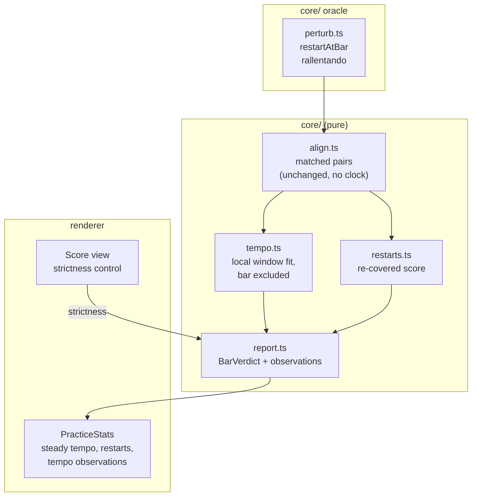

# 0008 — The timing model

> **Status:** draft
> **Created:** 2026-09-10
> **Owner skill(s):** dev, human
> **Related ADRs:** [0014](../adrs/0014-timing-is-judged-against-a-local-tempo-not-one-line-through-the-take.md)
> (proposed) is this plan's whole design;
> [0010](../adrs/0010-alignment-ends-where-the-player-stopped-an-unplayed-tail-is-free.md) (proposed)
> is the previous fix in the same area and the model for how this one is recorded;
> [0012](../adrs/0012-the-metronome-is-a-shared-grid-and-the-timing-reference-when-it-runs.md)
> (proposed) owns the click-relative path and bounds this plan to the other one
> **NFRs claimed:** 12, and a new row **14** in [nfr.md](../nfr.md) this plan adds
> **Depends on:** Plan [0002](0002-a-piece-is-practised.md) Phases 4 and 5 — the aligner, the
> fitted tempo and the per-bar report this plan replaces the timing half of

## TL;DR

You play a piece, fumble, stop, go back a bar and carry on — and the report says *"you restarted
at bar 4"* instead of turning the whole page orange. Each bar's timing is judged against the tempo
its neighbours were keeping, not against one line fitted through everything, so a disturbance no
longer contaminates the bars before and after it. A rallentando is described rather than punished,
the tempo figure becomes the tempo you actually held, and a strictness control lets you say how
fussy the app should be. This is what makes Plan 0002's Phase 7 item 6 — play the same piece well
and badly, do the statistics tell them apart — answerable at all.

## Context & problem

Plan 0002 fits one tempo to a whole take and judges each bar by its distance from that line. The
plan named the cost and accepted it: "a rallentando reads as error … the first thing Plan 0002
Phase 7 asks the player about."

Phase 7 asked, at the CK88 on 2026-09-10. The answer, measured against the real take (Bach
BWV 846, 168 note-ons, a deliberate false start):

```
counts        144 correct, 0 wrongPitch, 0 missing, 24 extra
bars          7 of 9 attempted bars read `timing`
deviations    -2450, +2105, -1235 ms
fit           53.4 qpm where the player played about 64; rms 1671 ms against a 45 ms threshold
residuals     +1741 +1701 +1628 ... +18 -39 ... -1130 -1191
```

**The notes were perfect.** 144 as written, nothing wrong, nothing missing: the aligner picked the
thread straight back up after the restart, which is the question Plan 0002 said no generated take
could ask. It is the *timing* that failed, and the residual ramp says why — replaying a bar gives
one score position two different times, a straight line cannot represent that, so the slope
flattens and every note inherits an error growing linearly with distance from the crossing point.

Two properties of a global reference make this more than a bad number. It **propagates backwards
as well as forwards**, so bars played before the restart were flagged for something that happened
after them. And it leaves the player no way out: "once timing is wrong I can't go back to right
timing after." No threshold fixes it — at an rms of 1671 ms the threshold would need to be
thirty-seven times its current value, and would then report nothing at all.

What this blocks is concrete. Plan 0002 Phase 7 item 6 asks whether the statistics tell a good
take from a bad one. On this scoring path both read out of time throughout, so the answer is
unobtainable, and **Plan 0002 cannot close until this is fixed.**

## Decision

A bar's timing is judged against a tempo fitted from the bars around it, **excluding the bar
itself** so that a rushed bar is measured against what its neighbours were doing rather than
against a line drawn partly through its own notes (ADR-0014). A rallentando is followed by the
local trend and reported as an observation rather than an error; a restart is detected from the
run of played notes that re-covers score already passed, and named; the headline tempo becomes the
steady-state tempo taken from the stretches where the player was steady.

We rejected segmenting the take at restarts and fitting one line per segment, because a long
segment containing a ritardando has the same defect over a shorter span. We rejected judging
evenness alone with no tempo reference, because it cannot say a bar was rushed relative to the
music around it and would delete Plan 0002's `rushBar` property rather than keep it. We rejected a
robust global fit (Theil-Sen, RANSAC), because a rallentando is not an outlier — it is half the
data — and the reference would still be global, so the propagation stays. We rejected widening the
threshold on the measurement above.

Nothing in the matcher changes. Tempo is fitted after the match, over the pairs `align.ts` already
produces, so the tempo-freedom every test in `core/src/align/` defends is untouched.

## Architecture diagram



## Implementation phases

Each phase ships as its own commit. `dev` runs Phases 1 to 5 in one session; the architect reviews
the whole plan once, in a fresh session, after Phase 6. Every `dev` phase is checkable with
nothing plugged in (NFR 11); Phase 6 needs the instrument.

**The oracle comes first, before the model that has to satisfy it.** Plan 0002 adopted the same
ordering for the same reason, recorded in its own notes: an oracle written after the thing it
tests tends to agree with it.

### Phase 1 — The generator restarts, and slows down
- **Owner skill:** dev
- **What:** Two new perturbations, each declaring its own expected verdict, and two generated
  performances you can select in the Score view and practise against. This phase is deliberately
  the oracle alone; what it shows on screen is two new entries in the *Play from* picker, and
  playing one of them demonstrates the defect the rest of the plan removes.
- **Files touched:** `core/src/midi/perturb.ts`, `core/src/midi/perturb.test.ts`,
  `electron/midi/virtualPorts.ts`, `electron/midi/virtualPorts.test.ts`,
  `electron/midi/SyntheticSource.test.ts`, `e2e/app.spec.ts`.
- **Notes for the implementer:**
  - `restartAtBar(bar)` plays up to and including that bar, then **replays it from its start** and
    continues. That is what the player did: the replayed notes are correct notes with nowhere left
    in the score to match, which is where the 24 extras in the measurement came from.
  - `rallentando({ fromBar, toBar, factor })` stretches the inter-onset gaps progressively so the
    final gap is `factor` times the written one, with the bars before `fromBar` untouched.
  - **Both declare no note-level verdict at all**, and that is the assertion that matters: a
    restart is not a mistake and a rallentando is not a mistake. `restartAtBar` declares a
    `restart` verdict; `rallentando` declares a `tempoChange` verdict. Neither declares
    `wrongPitch`, `missing`, `extra` or `timing`.
  - The port list is enumerated by id and by exact count in three existing tests (Plan 0002
    Phase 3's note). They grow by two; keep the counts exact rather than loosening them.
- **Done when:** `restartAtBar(3)` emits every note of bar 3 twice and nothing else changes, with
  the second copy later in time than the first; `rallentando` leaves every gap before `fromBar`
  identical to the unperturbed take and scales the last gap by the stated factor, checked as a
  ratio rather than against absolute times; both are byte-identical across two runs at one seed;
  and both new ports appear in the Score view's picker and record a take when practised.

### Phase 2 — A bar is judged against its neighbours
- **Owner skill:** dev
- **What:** The local tempo curve of ADR-0014, and `timingDeviation` measured against it. The
  visible change is the whole point of the plan: the restart and rallentando takes stop being
  orange.
- **Files touched:** `core/src/align/tempo.ts`, `core/src/align/tempo.test.ts`,
  `core/src/align/report.ts`, `core/src/align/report.test.ts`, `shared/score.ts`, `docs/nfr.md`.
- **Notes for the implementer:**
  - `localTempo(pairs, bar, options)` fits over the matched pairs whose bars lie within a window
    either side of `bar` **and excludes the pairs belonging to `bar` itself**. This exclusion is
    the crux of ADR-0014 and the easiest thing in the plan to get wrong: a reference fitted from
    data including the bar under test moves to meet it, and no bar ever deviates.
  - State the window width in the code with the reasoning. Assert its *effects* — a rallentando is
    clean, a rushed bar is flagged — never the number itself, so tuning cannot make a test pass
    that should not.
  - **A window with too few samples yields no verdict, not a confident one.** A bar near either
    end of the take has neighbours on one side only; below a stated minimum the bar reports
    `timingDeviation` 0 and a state that is not `timing`. Reuse `MIN_TEMPO_SAMPLES`' reasoning.
  - `fitTempo` stays, unchanged and exported: Phase 4 needs a global fit for the steady-state
    figure, and ADR-0012's click path is a separate reference entirely.
  - **`docs/nfr.md` gains row 14**, a property row with no milliseconds in it: *a take played
    evenly reports no timing error, however the take is structured.* Asserted by tests over the
    oracle — a restart, a rallentando, a take at half speed and a take with a long pause all
    report zero bars in `timing`, while a genuinely rushed bar is still flagged.
- **Done when:** a clean take of every fixture score still reports every bar clean and every
  existing test in `core/src/align/` still passes unchanged in meaning; a `rallentando` take
  reports **zero** bars in `timing`; a `restartAtBar` take reports zero bars in `timing` **and no
  bar before the restart is flagged**, which is the propagation property and the single most
  important assertion in this plan; `rushBar` still ranks the rushed bar worst by timing and still
  flags it; a take played evenly at half speed still reports zero timing errors; and NFR 14 is in
  `docs/nfr.md` with those tests named as its method.

### Phase 3 — A restart is named, not counted as mistakes
- **Owner skill:** dev
- **What:** Detection of a restart, a place for it in `PracticeReport`, and a line in the Score
  view that says where it happened. The notes it accounts for stop being reported as extras.
- **Files touched:** `core/src/align/restarts.ts`, `core/src/align/restarts.test.ts`,
  `core/src/align/report.ts`, `core/src/align/report.test.ts`, `shared/score.ts`,
  `renderer/components/PracticeStats.tsx` + `.module.css`, `e2e/practice.spec.ts`.
- **Notes for the implementer:**
  - A restart is **a run of played groups the matcher left over, whose pitches re-cover a stretch
    of expected groups the take has already matched.** The pitch evidence is what identifies it;
    a long time gap beside it is corroboration, not the trigger. Reading a clock here is fine —
    `report.ts` and `tempo.ts` already do — but the matcher still must not.
  - The notes a restart accounts for are **removed from `counts.extra`** and reported under the
    restart instead. They were correct notes played twice, which is care rather than error.
  - `PracticeReport` gains `restarts: RestartVerdict[]`. Keep it sized by the score, not by the
    take: one entry per restart, each naming the bar and how many notes it covered, never a list
    of the notes. Plan 0002's report-size property (NFR 7's lever) applies here too.
  - Colour is never the only carrier: the restart reads as a sentence in the statistics panel.
- **Done when:** a `restartAtBar(3)` take reports exactly one restart, at the bar the perturbation
  declared, and `counts.extra` is **zero** where it was previously the size of the replayed bar; a
  take with no restart reports an empty list; two restarts in one take are reported as two; the
  serialised report for a take with a restart stays within a small factor of the same take
  without one, asserted as a ratio; and the e2e practice run shows the restart sentence in the
  statistics panel.

### Phase 4 — The tempo you kept, and the shape you gave it
- **Owner skill:** dev
- **What:** The headline tempo becomes the steady-state tempo, and a rallentando is described in a
  sentence instead of being invisible.
- **Files touched:** `core/src/align/tempo.ts`, `core/src/align/tempo.test.ts`,
  `core/src/align/report.ts`, `core/src/align/report.test.ts`, `shared/score.ts`,
  `renderer/components/PracticeStats.tsx` + `.module.css`.
- **Notes for the implementer:**
  - **Steady-state tempo** is taken from the local tempi, over the bars where the player was
    steady — a median rather than a mean, so a restart and a ritardando cannot drag it. It stays
    in the existing `fittedTempo` field: same name, same units, refined meaning. Say so in the
    field's comment, because Plan 0003's coach summary reads it.
  - **A tempo observation** names a span and a percentage: "slowed 22% over bars 9 to 11". Derive
    it from a monotonic run in the local tempo curve past a stated size. It is information and
    never a verdict; no bar state changes because of one.
  - Keep observations bounded — the largest few, like `WORST_BARS_SHOWN` in the same component —
    so a take that wanders does not produce a wall of sentences.
- **Done when:** the steady-state tempo of a clean take of each fixture is within one per cent of
  the tempo it was generated at; the steady-state tempo of a `restartAtBar` take is within one per
  cent of the same take without the restart, which is the property that says a restart no longer
  moves the headline number; a `rallentando({ factor: 0.7 })` take produces exactly one tempo
  observation, naming the bars the perturbation named and a percentage within a stated tolerance of
  30%; an even take produces none; and no bar's state changes because an observation exists.

### Phase 5 — How fussy the app should be
- **Owner skill:** dev
- **What:** A strictness control in the Score view, three positions, changing the timing threshold
  and nothing else.
- **Files touched:** `renderer/views/Score.tsx` + `.module.css`,
  `renderer/hooks/usePracticeReport.ts`, `core/src/align/report.ts`, `shared/score.ts`,
  `e2e/practice.spec.ts`, `README.md`.
- **Notes for the implementer:**
  - Three named positions, not a slider: a slider invites tuning the number until the feedback
    flatters. Name them for what they mean to a player, and write the millisecond each maps to in
    the code with the reasoning.
  - **It is not persisted.** There is no settings store yet — `electron/settings/` does not exist
    and Plan 0003 creates it for the API key — so this follows the precedent Plan 0002 Phase 6 set
    for the quantisation grid: a control in the view, remembered for as long as the view is open.
    Persisting it is a one-line followup once that store exists, and is listed below.
  - Changing strictness **re-derives the report from the take already loaded**; it does not
    re-record and does not re-read the file.
  - Only bar *state* moves. `timingDeviation` is a measurement and does not change with strictness,
    and neither do the note counts.
- **Done when:** the same take at the strictest and most relaxed settings produces identical
  `counts`, identical `timingDeviation` values and a different number of bars in `timing`;
  switching the control re-colours the score without a new take; and the e2e practice run drives
  the control and observes the bar count change.

### Phase 6 — At the piano, with the takes that started this
- **Owner skill:** human
- **What:** The user re-runs the scenarios that produced the defect, and answers the Plan 0002
  item that was blocked by it. This is the only evidence that the fix does what the player asked
  for; the oracle can prove the property but not the feel.
- **Checklist:**
  1. **The false start again.** Play four or five bars of BWV 846, stop mid-bar, go back one bar,
     continue, stop. Does the report say you restarted, and are the bars before the restart clean?
  2. **Can you get back to right timing?** After the restart, do the later bars read on their own
     merits, or do they still inherit the disturbance?
  3. **Rubato.** Play a deliberate rallentando into a cadence. Is it described rather than
     reported as error, and is the description one you recognise?
  4. **A genuinely rushed bar.** Rush one bar deliberately, in an otherwise even take. Is it
     flagged? This is the property that must survive, and the one most at risk from a local
     reference.
  5. **Plan 0002 Phase 7 item 6, finally.** Play the same piece well and badly. Do the statistics
     tell the two takes apart in a way you would trust?
  6. **Strictness.** Does the control change what you see in a way that feels like strictness
     rather than like a different opinion?
  7. **The tempo figure.** Does the steady-state number match what you think you were playing?
- **Done when:** every line has an answer in the log, and anything that failed is a followup row
  rather than a fix made in this phase. **Item 5's answer belongs in Plan 0002's log as well**,
  since it is that plan's Phase 7 item 6 and its close depends on it.

## Data shapes

Illustrative, not final; `shared/score.ts` carries the Zod that governs.

```ts
/** One local reference, per bar, fitted from its neighbours and not from itself. */
interface LocalTempo {
  bar: number
  qpm: number
  msPerQuarter: number
  originMs: number
  /** Matched pairs the window drew on, excluding this bar's own. */
  samples: number
}

/** The player went back over music they had already played. */
interface RestartVerdict {
  /** The bar they resumed from. */
  bar: number
  /** How many note-ons the repeat accounted for; not the notes themselves. */
  notes: number
}

/** Information, never a verdict: what the tempo did over a span. */
interface TempoObservation {
  fromBar: number
  toBar: number
  /** Negative is slower. -22 reads "slowed 22%". */
  percent: number
}

/** PracticeReport gains, and refines one field it already has. */
interface PracticeReportAdditions {
  restarts: RestartVerdict[]
  tempoObservations: TempoObservation[]
  /** REFINED: now the steady-state tempo, not a fit across the whole take. */
  fittedTempo: number | null
}
```

## Risks & open questions

- **The window width is a judgement and the plan does not fix it.** Too narrow and the reference
  chases the player, forgiving real unevenness; too wide and it reapproaches the global line.
  Phase 2 states a number with reasoning and asserts effects; Phase 6 item 4 is where a player
  finds out whether it forgives too much.
- **A uniformly rushed take is invisible on this path**, by construction (ADR-0014's stated
  negative). That is ADR-0012's metronome to fill, and the two paths are complementary. Worth
  telling the player, in the copy, that timing here is about evenness rather than about speed.
- **Restart detection may fire on repeated material.** A piece whose figuration repeats exactly
  could look like a restart when the player simply continued. The pitch-run evidence plus a
  corroborating time gap is the guard; Phase 3's tests should include a take with genuinely
  repeating material and no restart in it.
- **`timingDeviation` changing reference is a seam change** that Plan 0003 reads. The field keeps
  its name and units, so nothing breaks mechanically, but the coach's prompt describes it and the
  sentence is now different.
- Whether a restart should also split the tempo curve, rather than only being reported, is left
  open. Phase 2's windows straddle it; if Phase 6 item 2 says the disturbance still leaks, that is
  the first thing to try.

## What this plan does NOT do

- **It does not touch the matcher.** No change to `align.ts`, the band, the cost function or the
  endpoint. Tempo-freedom is preserved exactly.
- **It does not implement click-relative scoring.** ADR-0012 and Plan 0006 own that path; this
  plan is the no-click one, and the two must not be merged into a single reference.
- **It does not persist the strictness control**, because there is no settings store yet.
- **It does not address the unbounded-extras property** carried from Plan 0002's close review —
  a player who repeats a passage still grows the report. Phase 3 removes the *restart* case from
  the extras count, which is the common one, and leaves the general property to Plan 0003.
- **It does not add a tempo graph.** Observations are sentences; drawing the curve is a separate
  question and belongs with Plan 0007's on-score drawing if it is ever wanted.

## Implementation log

> Written by `dev`, one row per phase as that phase's commit lands, and the close block after the
> last one. **The phases above are the contract; everything here is what happened.** Observations,
> never conclusions. A deviation from the plan or an unmet done-when is always disclosed.

**Lane:** _(dev records `main` or the worktree with the first phase commit)_

| phase | owner | state | commit |
|---|---|---|---|
| 1 — The generator restarts, and slows down | dev | | |
| 2 — A bar is judged against its neighbours | dev | | |
| 3 — A restart is named, not counted as mistakes | dev | | |
| 4 — The tempo you kept, and the shape you gave it | dev | | |
| 5 — How fussy the app should be | dev | | |
| 6 — At the piano, with the takes that started this | human | | |

### Measurements

### Notes

### Close triggers

- **What shipped:**
- **User-visible docs touched:**
- **Full gate at the last phase:**
- **Outstanding `human` phases:**

## Followups (after this lands)

- **Persist the strictness control** once Plan 0003 creates the settings store.
- **Re-answer Plan 0002 Phase 7 item 6** in that plan's log, and close Plan 0002. This plan
  existing is the reason that one is still open.
- **Whether a restart should split the tempo curve**, not merely be reported. See Risks.
