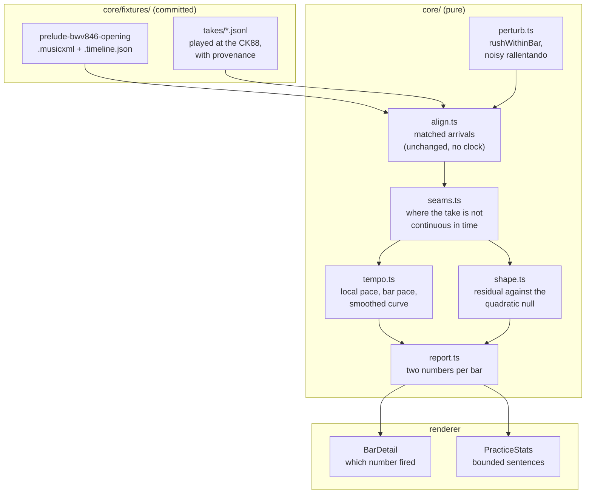

# 0009 — A bar is judged note by note

> **Status:** approved
> **Created:** 2026-09-10
> **Owner skill(s):** dev, human
> **Related ADRs:** [0015](../adrs/0015-a-bar-is-judged-twice-the-pace-it-kept-and-the-shape-inside-it.md)
> (proposed) is the measure — a bar carries two numbers, and the shape one is read against a
> quadratic null; [0016](../adrs/0016-a-reference-is-never-drawn-across-a-disturbance.md)
> (proposed) is the reference rule that stops a mistake reaching the bars beside it;
> [0017](../adrs/0017-the-oracle-gains-recorded-playing.md) (proposed) is why the tests may read a
> take recorded at the CK88. [0014](../adrs/0014-timing-is-judged-against-a-local-tempo-not-one-line-through-the-take.md)
> (accepted) is what this repairs, and its `Outcome` section is this plan's brief
> **NFRs claimed:** 12, 14 in [nfr.md](../nfr.md), and a new row **15** this plan adds
> **Depends on:** Plan [0008](done/0008-the-timing-model.md) entire — every followup row in that
> plan is a phase here, and its Phase 6 at the piano is the evidence for all of them

## TL;DR

You rush a bar, and the app says you rushed *that* bar — not the three bars around it. A bar now
carries two numbers instead of one: the pace it kept against the music around it, which is what
Plan 0008 shipped, and the **shape of its arrivals inside it**, which is new and is what catches a
hand that hurries three notes and gives them back before the barline. No reference is drawn across
a disturbance any more, so a mistake stops contaminating its neighbours and the bar you went back
inside stops reading four seconds late. A rallentando a human actually plays is finally described.
And the oracle stops being made only of things we imagined: the opening of the Prelude is engraved
into this repository and takes of you playing it — well, badly, and deliberately wrong — become
fixtures the tests read.

## Context & problem

Plan 0008 closed on 2026-09-10 with a `human` phase that failed three of its seven items, and the
close review's verdict was that **the local reference lands and the two things built on top of it
do not**. This plan is that plan's `## Followups`, all eight rows, taken as one piece of work
because they are one piece of work: they were all found in one evening, they all live in
`core/src/align/`, and four of them are the same bug wearing different clothes.

The evidence, from Plan 0008's `### Phase 6 at the piano` (BWV 846 at the CK88, four takes):

```
item 3  one bar rushed deliberately, otherwise even
        bar 2 -619 ms | bar 3 +314 ms | bar 1 +200 ms | the rushed bar: as written
item 2  a false start into the middle of a bar
        bar 4 +3992 ms, bar 5 -86 ms, every other bar clean
item 4  a deliberate rallentando
        no tempo observation at all; four bars amber instead
item 5  the Prelude's repeated figuration
        ~35 restart sentences in one paragraph, bar 30 alone six times,
        and "You pressed on 240% over bars 39 to 41"
```

**Item 3 is the one the player named**, and their reading was the diagnosis: *"i think that we
measure time between bars, not individual notes - we should measure notes taking into account
everything."* `barDeviation` compares a bar's overall **pace** with its neighbours', and states
the cost in its own comment. A hand does not rush a bar the way the generator does. Worked over a
bar of the Prelude — sixteen arrivals, 3 750 ms — a hand that takes three notes at 75 % and gives
them back before the barline leaves the bar's total duration **unchanged to the millisecond**. The
bar did not read `as written` because the threshold was wrong; it read `as written` because
nothing was measuring.

**Items 2, 4's amber bars and 5's nonsense figure are one cause**: every reference in the model is
still allowed to draw through the disturbance it is supposed to be judging around. ADR-0014 took
the bar under test out of its own window and stopped there. The window still reaches through the
gaps that *touch* that bar, the bar's own pace is still fitted straight across a restart, and the
observation walk still steps over a seam.

**And every one of these passes on the generated oracle.** That is the finding behind the finding.
`rushBar` compresses a bar uniformly; `rallentando` ramps without noise; `restartAtBar` goes back
to a bar boundary rather than into the middle of one; no fixture repeats its own figuration. Five
`dev` phases, 578 tests and forty seeds were green on the way out the door.

## Decision

**A bar is judged twice** (ADR-0015): `timingDeviation` keeps its name, units and meaning — the
bar's pace against the pace the bars around it kept — and a new `timingShape` says how far the
bar's own arrivals fell from the smoothest curve the bar could have been. Either past its own
threshold makes the bar `timing`; both move with the existing strictness control; both thresholds
are chosen from a floor **measured on recorded playing** rather than picked. The null for the
shape is a quadratic, not a line, because a linearly changing pace integrates to a quadratic in
time: a ritardando inside a bar then reads exactly zero, where against a line it reads 40 ms and
is indistinguishable from a genuinely hurried bar at 57 ms.

**No reference is drawn across a disturbance** (ADR-0016): a neighbour's window is built from gaps
lying entirely inside the neighbouring bars, no pace of any kind is fitted across a seam, and no
tempo observation spans one. A seam is earned by evidence — the arrivals a restart accounts for,
or a gap wildly out of proportion to the pace the player was mostly keeping — and it never
produces a verdict of its own, because a player who pauses between two bars has played evenly
(NFR 14).

**The oracle gains recorded playing** (ADR-0017): the opening of the Prelude is engraved in this
repository from the composition, the player records four takes of it at the CK88, and those takes
are committed under `core/fixtures/takes/` with their provenance and asserted against as
properties — never as milliseconds.

We rejected recursing ADR-0014 down to the arrival as the primary measure, because a reference
drawn from a window forgives any disturbance longer than the window, so a hand hurrying four
consecutive notes inside a bar of sixteen would be followed rather than flagged — the same
blindness one level down. We rejected folding the two numbers into one, because "ragged" and
"faster than the music around it" want different practice. We rejected demoting the pace verdict
to an observation, for now, because it deletes a property Plan 0002 asserts and the player has not
yet read both numbers side by side. We rejected adding the missing perturbations *instead of*
recording, because each new perturbation is another guess about human error written by the same
hand as the model.

## Architecture diagram



## Implementation phases

Each phase ships as its own commit. `dev` runs the `dev` phases in order; the architect reviews the
whole plan once, in a fresh session, after the last phase. **Phase 2 is a `human` phase in the
middle of the run**: if it has not happened, `dev` writes the log row it asks for, continues with
the generated oracle, and the recorded-take assertions in Phases 3 to 6 are the part that is
deferred. Every other `dev` done-when is checkable with nothing plugged in (NFR 11).

**The oracle comes first, and this time it comes twice**: what can be generated in Phase 1, and
what only a hand can produce in Phase 2. Plan 0008 ordered the oracle first for the right reason
and still shipped a model its oracle agreed with.

### Phase 1 — The Prelude, engraved here, and a hand that hurries inside a bar
- **Owner skill:** dev
- **What:** The first fixture score dense enough to have a shape — the opening of BWV 846, written
  in this repository — and the two perturbations the generator was missing. Visible immediately:
  two new entries in the *Play from* picker, and practising one of them shows the defect the rest
  of the plan removes.
- **Files touched:** `core/fixtures/scores/prelude-bwv846-opening.musicxml`,
  `core/fixtures/scores/prelude-bwv846-opening.timeline.json`, `core/src/midi/perturb.ts`,
  `core/src/midi/perturb.test.ts`, `electron/midi/virtualPorts.ts`,
  `electron/midi/virtualPorts.test.ts`, `electron/midi/SyntheticSource.test.ts`,
  `e2e/app.spec.ts`, `e2e/score.spec.ts`.
- **Notes for the implementer:**
  - **The engraving is ours.** Write the MusicXML from the composition: eight bars, 4/4, the
    Prelude's figure — five pitches a half-bar, the half-bar written twice, sixteen arrivals to
    the bar. Nothing from `scores-local/` is copied; that directory is gitignored precisely
    because the arrangements are somebody else's work (`scripts/fetch-scores.mjs` says so).
  - **Check it against what the player actually played**, once, by hand: import
    `scores-local/Prelude_I_in_C_major_BWV_846...mxl` in the app and confirm our timeline's notes
    and bars equal the first eight bars of the extracted one. That is a measurement for the log,
    not a test — the comparison file is not in the repository and never will be.
  - `rushWithinBar({ bar, from, count, fraction })` shortens `count` gaps starting at the `from`-th
    arrival of the bar and lengthens the following `count` by the reciprocal, so **the bar's total
    duration is unchanged**. That property is the phase's most important assertion: it is what
    makes the take invisible to `timingDeviation` and is the whole reason this plan exists.
  - The noisy rallentando is `rallentando` with a per-bar wobble: each bar's pace multiplied by a
    seeded factor of a stated size, so a strictly monotonic run of bar paces is no longer free.
    Keep it a separate option on the existing perturbation rather than a new kind.
  - Port ids follow the existing scheme, `virtual:score:prelude-opening-*`. The three exact port
    counts in the tests grow; keep them exact.
- **Done when:** `rushWithinBar` produces a take whose bar duration is identical to the clean
  take's to the millisecond while three of its gaps are shorter and three longer; the same take's
  `timingDeviation` under the **current** model is under the strictest threshold, which is the
  defect stated as a test; the noisy rallentando's bar-to-bar paces are not monotonic while its
  overall change is the declared one; both are byte-identical across two runs at one seed; the
  engraved fixture imports, draws and extracts a timeline whose notes match the committed
  `.timeline.json`; and its generated ports appear in the picker and record a take when practised.

### Phase 2 — Four takes at the CK88, and the answer Plan 0002 is waiting for
- **Owner skill:** human
- **What:** The player records the takes that become this plan's oracle, against the fixture
  Phase 1 engraved. Everything after this is measured against them.
- **Checklist:**
  1. **Clean.** Play the eight bars as evenly as you can, twice. This is the take every threshold
     is measured against; it is the floor of *your* playing, not of a generator's.
  2. **A bar rushed inside itself.** Play evenly, and in one bar hurry the middle of the bar and
     arrive at the next barline on time. Say which bar afterwards.
  3. **A rallentando into the cadence.** Slow over the last two or three bars, as you would mean
     it musically.
  4. **A false start into the middle of a bar.** Stop partway through a bar, go back to the
     beginning of that bar or the one before, and carry on to the end.
  5. **Plan 0002 Phase 7 item 6, cleanly**: one take played well and one played badly, each
     stopped before the next begins. Two separate recordings, and no running on into the Fugue.
- **Notes:** Each take needs one line of provenance written the same evening: which item, which
  bar you did the thing in, and anything you noticed. That line is the expected verdict, and it is
  the only thing nobody can re-derive from the file later.
- **Done when:** the take files and their provenance are in `core/fixtures/takes/`, each named for
  what it is; every checklist line has an answer; and **item 5's answer is written into Plan
  0002's log**, which is that plan's last open item.

### Phase 3 — The shape of a bar
- **Owner skill:** dev
- **What:** ADR-0015's second number. The bar the player rushed is reported as the bar the player
  rushed.
- **Files touched:** `core/src/align/shape.ts`, `core/src/align/shape.test.ts`,
  `core/src/align/report.ts`, `core/src/align/report.test.ts`, `shared/score.ts`,
  `renderer/components/BarDetail.tsx`, `renderer/components/PracticeStats.tsx`, `docs/nfr.md`.
- **Notes for the implementer:**
  - The null is a **quadratic in score position** fitted to the bar's own arrivals; the shape is
    the rms of the residuals over the remaining degrees of freedom. A line is what the first
    attempt used and it cannot tell a ritardando from a hurried bar — worked in ADR-0015's table,
    40 ms against 57 ms.
  - **Measure before choosing the thresholds.** Report, in the log: the shape of the recorded
    clean take (the floor), of the recorded rushed take (the signal), and of the recorded
    rallentando (which must be near the floor, not the signal). Then set the three positions.
    Nothing here is a number chosen from taste; `STRICTNESS_MS` gained its numbers this way.
  - **A minimum arrival count, stated with its reasoning.** A quadratic through four arrivals has
    one degree of freedom. Below the minimum a bar reports `timingShape` 0 and a state that is not
    `timing`, the way a bar with no neighbours already reports no pace.
  - `BarDetail` must say **which** of the two fired and stop saying "against the fitted tempo",
    which has been wrong since Plan 0008 Phase 2. `PracticeStats`' worst-bar list ranks by the
    worse of the two.
  - **`docs/nfr.md` gains row 15**: *a bar whose notes are uneven is reported, and a bar that is
    merely smooth is not.* Asserted over both oracles — the recorded rushed take flags its bar,
    the recorded rallentando and clean takes flag nothing.
  - While in `report.ts`: `analyse()`'s `fit` is computed for nobody and `barsByTiming`'s comment
    still says "fitted tempo". Both are close-review rows from Plan 0008.
- **Done when:** the recorded take of Phase 2 item 2 reports `timing` on the bar the player says
  they rushed, and on no other bar; the same take's `timingDeviation` is still inside its
  threshold, which is the proof that the new number is what caught it; the recorded clean take
  reports no bar in `timing` at every strictness; the recorded rallentando reports no bar in
  `timing`; a generated `rushWithinBar` take flags its bar across forty seeds; `rushBar` and every
  existing test in `core/src/align/` still passes unchanged in meaning; and NFR 15 is in
  `docs/nfr.md` naming those tests as its method.

### Phase 4 — No reference is drawn across a disturbance
- **Owner skill:** dev
- **What:** ADR-0016. A mistake stops reaching the bars beside it, and the bar the player went
  back inside stops reading four seconds late.
- **Files touched:** `core/src/align/seams.ts`, `core/src/align/seams.test.ts`,
  `core/src/align/tempo.ts`, `core/src/align/tempo.test.ts`, `core/src/align/report.ts`,
  `core/src/align/report.test.ts`, `core/src/midi/perturb.ts`, `core/src/midi/perturb.test.ts`.
- **Notes for the implementer:**
  - Three changes, one rule. `localTempo`'s window takes only gaps lying **entirely inside** the
    neighbouring bars. `barPaces` and `localTempo` refuse to draw a gap across a seam. A bar that
    contains a seam reports neither number.
  - A seam comes from two sources: the played groups `findRestarts` accounts for, and a gap
    between consecutive arrivals whose elapsed time is out of proportion to the pace the player
    was mostly keeping. `steadyTempo`'s `STEADY_FACTOR` is the existing reasoning for the second;
    reuse it rather than inventing a second constant.
  - **A pause is not a verdict.** NFR 14's long-pause test must still report zero bars in
    `timing`; a seam removes the pause from every reference and produces nothing of its own.
  - `restartAtBar` needs a variant that goes back into the **middle** of a bar, which is what the
    player did and what produced the +3992 ms. Without it the phase has no generated case.
  - Excluding the boundary gaps costs evidence: a four-arrival bar has three interior gaps and
    `MIN_LOCAL_GAPS` is two, so the scale fixture survives; a three-arrival bar next to a seam
    will not, and reports nothing. Say so in the code.
- **Done when:** the recorded take of Phase 2 item 4 reports no bar in `timing` at all, including
  the bar the player went back inside; the same take's restart is still named at the right bar;
  a generated take with one bar rushed reports `timing` on that bar **and on neither neighbour**,
  which is the propagation property at bar resolution and this phase's most important assertion;
  a take with a three-second pause between two bars still reports zero bars in `timing` (NFR 14);
  and every existing test in `core/src/align/` still passes unchanged in meaning.

### Phase 5 — A rallentando a human plays is described
- **Owner skill:** dev
- **What:** The observation machinery survives contact with bar-to-bar noise, and stops reading
  across a seam.
- **Files touched:** `core/src/align/tempo.ts`, `core/src/align/tempo.test.ts`,
  `core/src/align/report.ts`, `core/src/align/report.test.ts`.
- **Notes for the implementer:**
  - The run detection wants a **smoothed** pace curve before it looks for a direction: a human
    ritardando wobbles and the strict monotonic run of three breaks at two, which is why Phase 6
    saw no observation at all. Smooth, then require the net change rather than every step.
  - The test that matters is over the **recorded** rallentando take, not the generated one. The
    generator is why this looked finished.
  - A run may not cross a seam (ADR-0016). That is where "You pressed on 240% over bars 39 to 41"
    came from.
  - Keep `MAX_TEMPO_OBSERVATIONS`. Smoothing makes runs easier to find, not more worth saying.
- **Done when:** the recorded rallentando take produces exactly one observation, naming a span
  that ends at the bar the player says they slowed into and a percentage of the sign they
  intended; the recorded clean take produces none; the noisy generated rallentando of Phase 1
  produces one; a take with a restart in it produces no observation spanning the seam; and no
  bar's state changes because an observation exists.

### Phase 6 — Restarts: bounded, and not fooled by a piece that repeats itself
- **Owner skill:** dev
- **What:** The last two Phase 6 rows and the two close-review rows that go with them.
- **Files touched:** `core/src/align/restarts.ts`, `core/src/align/restarts.test.ts`,
  `core/src/align/report.ts`, `core/src/align/report.test.ts`, `shared/score.ts`,
  `renderer/components/PracticeStats.tsx` + `.module.css`, `e2e/practice.spec.ts`.
- **Notes for the implementer:**
  - **The count is unbounded, not just the sentence.** `MAX_TEMPO_OBSERVATIONS` bounds one new
    sentence and `WORST_BARS_SHOWN` the bar list; restarts got neither, and the report is what
    goes to the coach (NFR 7). Bound the list in the **report**, keep the largest few, and let the
    panel say how many more there were.
  - **The guard is the corroborating time gap** ADR-0014 named and Plan 0008 never implemented. A
    run of leftover groups that re-covers matched score *and* sits beside a seam is a restart; one
    that re-covers matched score in a piece that simply repeats itself is not.
  - The existing repeating-figuration test cannot fail for the reason it exists: it plays a
    repeating piece **cleanly**, so nothing is left over and the covering search never runs. It
    needs leftover groups in a repeating piece — a wrong note or an inserted one, in a fixture
    whose bars repeat.
  - The report-size property is asserted on two restarts in a four-bar fixture, at a ratio bound
    of 1.1. Assert it where it bites: many restarts over a piece with many bars.
- **Done when:** a take of a piece whose figuration repeats, with leftover groups in it, reports no
  restart; the recorded false-start take still reports its restart at the right bar; a take with
  more restarts than the cap reports exactly the cap and the panel says how many were omitted;
  the serialised report of a long take with twenty restarts stays within a small factor of the
  same take with none, asserted as a ratio; and the e2e practice run still shows the restart
  sentence.

### Phase 7 — At the piano, with the model that was built from your playing
- **Owner skill:** human
- **What:** The same seven questions Plan 0008 asked, against the model its answers built.
- **Checklist:**
  1. **A genuinely rushed bar.** The item that failed. Rush one bar in an otherwise even take. Is
     it flagged, is it the only one, and does the sentence say *ragged* rather than *fast*?
  2. **Rubato.** A deliberate rallentando. Described rather than punished, and is the description
     one you recognise?
  3. **The false start again.** Go back into the middle of a bar. Is that bar clean now?
  4. **Two numbers, one sentence.** When a bar is called out, can you tell from the app which of
     the two things you did, and does it match what you did?
  5. **Strictness, with two thresholds.** Does it still read as strictness rather than as a
     different opinion?
  6. **Your own floor.** Play as evenly as you can and read the shape numbers of the clean bars.
     Is the app's idea of your unevenness one you recognise?
  7. **A real piece, not the fixture.** Practise something from `scores-local/` for a few minutes.
     Does the report describe the session you had?
- **Done when:** every line has an answer in the log, and anything that failed is a followup row
  rather than a fix made in this phase.

## Data shapes

Illustrative, not final; `shared/score.ts` carries the Zod that governs.

```ts
/** A bar now carries two timing numbers, and either can call it out (ADR-0015). */
interface BarVerdictAdditions {
  /** UNCHANGED: this bar's pace against the pace the bars around it kept. */
  timingDeviation: number
  /**
   * How far this bar's own arrivals fell from the smoothest curve the bar
   * could have been, in milliseconds. Placement and overall pace are both
   * removed first, so this is raggedness and nothing else. Zero when the bar
   * has too few arrivals to have a shape.
   */
  timingShape: number
}

/** Where the take is not continuous in time, and nothing may be fitted across it. */
interface Seam {
  /** The arrival index the discontinuity precedes. */
  atArrival: number
  bar: number
  kind: 'restart' | 'gap'
}

/** Both thresholds move together with the one control the player sees. */
interface StrictnessThresholds {
  paceMs: number
  shapeMs: number
}
```

## Risks & open questions

- **The margin is thin.** The shape signal is about three times its floor, where Plan 0008's pace
  number had fifteen. If the player's ordinary unevenness turns out to be 30 ms rather than 15,
  the strictest setting will be unusable and the honest response is to move the thresholds, not
  the model. Phase 3 measures the floor before choosing; Phase 7 item 6 is where the player says
  whether the app's idea of their unevenness is theirs.
- **The quadratic null forgives an accelerando inside one bar** by construction. A player who
  speeds up smoothly through every bar and resets at each barline is invisible to both numbers.
  Accepted in ADR-0015, and worth watching for at Phase 7.
- **A seam threshold is still a threshold.** A player who hesitates constantly will have seams
  they would not call seams, and each one costs the verdicts around it. If Phase 7 says the report
  has gone quiet, that constant is the first thing to look at.
- **The engraved fixture is eight bars of one piece.** It is dense and real, and it is still one
  texture: an even stream of sixteenths in one hand. Nothing here is tested against a bar of mixed
  rhythms, and the shape number's behaviour on dotted or syncopated writing is unknown. The
  quadratic is fitted against **score position**, not against uniform spacing, so it should hold;
  "should" is not "does".
- **Two numbers may be one too many for the player.** Phase 7 item 4 is the question. If the
  answer is that the distinction does not survive being read, ADR-0015's Alternative C — shape
  alone, pace demoted to an observation — is the change to make, and it gets simpler, not harder.
- Whether the coach's summary (Plan 0003) should carry both numbers or the worse of them is left
  open. It is one field in a prompt and it wants a real summary to look at first.

## What this plan does NOT do

- **It does not touch the matcher.** No change to `align.ts`, the band, the cost function or the
  endpoint. Tempo-freedom is preserved exactly, and every seam and every reference is computed
  after the match from the pairs it already produces.
- **It does not implement click-relative scoring.** ADR-0012 and Plan 0006 own that path.
- **It does not judge the notes of a chord separately.** The atom is the arrival, decided in the
  interview; "which note of the chord was late" wants Plan 0007's ghost noteheads to show it and
  `ONSET_WINDOW_MS` measured against a real hand first.
- **It does not persist the strictness control.** Still no settings store; Plan 0003 creates one.
- **It does not draw a tempo curve.** Observations remain sentences.
- **It does not commit anything from `scores-local/`.** The fixture is engraved here from the
  composition, which is what makes it committable at all.

## Implementation log

> Written by `dev`, one row per phase as that phase's commit lands, and the close block after the
> last one. **The phases above are the contract; everything here is what happened.** Observations,
> never conclusions. A deviation from the plan or an unmet done-when is always disclosed.

**Lane:** to be decided at the go.

| phase | owner | state | commit |
|---|---|---|---|
| 1 — The Prelude, engraved here, and a hand that hurries inside a bar | dev | | |
| 2 — Four takes at the CK88 | human | | |
| 3 — The shape of a bar | dev | | |
| 4 — No reference is drawn across a disturbance | dev | | |
| 5 — A rallentando a human plays is described | dev | | |
| 6 — Restarts: bounded, and not fooled | dev | | |
| 7 — At the piano, with the model that was built from your playing | human | | |

### Measurements

### Notes

### Close triggers

## Followups (after this lands)
