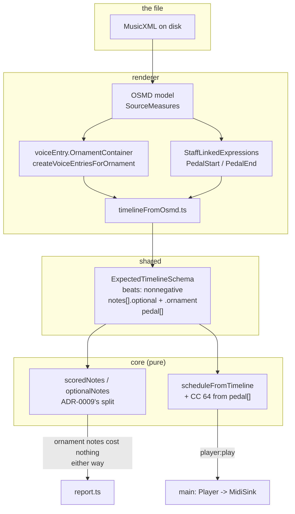

# 0010 — The timeline tells the truth about the page

> **Status:** draft
> **Created:** 2026-09-11
> **Owner skill(s):** dev, human
> **Related ADRs:** [0018](../adrs/0018-the-timeline-carries-the-page-ornaments-expanded-pedal-as-its-own-track.md)
> (proposed) is this plan's whole design — it amends
> [0005](../adrs/0005-the-expected-note-timeline-is-extracted-from-osmds-model.md) (accepted),
> which stays the rule that there is one parse and OSMD owns it;
> [0009](../adrs/0009-an-ornament-is-optional-a-grace-note-is-scored-neither-way.md) (accepted) is
> the scoring mechanism this plan gives a second producer;
> [0007](../adrs/0007-playback-is-a-schedule-built-in-core-and-clocked-by-main-behind-a-midisink.md)
> (accepted) is what emits the pedal
> **NFRs claimed:** none new. NFR 12 and 13 must be unchanged, and are re-reported.
> **Depends on:** nothing in flight. It touches `ExpectedTimeline`, which Plan
> [0009](0009-a-bar-is-judged-note-by-note.md) also reads — see `## Risks & open questions` for the
> one field they could collide on.

## TL;DR

Two things that are broken today stop being broken. A real score — BWV 555, where the Prelude ends
and the Fugue begins on an empty carrier bar — can be played at all, instead of being refused by a
schema that insists every bar has length. And a bar with a turn over it stops being marked **wrong
for being played correctly**: the ornament is expanded into the notes it means, using OSMD's own
realisation, and those notes are scored neither way, exactly as ADR-0009 already treats a grace
note. On top of that the piece finally plays with its pedal, because the timeline gains somewhere
for a pedal mark to live. The player's side of it: put a piece with ornaments on the stand, press
Play, and hear the piece; then play it yourself, ornaments and all, and see green.

## Context & problem

Plan 0004's Phase 7 was the first time a real, un-fixtured piece went through the whole path at the
instrument, and it found two defects that every fixture in this repository had agreed to hide.

**`player:play` was refused by Zod for BWV 555.** `bars[25].beats` is `0`;
`ExpectedBarSchema` demands `z.number().positive()`. Measure 25 contains only an `<attributes>`
element — no notes, no rests — the carrier bar where the metre changes. OSMD reports
`Duration.RealValue` of 0 and `renderer/score/timelineFromOsmd.ts:45` maps it straight through.

Two things make it worth more than one file. **`barTableProblems` cannot catch it**: it checks only
that `onset + beats` equals the next bar's `onset`, and a zero-length bar is perfectly contiguous.
And **the timeline is schema-checked only when it crosses IPC for playback** — the practice path
builds it in the renderer and validates nothing — so this score practises fine and only fails to
play. That asymmetry is why it survived until a piece was played at the piano.

**A symbol ornament is a live scoring bug, and ADR-0009 does not cover it.** That ADR made an
ornament optional and fixed one shape of ornament: the written-out grace note, which the extractor
reads as `voiceEntry.IsGrace`. A turn, trill or mordent is a **symbol over a principal note**. OSMD
puts it in `voiceEntry.OrnamentContainer`; the extractor has never looked at that property; the
timeline gets one note. A player who correctly realises the turn plays four or five notes where one
is expected, the surplus matches nothing, `report.ts` charges each as `extra`, and the bar goes
`wrong`. It is the failure ADR-0009 exists to prevent, alive by another route, and **ADR-0009's own
Context argues for fixing it**: "the repertoire Phase 7 exists to try is exactly the repertoire that
has ornaments".

**The blind spot that hid it is still open, verified 2026-09-11.** No fixture score contains a
`<turn>`, `<trill-mark>` or `<mordent>`. The corpus gained `grace-note.musicxml` for ADR-0009 and
that file holds `<grace slash="yes"/>` — the case that was fixed. Its own header comment reads
"real repertoire is full of ornaments"; the symbol form was never added, so this path is exercised
by nothing, exactly as the grace path was not.

**And Phase 7 item 3 asked for pedal that a score cannot carry.** The item wants a piece to play
"with the sustain pedal messages included"; `ExpectedTimeline` has no pedal concept, so
`scheduleFromTimeline` emits only `noteOn` and `noteOff`. The user reported hearing pedal work from
a score anyway, and the likeliest explanation is their own foot — the CK88's pedal sustains whatever
the instrument is sounding, including notes the app just sent it, with no MIDI pedal involved.
**That explanation was never tested.** This plan tests it and then makes the item true as written.

## Decision

Extract what the page says, once, in the library that draws it — ADR-0018.

A **bar may be empty**: `beats` relaxes to non-negative, a zero-length bar stays indexed where the
score put it, and `barTableProblems` gains a line that names one rather than passing it silently.
An **ornament is expanded at extraction** by OSMD's own `createVoiceEntriesForOrnament`, and what it
expands into is flagged `optional` — the `grace` boolean generalises, so a realised trill and a
written-out grace note share ADR-0009's one scoring path while staying distinguishable through a new
`ornament` kind. **Pedal becomes its own track**, `pedal: PedalMark[]` read from OSMD's
`PedalStart` / `PedalEnd` expressions, because a press happens between notes and over rests and the
pedal-*up* belongs to no note at all; playback emits CC 64 from it and scoring ignores it entirely.

We rejected a parallel `marks[]` array, because it makes two consumers each implement what a turn
means — the shape of the bug being fixed — and we rejected pedal as a field on a note, because a
press over a rest has nowhere to live and the lift would be lost.

Dynamics and fingering stay out, by ADR-0018 and by ADR-0005's still-standing tempo-free,
dynamics-free premise.

## Architecture diagram



## Implementation phases

### Phase 1 — A score with a turn in it, and the bug on screen
- **Owner skill:** dev
- **What:** The missing fixture, and the failure made visible before anything is fixed: a score
  whose bar carries a `<turn>`, imported and drawn, whose timeline holds one note where the page
  says four.
- **Files touched:** `core/fixtures/scores/ornaments.musicxml`,
  `core/fixtures/scores/ornaments.timeline.json`, `e2e/score.spec.ts`
- **Notes for the implementer:** Hand-write the MusicXML rather than fetching one; it needs to be
  small and legible, in the shape of the existing fixtures. Put a `<trill-mark>`, a `<turn>` and a
  `<mordent>` in it, on separate principal notes, and an accidental under one of them
  (`<accidental-mark>`), because `OrnamentContainer.AccidentalBelow` is a property this plan will
  later have to honour and a fixture that never exercises it proves nothing. Keep the rest of the
  bar plain. Commit the timeline it produces **as it is today**, wrong: one note per ornament. That
  committed file is the before-picture, and Phase 3 is what changes it. The e2e case follows
  "each fixture score imports and draws" exactly.
- **Done when:** `ornaments.musicxml` imports and draws in the app like every other fixture, and
  the committed `ornaments.timeline.json` shows **one** expected note under each of the three
  ornament symbols — the defect, asserted, so that the next phases cannot claim a fix that is not
  one. `npm run gate` is green.

### Phase 2 — A bar may be empty
- **Owner skill:** dev
- **What:** A score with an attributes-only measure plays instead of being refused.
- **Files touched:** `shared/score.ts`, `core/src/score/timeline.ts`,
  `core/src/score/timeline.test.ts`, `core/fixtures/scores/empty-carrier-bar.musicxml`,
  `core/fixtures/scores/empty-carrier-bar.timeline.json`, `e2e/player.spec.ts`
- **Notes for the implementer:** `beats: z.number().positive()` becomes `z.number().nonnegative()`,
  and that is the whole schema change. Before relaxing it, **read every consumer of `beats` and
  confirm the claim this rests on**: they all use it additively as `onset + beats`
  (`core/src/midi/perturb.ts`, `core/src/player/schedule.ts`, three sites in
  `core/src/score/timeline.ts`) and alignment does not read it at all. If any site divides by it,
  stop and say so — that changes the design, not the implementation. `barTableProblems` gains a
  problem string naming a zero-length bar; it is a **report, not a refusal**, so the bar stays
  legal and stays indexed. `noteBarProblems` already does the right thing by construction: a note
  claiming a zero-length bar fails `note.onset >= bar.onset + bar.beats` and is flagged. The
  fixture is an attributes-only measure between two real ones, the minimal reproduction of BWV
  555's carrier bar.
- **Done when:** A timeline whose middle bar has `beats: 0` parses, and `barTableProblems` returns
  a string naming that bar while reporting no contiguity break. The bar table stays indexed with no
  index skipped across the empty bar. End to end: `empty-carrier-bar` imports and a bar range
  spanning the empty bar plays the notes on both sides of it, where today `player:play` is refused.
  `npm run gate` is green.

### Phase 3 — A turn is played, and costs nothing to play
- **Owner skill:** dev
- **What:** Ornaments expand at extraction into optional notes, so the demonstration plays them and
  the scorer charges nobody for them.
- **Files touched:** `shared/score.ts`, `renderer/score/timelineFromOsmd.ts`,
  `renderer/score/timelineFromOsmd.test.ts`, `core/src/score/timeline.ts`,
  `core/src/score/timeline.test.ts`, `core/src/align/onsetGroups.ts`,
  `core/src/align/onsetGroups.test.ts`, `core/src/align/report.test.ts`,
  `core/src/score/timelineFromMidi.ts`, `core/fixtures/scores/*.timeline.json`,
  `core/fixtures/playback/sampler.timeline.json`, `e2e/score.spec.ts`
- **Notes for the implementer:** Two changes, in this order. **First the rename**: `grace: boolean`
  becomes `optional: boolean`, and a sibling `ornament: OrnamentKind | null` is added, `null` for a
  written-out grace note. Regenerate all six committed timelines; the e2e case "the committed
  timelines still match what the app extracts" is what proves the regeneration was mechanical.
  `graceNotes` becomes `optionalNotes` and `scoredNotes` filters on `!note.optional` — the split
  itself does not move, and `onsetGroups` keeps attaching optional pitches to the group they
  decorate exactly as it does now (ADR-0009). **Then the expansion**: read
  `voiceEntry.OrnamentContainer`, and when it is present call OSMD's own
  `VoiceEntry.createVoiceEntriesForOrnament(entry, activeKey)` rather than realising the ornament
  yourself — ADR-0018 is explicit that the realisation belongs to the library that owns the parse.
  The active key is available from the measure's key instruction the extractor already walks. The
  principal note keeps `optional: false`; everything the expansion adds is `optional: true` with the
  kind set. `timelineFromMidi.ts` has no ornaments to read and only needs the field rename.
  **Do not touch `report.ts`**: if this works, it works because `scoredNotes` never saw the notes.
- **Done when:** For `ornaments.musicxml`, the timeline holds the realised pitches of the trill, the
  turn and the mordent, the principal notes are `optional: false` and every added note is
  `optional: true` with its `ornament` kind set. **The behavioural claim, asserted over the
  aligner:** a generated take that plays the turn out in full and a generated take that plays only
  the principal note both report that bar clean — no `extra`, no `missing` — which is the bug in
  `## Context & problem` stated as a test. The accidental under the mordent reaches the realised
  pitch, so `AccidentalBelow` is exercised rather than assumed. All six previously committed
  timelines differ **only** by the field rename. `npm run gate` is green.

### Phase 4 — The pedal goes down
- **Owner skill:** dev
- **What:** The timeline carries pedal marks and playback sends CC 64 from them.
- **Files touched:** `shared/score.ts`, `renderer/score/timelineFromOsmd.ts`,
  `renderer/score/timelineFromOsmd.test.ts`, `core/src/player/schedule.ts`,
  `core/src/player/schedule.test.ts`, `core/fixtures/scores/pedal.musicxml`,
  `core/fixtures/scores/pedal.timeline.json`, `e2e/player.spec.ts`
- **Notes for the implementer:** `pedal: PedalMark[]` on the timeline, each `{ at, down, staff }`
  with `at` in quarter notes like every other onset in the file. Read
  `SourceMeasure.StaffLinkedExpressions[][]`, take `PedalStart` and `PedalEnd` from each
  `MultiExpression`, and use its `AbsoluteTimestamp` through the same `quarters()` conversion the
  extractor already applies to notes and measures — do not invent a second conversion.
  `scheduleFromTimeline` emits `cc` events with controller 64, value 127 for a press and 0 for a
  lift, interleaved into the ordered event list by `at`. A bar range that starts under a held pedal
  **must press it at the range's start**, or a demonstration of bars 9 to 12 sounds dry where the
  piece is wet; work that out from the marks before the range rather than leaving it to chance. The
  panic path already lifts sustain on every channel it touched (ADR-0007) and needs no change —
  confirm that by test rather than by reading. Scoring must not learn about `pedal[]` at all.
- **Done when:** For `pedal.musicxml`, the timeline's `pedal[]` holds a down at the marked beat and
  an up at the release, and `scheduleFromTimeline` produces CC 64 events at the matching
  milliseconds, ordered correctly against the note-ons around them. A bar range beginning inside a
  pedalled span opens with a CC 64 press. Stopping mid-span still lifts sustain on every channel
  touched. End to end: playing `pedal.musicxml` produces the CC 64 events in the renderer's
  `player:event` stream. NFR 13's property is unchanged — nothing dropped, nothing reordered,
  nothing left sounding. `npm run gate` is green.

### Phase 5 — At the piano
- **Owner skill:** human
- **What:** The two answers no generated run can give: whether the expanded ornament sounds like
  music, and whether a score's pedal messages actually reach the CK88.
- **Files touched:** the plan's implementation log
- **Done when:** all of the following are recorded in the log:
  1. **The discriminating pedal run, which Plan 0004 Phase 7 owed and did not do.** Play a score
     **with your foot off the pedal**, before and after this plan. Before: does it sustain? That
     answers whether the sustain you heard on 2026-09-11 was the app or your own foot, and it is a
     minute's work that has been carried as unexplained for a plan.
  2. A score with pedal marks plays with them, foot off the pedal, and sounds musically right —
     wet where the page says wet, dry where it says dry. The user's judgement; this is what the
     item exists for.
  3. **The ornament, judged as music.** A piece with a trill and a turn plays back. OSMD picks one
     realisation — how many notes a trill gets, whether a turn starts on the note or above — and
     ADR-0018 accepts inheriting that choice. Is the realisation good enough to demonstrate from,
     or misleading? A "no" for a specific ornament kind is a finding to record, and the response
     named in that ADR is to stop expanding **that kind**, never to write our own realiser.
  4. Play the ornamented bar yourself, once realising the ornament and once plainly, and confirm
     the bar reads clean both ways at the instrument — the Phase 3 assertion, felt rather than
     generated.

## Data shapes

```ts
// illustrative — the Zod schemas in shared/score.ts are what is real

type OrnamentKind =
  | 'trill' | 'turn' | 'invertedTurn' | 'delayedTurn'
  | 'delayedInvertedTurn' | 'mordent' | 'invertedMordent'

type ExpectedNote = {
  midi: number
  onset: number
  duration: number
  bar: number
  staff: number
  voice: number
  tied: boolean
  /** Scored neither way (ADR-0009). Was `grace`; now also every note an
   *  ornament expanded into. */
  optional: boolean
  /** Which symbol produced this note, or null for a written-out grace note
   *  and for every ordinary note. */
  ornament: OrnamentKind | null
}

/** A sustain change at a point in the score. Not a note, and not a property
 *  of one: a press happens between notes and over rests, and the lift is the
 *  half that decides whether a chord blurs into the next. */
type PedalMark = { at: number; down: boolean; staff: number }

type ExpectedTimeline = {
  scoreId: string
  notes: ExpectedNote[]
  /** `beats` may now be 0: an attributes-only measure is a real bar with no
   *  length, and it keeps its index. */
  bars: ExpectedBar[]
  pedal: PedalMark[]
}
```

## Risks & open questions

- **OSMD's realisation may be musically wrong for a given ornament**, and we inherit it by
  decision. Phase 5 item 3 is the check. The response is to stop expanding that kind, which is a
  one-line filter, not to build a realiser — ADR-0018 is explicit and this plan does not reopen it.
- **`createVoiceEntriesForOrnament` may behave differently than its signature suggests** — it is
  an instance method on `VoiceEntry` in OSMD 2.1.2's typings and its use inside OSMD is for
  playback, not for our extraction path. If it throws, returns empty, or needs state the extractor
  does not have, **Phase 3 stops and says so**: the fallback is to mark the principal note's group
  as accepting surplus without expanding, which fixes the scoring bug and not the demonstration,
  and that is a design change for the architect rather than an improvisation.
- **The field rename collides with Plan 0009 if both are in flight.** That plan is parked and works
  in `core/src/align/`, which reads `scoredNotes` rather than the field; the collision is one
  identifier, not a design conflict. Whichever lands second rebases over the rename. **Do not run
  these two in parallel worktrees** without agreeing that first.
- **The practice path still validates nothing.** This plan fixes the defect that asymmetry hid; it
  does not fix the asymmetry. A timeline built in the renderer for practice is still unchecked, so
  the next extractor bug will again surface on one path out of two. Named as a followup rather than
  widened into here, because parsing it on the practice path costs NFR 12 turnaround and wants its
  own measurement.
- **Fixture churn hides regressions if it is not mechanical.** Six committed timelines change in
  Phase 3. The e2e case that pins them is the guard, and the done-when says the diff must be *only*
  the rename — a timeline whose onsets moved during a rename is a bug, not a regeneration.
- **Offline and latency are untouched.** No new dependency (NFR 9), no network, nothing added to
  the MIDI-in path. NFR 12 and 13 are re-reported from the gate run rather than claimed.

## What this plan does NOT do

- **No dynamics.** A hairpin reaching velocity amends ADR-0005's tempo-free, dynamics-free premise
  and needs its own ADR. Playback's fixed velocity of 72 stands.
- **No fingering.** OSMD already draws it; it changes neither what is played nor how it is judged.
  It enters the data the day the coach comments on it.
- **No articulation** — staccato, accent, slur. `VoiceEntry` exposes them and this plan deliberately
  reads none: they change how a note is *played*, which is a scoring question this model has no
  vocabulary for yet.
- **No validation on the practice path.** See the risk above.
- **Nothing about how an ornament is drawn.** Plan 0007 owns glyphs, and ADR-0018 records the one
  obligation this plan hands it: an expanded ornament note has no notehead of its own.

## Implementation log

> Written by `dev`, one row per phase as that phase's commit lands, and the close block after the
> last one. **The phases above are the contract; everything here is what happened.**
> Observations, never conclusions. A deviation from the plan or an unmet done-when is always
> disclosed. Stays shorter than `## Implementation phases`.

**Lane:** _(`main` directly, or the worktree path plus its branch)_

| phase | owner | state | commit |
|---|---|---|---|
| 1 — A score with a turn in it, and the bug on screen | dev | not started | |
| 2 — A bar may be empty | dev | not started | |
| 3 — A turn is played, and costs nothing to play | dev | not started | |
| 4 — The pedal goes down | dev | not started | |
| 5 — At the piano | human | not started | |

### Measurements

_(NFR 12 and 13 re-reported from the gate run; no new row is claimed)_

### Notes

_(deviations, unmet done-whens, followups noticed and not acted on; one line each)_

### Close triggers

- **What shipped:** _(feature / fix-only / docs-chore-only)_
- **User-visible docs touched:** _
- **Full gate at the last phase:** _
- **Outstanding `human` phases:** _

## Followups (after this lands)

- **Validate the timeline on the practice path too**, or decide deliberately that it stays
  unchecked there. The asymmetry that hid the zero-beats bug is still present.
- **Dynamics**, as an ADR amending ADR-0005 — the first sign that changes a *number* rather than a
  set of notes.
- **Articulation**, once there is a scoring vocabulary for how a note was played rather than
  whether it was.
- **A trill's realisation as a setting**, if Phase 5 item 3 finds OSMD's choice misleading for one
  kind rather than all of them.
- **Over-pedalling as an observation.** The timeline now knows where the pedal should lift; a take
  knows where it did. Nothing compares them, and the coach would have something to say if it could.
