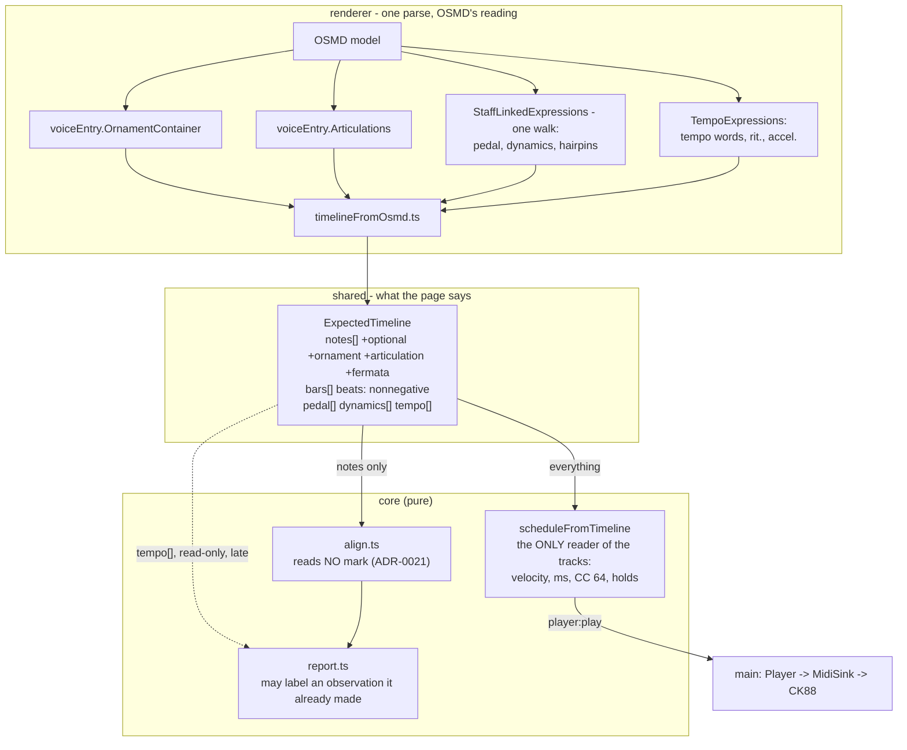

# 0010 — The timeline tells the truth about the page

> **Status:** in-progress 2026-09-11
> **Created:** 2026-09-11
> **Amended:** 2026-09-11, after Phase 3 stopped: the old Phase 3 is now Phases 3 and 4, and the
> later phases renumber by one. Amended again the same day after Phase 7 stopped on OSMD's tempo
> reading: a ramp is a word, a direction and a span, and `core/` sizes it. Phase 7 is rewritten.
> Both amendments are at the end of `## Decision`.
> **Owner skill(s):** dev, human
> **Related ADRs:** [0018](../adrs/0018-the-timeline-carries-the-marks-on-the-page.md) (proposed)
> decides what the timeline extracts and in what shape;
> [0021](../adrs/0021-expression-belongs-to-playback-scoring-only-describes-it.md) (proposed)
> decides who may act on it and is what keeps the aligner tempo-free. Together they are this plan's
> whole design, and they amend
> [0005](../adrs/0005-the-expected-note-timeline-is-extracted-from-osmds-model.md) (accepted),
> which stays the rule that there is one parse and OSMD owns it.
> [0009](../adrs/0009-an-ornament-is-optional-a-grace-note-is-scored-neither-way.md) (accepted) is
> the scoring mechanism this plan gives a second producer, and whose subtraction ADR-0018 now
> narrows so that an optional pitch forgives only a surplus strike;
> [0007](../adrs/0007-playback-is-a-schedule-built-in-core-and-clocked-by-main-behind-a-midisink.md)
> (accepted) owns the schedule that all of it reaches the instrument through;
> [0014](../adrs/0014-timing-is-judged-against-a-local-tempo-not-one-line-through-the-take.md)
> (accepted) is what Phase 9's annotation labels and must not disturb
> **NFRs claimed:** none new. NFR 12, 13 and **14** must be unchanged, and are re-reported — NFR 14
> in particular, because this plan is the one that could break tempo-freedom.
> **Depends on:** nothing in flight. It touches `ExpectedTimeline`, which Plan
> [0009](0009-a-bar-is-judged-note-by-note.md) also reads — see `## Risks & open questions` for the
> one field they could collide on.

## TL;DR

The app stops reading the page and starts reading the music. Two things that are broken today stop
being broken — a real score whose metre-change carrier bar has no length can be played at all, and
a bar with a turn over it stops being marked **wrong for being played correctly**. And the
demonstration stops being a MIDI file read aloud: a piece plays with its dynamics, its hairpins, its
pedal, its ornaments, its fermatas and its changes of tempo, every one of them read from OSMD's own
interpretation rather than invented here. Playback gets all of it; **the aligner gets none of it**,
which is the line ADR-0021 draws and the reason practising a study at half speed is still playing it
correctly. The one thing scoring gains is a better sentence: where the report already says you
slowed, it may now say you slowed *where the score asks you to*.

## Context & problem

Plan 0004's Phase 7 was the first time a real, un-fixtured piece went through the whole path at the
instrument, and it found two defects that every fixture in this repository had agreed to hide.

**`player:play` was refused by Zod for BWV 555.** `bars[25].beats` is `0`; `ExpectedBarSchema`
demands `z.number().positive()`. Measure 25 contains only an `<attributes>` element — no notes, no
rests — the carrier bar where the metre changes. OSMD reports `Duration.RealValue` of 0 and
`renderer/score/timelineFromOsmd.ts:45` maps it straight through.

Two things make it worth more than one file. **`barTableProblems` cannot catch it**: it checks only
that `onset + beats` equals the next bar's `onset`, and a zero-length bar is perfectly contiguous.
And **the timeline is schema-checked only when it crosses IPC for playback** — the practice path
builds it in the renderer and validates nothing — so this score practises fine and only fails to
play. That asymmetry is why it survived until a piece was played at the piano.

**A symbol ornament is a live scoring bug, and ADR-0009 does not cover it.** That ADR made an
ornament optional and fixed one shape of ornament: the written-out grace note, which the extractor
reads as `voiceEntry.IsGrace`. A turn, trill or mordent is a **symbol over a principal note**. OSMD
puts it in `voiceEntry.OrnamentContainer`; the extractor has never looked at that property; the
timeline gets one note. A player who correctly realises the turn plays four or five notes where one
is expected, the surplus matches nothing, `report.ts` charges each as `extra`, and the bar goes
`wrong`. It is the failure ADR-0009 exists to prevent, alive by another route, and **ADR-0009's own
Context argues for fixing it**: "the repertoire Phase 7 exists to try is exactly the repertoire that
has ornaments".

**The blind spot that hid it is still open, verified 2026-09-11.** No fixture score contains a
`<turn>`, `<trill-mark>` or `<mordent>`. The corpus gained `grace-note.musicxml` for ADR-0009 and
that file holds `<grace slash="yes"/>` — the case that was fixed. Its own header comment reads
"real repertoire is full of ornaments"; the symbol form was never added, so this path is exercised
by nothing, exactly as the grace path was not.

**And then the user asked for the rest of it.** On 2026-09-11, having watched playback work: the app
should play the music *as written* — its dynamics, its changes of tempo, its ornaments — and send
pedal if it can. Today **every note is velocity 72** and the tempo comes from a box in the transport.
A demonstration of a nocturne and a demonstration of a scale exercise are, to the ear, the same
performance at different pitches. Phase 7 item 3 of Plan 0004 had already asked for pedal the score
could not carry; that item was mis-specified against a timeline with nowhere to put one.

**The whole list is on OSMD's model, already interpreted.** This is what makes the plan affordable,
and ADR-0018 turns on it:

| Mark | Where | What OSMD decides for us |
|---|---|---|
| Ornaments | `voiceEntry.OrnamentContainer` | `createVoiceEntriesForOrnament` realises it with the key applied, and a trill's above-accidental; its timestamps are aliased and are captured (Phase 4) |
| Pedal | `MultiExpression.PedalStart` / `.PedalEnd` | start and end at an `AbsoluteTimestamp` |
| Dynamics | `MultiExpression.InstantaneousDynamic` | `MidiVolume` — the pp-to-ff mapping already exists |
| Hairpins | `.StartingContinuousDynamic` / `.EndingContinuousDynamic` | the span and its end dynamic |
| Tempo words | `MultiTempoExpression.InstantaneousTempo` | a default bpm for each word, Larghissimo to Prestissimo, and metronome marks |
| rit. / accel. | either tempo class, depending on the spelling | that the word is a tempo change, and which way. **Not its size**: in 2.1.2 `rit.` reads as an instantaneous tempo of 0 bpm (amended after Phase 7) |
| Articulation, fermata | `voiceEntry.Articulations` | a 28-value enum including `staccato`, `tenuto`, `accent`, `fermata` |

Pedal, dynamics and hairpins hang off the **same** `MultiExpression` objects, so they are one
traversal rather than three. **We write no interpreter** — no turn-realiser, no pp-to-velocity
table, no value for a tempo word. The one number this plan owns is the size of a ramp, which the
page never gives (amended after Phase 7).

**The danger is entirely on the scoring side**, and it is not hypothetical. The aligner is
tempo-free by construction and four ADRs protect that: ADR-0005 makes onsets quarter notes, ADR-0009
refused to let a grace note consult a clock, ADR-0010 preserved it, ADR-0012 kept click-relative
scoring strictly beside it, and ADR-0014 fits tempo from the take's own neighbours. NFR 14 states
the property and `README.md` states it to the player. Let the page's tempo reach `align.ts` and a
learner working a study at half speed — the correct way to work a study — opens the app to find
every bar red. **ADR-0021 is the line, and this plan is where it is either held or lost.**

## Decision

Extract the marks once, in the library that draws them (ADR-0018); let playback use all of them and
the aligner none of them (ADR-0021).

**A bar may be empty.** `beats` relaxes to non-negative, a zero-length bar stays indexed where the
score put it, and `barTableProblems` gains a line that names one rather than passing it silently.

**Marks enter by one of three routes, decided by what kind of thing each is.** An **ornament** is
note-generating and ambiguous, so it is expanded at extraction by OSMD's own realiser and flagged
`optional` — the `grace` boolean generalises, so a realised trill and a written-out grace note share
ADR-0009's one scoring path while staying distinguishable through a new `ornament` kind.
**Articulation and fermata** are properties of a note and ride the note. **Pedal, dynamics,
hairpins and tempo** span or sit between notes, so each gets its own track holding what the page
says rather than a resolved number — a `DynamicMark` says "forte here", not "velocity 88 on these
nineteen notes".

**The arithmetic happens once, in `core/`, at schedule time.** `scheduleFromTimeline` resolves a
dynamic to a velocity, interpolates a hairpin, converts a tempo mark and a rit. curve into
milliseconds, holds a fermata and shortens a staccato. It is a pure function with fixture tests and
the only consumer of those tracks.

**The written tempo is playback's default; the transport's box overrides it**, preserving the
relative shape underneath, because "demonstrate this passage slowly" is the most useful thing a
demonstration does and Plan 0005 depends on it.

**Scoring reads none of it**, and may only annotate an observation it has already made: where the
report says the player slowed and the page asks for a rallentando there, the prose may say so. It
never creates an observation, never changes a verdict or a colour, and never reports the absence of
observance.

We rejected one undifferentiated `marks[]` array, because it makes each consumer re-derive what kind
of thing a mark is and lets one silently ignore them; we rejected resolving dynamics and tempo to
per-note numbers at extraction, because once *forte* is velocity 88 nothing can say the score asked
for forte; and we rejected judging expression, which would put `align.ts` on a clock and grade the
CK88's velocity curve rather than the playing.

Fingering stays out: OSMD draws it, and it changes neither what is played nor how it is judged.

**Amended 2026-09-11, after Phase 3 stopped.** `dev` found that OSMD 2.1.2's
`createVoiceEntriesForOrnament` returns aliased timestamps and, for the mordent, aliased lengths,
and that its realisation always re-emits the principal's pitch. Reading the aligner turned up two
more faults in the phase as written. Five rulings follow, and the user took the first and the
last:

1. **The rhythm is captured, not repaired.** OSMD's values are correct at the moment each
   generated entry is built; the aliasing corrupts them afterwards. The extractor wraps the two
   builders on the one `VoiceEntry` for the duration of the call and records each entry's
   timestamp and length as numbers when they are made. All seven kinds come out as OSMD intended,
   and we choose no rhythm. Transcribing OSMD's intended fractions into a table of ours was
   rejected, because it is the realiser ADR-0018 refuses to own.
2. **An optional pitch forgives only a surplus strike.** ADR-0009 subtracts optional pitches from
   what was played *before* the comparison. That is sound only while an ornament shares no pitch
   with its group, and an OSMD realisation always shares one: a turn on A4 makes A4 optional, and a
   player who plays the A4 plainly has it subtracted and reported `missing`. The rule becomes:
   subtract the scored pitches first, then forgive what is left over only where it is optional.
   The result is identical to today whenever optional and scored pitches are disjoint, and it
   fixes a latent ADR-0009 defect on the way: a grace note that repeats a chord tone.
3. **A realised note attaches backwards.** A grace note anticipates its principal, so it joins the
   first group at or after it (ADR-0009). A realised ornament note sounds *within* its principal,
   after that note's onset, so it joins the last group at or before its own onset. Otherwise it
   would be forgiven on the next beat.
4. **The principal stays scored and stops sounding.** It keeps `optional: false` and its written
   length, and it carries the ornament's kind. Playback and the take generator sound its
   realisation in its place. Sounding both would restrike a key that is already held.
5. **The old Phase 3 is split in two.** Phase 3 is the rename and the two scoring rules, proven on
   hand-built timelines. Phase 4 is the extraction, the playback and the fixture-level
   behavioural claim.

**Amended 2026-09-11, after Phase 7 stopped.** `dev` found that OSMD 2.1.2 resolves only one of
the fixture's four tempo marks to a usable number, the metronome mark. The architect read the
bundled source. The reader tests a word against the *instantaneous* list first, and that list's
"tempo changes general" entry holds `rit.`, `a tempo`, `tempo primo` and `accel` without its full
stop. Such a word takes its bpm from `<sound tempo>`, which is 0 when absent. OSMD's own playback
cursor skips a 0, but `TemposCalculator` carries it forward as the running tempo, so every ramp
after it starts and ends at 0. `accel.` with its full stop does become a ramp, but its type stays
unset because `setTempoType` compares the label without stripping the stop. And a ramp's size is a
fixed fraction of its start tempo, scaled by its span, through a `getTempoFactor()` that always
returns 1. A word such as `Allegro` does get a usable default (130). The user took the ruling:

6. **OSMD decides what is a tempo mark. Where the page gives a number, OSMD's number is the
   number.** That covers a metronome mark and a word OSMD gives a positive bpm, whether from
   `<sound tempo>` or from its defaults.
7. **A ramp is a word, a direction and a span, and `core/` sizes it.** The page never says how
   much a *rit.* slows, just as it never says how long a fermata holds. The plan already accepts a
   named taste constant for the fermata, and a ramp gets the same treatment: `RAMP_CHANGE`, in
   `core/`, which Phase 10 tunes. The extractor considers only marks OSMD itself placed in
   `TempoExpressions`, whichever class it put them in. It reads direction from a small table of
   unambiguous ramp words, and a test holds that table to OSMD's own slower and faster lists. A
   ramp runs to the next mark read, or to the end of the piece.
8. **`a tempo` and `tempo primo` are read, as returns.** Reading a *rit.* without the return that
   ends it would leave the rest of the piece slow.
9. **The earlier ruling on `getTempoFactor()` is superseded.** It kept OSMD's size and span and
   took only the direction from the type. OSMD's size is no longer read at all, nor its span.

Rejected: **recomputing OSMD's ramp with the running tempo repaired.** For `rit.`, which OSMD never
made a ramp, that means transcribing its span rule (`TempoChangeMeasureValidity`, and the breaks at
a final barline or a repeat). That is ADR-0018's Alternative D in another place: OSMD's internals,
copied, drifting silently on an upgrade. Also rejected: **reading no ramps**, which leaves a
demonstration that steps between tempos and never phrases, and that is the phase's reason to exist.

## Architecture diagram



## Implementation phases

### Phase 1 — A score with a turn in it, and the bug on screen
- **Owner skill:** dev
- **What:** The missing fixture, and the failure made visible before anything is fixed: a score
  whose bar carries a `<turn>`, imported and drawn, whose timeline holds one note where the page
  says four.
- **Files touched:** `core/fixtures/scores/ornaments.musicxml`,
  `core/fixtures/scores/ornaments.timeline.json`, `e2e/score.spec.ts`
- **Notes for the implementer:** Hand-write the MusicXML rather than fetching one; it needs to be
  small and legible, in the shape of the existing fixtures. Put a `<trill-mark>`, a `<turn>` and a
  `<mordent>` in it, on separate principal notes, and an accidental under one of them
  (`<accidental-mark>`), because `OrnamentContainer.AccidentalBelow` is a property this plan will
  later have to honour and a fixture that never exercises it proves nothing. Keep the rest of the
  bar plain. Commit the timeline it produces **as it is today**, wrong: one note per ornament. That
  committed file is the before-picture, and Phase 4 is what changes it. The e2e case follows
  "each fixture score imports and draws" exactly.
- **Done when:** `ornaments.musicxml` imports and draws in the app like every other fixture, and
  the committed `ornaments.timeline.json` shows **one** expected note under each of the three
  ornament symbols — the defect, asserted, so that the next phases cannot claim a fix that is not
  one. `npm run gate` is green.

### Phase 2 — A bar may be empty
- **Owner skill:** dev
- **What:** A score with an attributes-only measure plays instead of being refused.
- **Files touched:** `shared/score.ts`, `core/src/score/timeline.ts`,
  `core/src/score/timeline.test.ts`, `core/fixtures/scores/empty-carrier-bar.musicxml`,
  `core/fixtures/scores/empty-carrier-bar.timeline.json`, `e2e/player.spec.ts`
- **Notes for the implementer:** `beats: z.number().positive()` becomes `z.number().nonnegative()`,
  and that is the whole schema change. Before relaxing it, **read every consumer of `beats` and
  confirm the claim this rests on**: they all use it additively as `onset + beats`
  (`core/src/midi/perturb.ts`, `core/src/player/schedule.ts`, three sites in
  `core/src/score/timeline.ts`) and alignment does not read it at all. If any site divides by it,
  stop and say so — that changes the design, not the implementation. `barTableProblems` gains a
  problem string naming a zero-length bar; it is a **report, not a refusal**, so the bar stays
  legal and stays indexed. `noteBarProblems` already does the right thing by construction: a note
  claiming a zero-length bar fails `note.onset >= bar.onset + bar.beats` and is flagged. The
  fixture is an attributes-only measure between two real ones, the minimal reproduction of BWV
  555's carrier bar.
- **Done when:** A timeline whose middle bar has `beats: 0` parses, and `barTableProblems` returns
  a string naming that bar while reporting no contiguity break. The bar table stays indexed with no
  index skipped across the empty bar. End to end: `empty-carrier-bar` imports and a bar range
  spanning the empty bar plays the notes on both sides of it, where today `player:play` is refused.
  `npm run gate` is green.

### Phase 3 — An ornament costs nothing, whatever pitch it shares
- **Owner skill:** dev
- **What:** The rename, the `ornament` field, and the two scoring rules a realised ornament needs,
  proven on hand-built timelines before any OSMD code is written. A latent ADR-0009 defect is
  fixed on the way: a grace note that repeats a pitch its group already scores.
- **Files touched:** `shared/score.ts`, `core/src/score/timeline.ts`,
  `core/src/score/timeline.test.ts`, `core/src/score/timelineFromMidi.ts`,
  `core/src/align/onsetGroups.ts`, `core/src/align/onsetGroups.test.ts`, `core/src/align/align.ts`,
  `core/src/align/align.test.ts`, `core/src/align/report.ts`, `core/src/align/report.test.ts`,
  `core/src/align/restarts.test.ts`, `core/src/midi/generate.ts`, `core/src/player/schedule.ts`,
  `core/src/player/schedule.test.ts`, `renderer/score/timelineFromOsmd.ts`,
  `renderer/score/timelineFromOsmd.test.ts`, `renderer/hooks/usePracticeReport.test.ts`,
  `electron/score/midiImport.test.ts`, `core/fixtures/scores/*.timeline.json`,
  `core/fixtures/playback/sampler.timeline.json`, `e2e/score.spec.ts`. The list is every file
  `git grep grace` found on 2026-09-11; a site outside it is a stop, as usual.
- **Notes for the implementer:** Three changes, in this order.
  **The rename.** `grace: boolean` becomes `optional: boolean`, and a sibling
  `ornament: OrnamentKind | null` is added. The field is `null` everywhere in this phase, because
  nothing expands yet. `graceNotes` becomes `optionalNotes`; `scoredNotes` filters on
  `!note.optional`. In `schedule.ts` and `generate.ts` the change is the rename and nothing else,
  because their behaviour for a realised ornament is Phase 4's. Regenerate every committed timeline.
  **The forgiveness rule** (amendment item 2). An optional pitch forgives a struck pitch only once
  the group's scored pitches have been taken out of the struck set, so it can excuse a surplus
  strike and never a scored one. Every site that computes what was *heard* for accounting uses
  the new rule: `ornamentAwareDifference` and `matchSharesNothing` in `align.ts`, and `heard` at
  `report.ts:150`. Two sites keep the plain subtraction on purpose, because they ask whether a
  played group is *nothing but ornament*: the roll-cost count at `align.ts:256` and
  `arrivalTime`. A trill's repeated principal counts as ornament for the roll cost. The fallback in
  `arrivalTime` already yields the first group of a realised run, which is on the beat. Comment the
  split where it happens.
  **The attachment rule** (amendment item 3). A note with `ornament` set joins the last group at or
  before its own onset. A grace note (`ornament: null`) keeps ADR-0009's forward rule unchanged.
  Build every ornament test below by hand, in the test file. Phase 4 produces the same shapes from
  a real score.
- **Done when:**
  1. **The rename is mechanical.** Every committed timeline (the seven scores and
     `sampler.timeline.json`) differs from its previous version only by `grace` becoming `optional`
     and an added `ornament: null`, and the e2e case "the committed timelines still match what the
     app extracts" proves it.
  2. **The latent defect, written failing first.** A group scoring C4-E4-G4 with a grace E4 attached
     reports clean both when the chord is played plainly and when the grace is struck ahead of it.
     Under the old rule the plain chord reports E4 `missing`.
  3. **A hand-built turn.** The principal A4 has `optional: false` and `ornament: 'turn'`, with a
     length of one quarter. B4, A4, G4 and A4 follow at +0, +0.25, +0.5 and +0.75, each
     `optional: true`, `ornament: 'turn'`, a quarter of a quarter long. Then a plain C5. All four
     realised pitches attach to the principal's group and none to C5's. The realisation played in
     full, each strike its own played group, reports clean. The principal alone reports clean.
     **B4 alone where A4 is written reports A4 `missing`**, and B4 reaches no verdict. That last
     case proves the rule excuses the ornament and not the note.
  4. **A hand-built trill.** A G4 principal and eight realised notes, alternating G4 and A#4 at
     eighth-of-a-quarter steps, played in full with every strike its own group, reports clean.
     That is OSMD's eight-note trill exactly at the aligner's absorb bound
     (`MAX_ABSORBED_GROUPS`).
  5. **Nothing else moved.** Every existing test in `core/src/align/` passes with no edit beyond
     the rename. The existing `withoutOrnaments` cases, where optional and scored pitches are
     disjoint, are the proof that the new rule matches the old one there. Nothing this phase adds
     to `core/src/align/` reads a played note's time (NFR 14).
  6. `npm run gate` is green.

### Phase 4 — A turn is played, and costs nothing to play
- **Owner skill:** dev
- **What:** Ornaments expand at extraction into optional notes, so the demonstration plays them and
  the scorer charges nobody for them.
- **Files touched:** `renderer/score/timelineFromOsmd.ts`, `renderer/score/timelineFromOsmd.test.ts`,
  `core/fixtures/scores/ornaments.musicxml`, `core/fixtures/scores/ornaments.timeline.json`,
  `core/src/player/schedule.ts`, `core/src/player/schedule.test.ts`, `core/src/midi/generate.ts`,
  `core/src/midi/generate.test.ts`, `core/src/align/report.test.ts`, `e2e/score.spec.ts`
- **Notes for the implementer:** **The extraction** (amendment item 1). When
  `voiceEntry.OrnamentContainer` is present, call OSMD's own
  `createVoiceEntriesForOrnament(entry, activeKey)`, but first wrap its two private builders,
  `createBaseVoiceEntry` and `createAlteratedVoiceEntry`, **on that instance only**, for that one
  call. Each wrapper records the timestamp and the length it was handed, as numbers, and then
  calls through. Restore them in a `finally`. Never patch `VoiceEntry.prototype`. The typings
  declare both methods `private`, so reach them through one narrow cast, and name OSMD 2.1.2 and
  the aliasing in the comment above it. Pair the i-th record with the i-th returned entry's pitch.
  Convert timestamps to quarters with the same arithmetic the extractor already applies to note
  onsets; do not write a second conversion. The principal is `notes[0]` of the entry, the note OSMD
  realises; any other notes of that chord stay plain. **If the capture count differs from the
  returned count, or the captured notes do not tile the principal exactly, do not expand that
  ornament**, and leave its principal as a plain note with `ornament: null`. Never write a partial
  realisation. **The principal** (amendment item 4) keeps `optional: false` and its written onset
  and length, and takes the ornament's kind.
  **The fixture** gains a bar of its own, before the final bar, holding the four kinds it lacks:
  `<inverted-turn>`, `<delayed-turn>`, `<delayed-inverted-turn>` and `<inverted-mordent>`, one per
  quarter and with no accidentals. The capture claims all seven kinds, and a claim over kinds no
  fixture holds is the blind spot this plan was written against. The delayed turns are the case
  that proves the capture, since their first length is aliased as well.
  **Playback** does not sound a note whose `ornament` is set and which is not optional, because its
  realisation sounds in its place. It sounds each realised note at its own onset and length. The
  short grace length stays reserved for `optional && ornament === null`. **The generator**, when
  asked to take ornaments, replaces such a principal with its realisation at the realised onsets;
  a grace note keeps its lead. When ornaments are skipped, nothing changes.
- **Done when:**
  1. **The realisation is OSMD's, captured.** For `ornaments.musicxml`, every principal is
     `optional: false` with its kind, every realised note is `optional: true` with its kind, and
     every other note is `ornament: null`. Relative to the principal's onset: the trill on G4 is
     eight notes, alternating G4 and A#4, 0.125 quarters apart; the turn on A4 is B4, A4, G4, A4,
     0.25 apart; the mordent on B4 is B4, C5, B4 at +0, +0.25 and +0.5, with lengths 0.25, 0.25
     and 0.5. **For every ornament in the fixture, all seven kinds, the realised notes are
     contiguous from the principal's onset and end exactly at its end.** That property is what
     shows the capture read OSMD's intent rather than its aliased result.
  2. **The accidentals, as OSMD 2.1.2 treats them.** The trill's above-accidental reaches the
     sounding pitch (A#4, 70); the mordent's below-accidental does not (C5, 72). Both are asserted
     as the library's behaviour, the ruling taken at Phase 1.
  3. **The behavioural claim, over the aligner.** Generated takes of `ornaments.musicxml`, one with
     the ornaments taken and one with them skipped, both report every bar clean: no `extra`, no
     `missing`. That is the bug in `## Context & problem` stated as a test. **The same taken take
     against a copy of the timeline with its optional notes removed reports extras in the
     ornamented bars.** That is what shows the take really contains the ornaments and the first
     claim is not vacuous.
  4. **Playback plays the ornament, not the note under it.** The schedule's note-ons for the turn
     are B4, A4, G4 and A4 at the realised times, with no A4 held for the whole quarter. No pitch is
     struck while it is still sounding. The schedule stays ordered and balanced (ADR-0007).
  5. No committed timeline other than `ornaments.timeline.json` changes in this phase.
  6. `npm run gate` is green.

### Phase 5 — The pedal goes down
- **Owner skill:** dev
- **What:** The timeline carries pedal marks and playback sends CC 64 from them.
- **Files touched:** `shared/score.ts`, `renderer/score/timelineFromOsmd.ts`,
  `renderer/score/timelineFromOsmd.test.ts`, `core/src/player/schedule.ts`,
  `core/src/player/schedule.test.ts`, `core/fixtures/scores/pedal.musicxml`,
  `core/fixtures/scores/pedal.timeline.json`, `e2e/player.spec.ts`
- **Notes for the implementer:** `pedal: PedalMark[]` on the timeline, each `{ at, down, staff }`
  with `at` in quarter notes like every other onset in the file. Read
  `SourceMeasure.StaffLinkedExpressions[][]`, take `PedalStart` and `PedalEnd` from each
  `MultiExpression`, and use its `AbsoluteTimestamp` through the same `quarters()` conversion the
  extractor already applies to notes and measures — do not invent a second conversion.
  `scheduleFromTimeline` emits `cc` events with controller 64, value 127 for a press and 0 for a
  lift, interleaved into the ordered event list by `at`. A bar range that starts under a held pedal
  **must press it at the range's start**, or a demonstration of bars 9 to 12 sounds dry where the
  piece is wet; work that out from the marks before the range rather than leaving it to chance. The
  panic path already lifts sustain on every channel it touched (ADR-0007) and needs no change —
  confirm that by test rather than by reading. Scoring must not learn about `pedal[]` at all.
- **Done when:** For `pedal.musicxml`, the timeline's `pedal[]` holds a down at the marked beat and
  an up at the release, and `scheduleFromTimeline` produces CC 64 events at the matching
  milliseconds, ordered correctly against the note-ons around them. A bar range beginning inside a
  pedalled span opens with a CC 64 press. Stopping mid-span still lifts sustain on every channel
  touched. End to end: playing `pedal.musicxml` produces the CC 64 events in the renderer's
  `player:event` stream. NFR 13's property is unchanged — nothing dropped, nothing reordered,
  nothing left sounding. `npm run gate` is green.

### Phase 6 — The music gets louder and softer
- **Owner skill:** dev
- **What:** Dynamics and hairpins reach the instrument. The end of velocity 72.
- **Files touched:** `shared/score.ts`, `renderer/score/timelineFromOsmd.ts`,
  `renderer/score/timelineFromOsmd.test.ts`, `core/src/player/schedule.ts`,
  `core/src/player/schedule.test.ts`, `core/fixtures/scores/dynamics.musicxml`,
  `core/fixtures/scores/dynamics.timeline.json`, `e2e/player.spec.ts`
- **Notes for the implementer:** `dynamics: DynamicMark[]` on the timeline, each
  `{ at, velocity, label, staff, until, endVelocity }` with the last two set only for a hairpin.
  Read them from the **same `MultiExpression` walk Phase 5 already wrote** for pedal —
  `InstantaneousDynamic` for a step, `StartingContinuousDynamic` / `EndingContinuousDynamic` for a
  hairpin — rather than a second traversal. **Take OSMD's `MidiVolume` and do not build a
  pp-to-velocity table**; ADR-0018 is explicit that the mapping belongs to the library. Resolution
  happens in `scheduleFromTimeline`, not in the extractor: a note takes the velocity in force at its
  onset, and inside a hairpin it interpolates linearly between the span's ends. `PLAYBACK_VELOCITY`
  (72) stops being the rule and becomes the fallback for a passage the page says nothing about —
  keep the constant, change its comment. A dynamic on one staff applies to that staff; a piece that
  marks only the left hand must not go quiet in the right.
- **Done when:** For `dynamics.musicxml`, the timeline's `dynamics[]` carries the step marks and the
  hairpin spans with their end dynamics, and `scheduleFromTimeline` gives **every note-on a velocity
  that follows the page**: a note under *ff* is louder than one under *pp*, and consecutive notes
  inside a written crescendo increase monotonically. A score with no dynamics at all produces every
  note at 72, unchanged from today. A dynamic on staff 1 does not alter staff 0's velocities.
  `npm run gate` is green.

### Phase 7 — The music breathes
- **Owner skill:** dev
- **What:** Tempo marks, rit. and accel. and the return from them, and the fermata. This is the
  phase that makes a demonstration phrase rather than march. Rewritten after the phase stopped on
  OSMD's tempo reading; see amendment items 6 to 9 at the end of `## Decision`.
- **Files touched:** `shared/score.ts`, `shared/player.ts`, `renderer/score/timelineFromOsmd.ts`,
  `renderer/score/timelineFromOsmd.test.ts`, `core/src/player/tempoMap.ts`,
  `core/src/player/tempoMap.test.ts`, `core/src/player/schedule.ts`,
  `core/src/player/schedule.test.ts`, `core/src/score/timeline.ts`,
  `core/src/score/timelineFromMidi.ts`, `renderer/components/Transport.tsx`,
  `renderer/views/Score.tsx`, `core/fixtures/scores/tempo-changes.musicxml`,
  `core/fixtures/scores/tempo-changes.timeline.json`, every other committed
  `core/fixtures/scores/*.timeline.json` and `core/fixtures/playback/sampler.timeline.json`,
  `e2e/score.spec.ts`, `e2e/player.spec.ts`. The hand-built timelines in
  `core/src/align/onsetGroups.test.ts`, `core/src/align/report.test.ts`,
  `core/src/align/restarts.test.ts` and `renderer/hooks/usePracticeReport.test.ts` may gain
  `tempo: []` and `fermata: false`, and nothing else.
- **Notes for the implementer:** The working tree already holds most of the schema and fixture
  work from before the stop. Keep what the ruling leaves standing, and reshape `TempoMark` and
  `readTempo` to it.
  **The extraction.** Walk `SourceMeasure.TempoExpressions` once. Read each
  `MultiTempoExpression`'s `InstantaneousTempo` and `ContinuousTempo`, whichever is present, and
  classify each mark by what it is, not by the class OSMD put it in:
  - **metronome**: `isMetronomeMark`, `TempoInBpm > 0`, beat unit `quarter`. OSMD holds no label
    for it, so write the mark as the page shows it, as `quarter = 120`. That fixes the schema
    failure the stop recorded. A metronome mark in any other beat unit, dotted ones included, is
    not read. Log it as a followup.
  - **word**: any other instantaneous mark with `TempoInBpm > 0`, except OSMD's `*generated`. The
    bpm is OSMD's: the `<sound tempo>` when the page writes one, and OSMD's default for the word
    otherwise.
  - **ramp**: the label, trimmed and lower-cased with one trailing full stop removed, is one of
    `rit`, `ritard`, `ritardando`, `rallentando` (slower) or `accel`, `accelerando` (faster). Read
    no number from OSMD for a ramp: not `TempoInBpm`, `StartTempo`, `EndTempo`, `TempoType` or
    `AbsoluteEndTimestamp`. `until` is the `at` of the next mark read, or the end of the last bar.
  - **return**: the normalised label is `a tempo` (`to: 'previous'`), or `tempo primo` or
    `tempo i` (`to: 'first'`).
  - **Anything else is not read.** That includes `rubato`, `doppio movimento`, `ritenuto`,
    `meno mosso`, `piu mosso`, `calando`, `allargando` and `stretto`. List what was ignored in the
    log.

  Marks at one instant are ordered return, then metronome or word, then ramp, and the scheduler
  applies them in that order. So a metronome mark beside an `a tempo` wins, and a ramp that starts
  there starts from it. A test in `timelineFromOsmd.test.ts` takes the fixture's parsed
  `ContinuousTempo`, reads `listContinuousTempoSlower` and `listContinuousTempoFaster` through its
  constructor, and asserts every ramp word sits in the list of its own direction. That keeps the
  table a filter over OSMD's classification rather than a classifier of ours. **Fermata** is
  unchanged from before the stop: upright and inverted both count.
  **The tempo map** is a pure module, `core/src/player/tempoMap.ts`. It takes the tempo track, the
  range start, the fallback bpm (today's transport value) and the override, and returns a function
  from quarters to milliseconds:
  - Before the first metronome mark or word, the fallback holds. A metronome mark or a word sets
    the tempo.
  - A ramp runs from the tempo in force at `at` to that tempo times `1 - RAMP_CHANGE` (slower) or
    `1 + RAMP_CHANGE` (faster). The tempo moves linearly in score time, and holds at the end
    until the next mark.
  - **Integrate a ramp's milliseconds exactly**, never once per note. Over a linear segment the
    time is `60000 * dq * ln(T1 / T0) / (T1 - T0)`, with `dq` in quarters and `T` in quarters
    per minute.
  - A return to `previous` restores the tempo in force when the most recent ramp began. With no
    ramp before it, it changes nothing. A return to `first` restores the first metronome mark or
    word.
  - Marks before the range start are applied to establish the tempo at the range start, the way
    Phase 5 settles the pedal.
  - **The override** replaces the written tempo in force at the range start, and every tempo in
    the map is multiplied by `chosen / writtenAtRangeStart`. Ramps and returns are relative, so
    the shape survives by construction. Do not flatten it, and do not let the box mean "ignore
    the page".
  - **A fermata** inserts `(FERMATA_HOLD - 1)` times its note's written length, in milliseconds
    at the tempo there, at that note's written end. Where several fermata notes end at one
    instant, insert once, from the longest. Every event at or after that instant moves later, so
    a note held across it is held longer, CC 64 included.

  `RAMP_CHANGE` and `FERMATA_HOLD` are named constants with comments that say they are taste.
  Record the starting values in the log. Phase 10 item 7 tunes them, so tests read the constants
  and never pin them to a musical claim. Every time `scheduleFromTimeline` produces goes through
  the map: note-ons, note-offs and pedal alike.
  **The transport** shows the written tempo in force at the start of what will play, which is the
  value the override scales from. With no marks it shows today's default. A value the player sets
  overrides it.
  **Scoring reads none of it.** Nothing in `core/src/align/` imports `tempoMap` or reads `tempo`.
  Phase 9 adds the only read, a label.
- **Done when:**
  1. **The track is what the page says.** `tempo-changes.timeline.json`'s `tempo` is exactly, in
     order: a metronome mark of 120 at 0, labelled `quarter = 120`; a slower ramp `rit.` from 4
     until 8; a return to `previous`, `a tempo`, at 8; a faster ramp `accel.` from 12 until 16;
     and a return to `previous`, `a tempo`, at 16. Only D5 at 16 has `fermata: true`. The
     committed file parses against its schema, and the ramp-word test holds.
  2. **A rit. slows and the return restores.** In the schedule at the written tempo, the gaps
     between consecutive note-ons from G4 at 4 through D5 at 8 **grow strictly**. From A5 at 12
     through D5 at 16 they **shrink strictly**. Every gap in bar 3, and bar 5's gaps from C5 at 17
     on, equal bar 1's, 500 ms each, to floating-point tolerance.
  3. **The override keeps the shape.** At a bpm of 60, every gap in the schedule is twice its value
     at the written 120, to floating-point tolerance, fermata included. So the ratio of the rit.'s
     first gap to its last is unchanged. A flattened curve fails this.
  4. **A fermata holds and everything after it waits.** Compared with the same timeline with D5's
     `fermata` false: D5 sounds longer by some amount X. Every event from 17 on is later by exactly
     X. Nothing before 16 moves.
  5. **A range starts at the tempo in force there.** A range from bar 3 plays its first gap at
     500 ms, not at the rit.'s end tempo.
  6. **No marks, no change.** A timeline with `tempo: []` schedules every note-on at
     `onset * 60000 / bpm`, today's rule, and every existing test in `schedule.test.ts` passes
     without edit.
  7. **End to end:** opening `tempo-changes` shows 120 in the transport, and opening a score with
     no marks shows today's default.
  8. NFR 13's property is unchanged: every schedule the suite builds is still ordered and balanced,
     the fermata case included. `core/src/align/` gains no import of `tempoMap` and no read of
     `tempo`.
  9. The fast gate is green: `npm run typecheck`, `npm run lint`, `npm test`,
     `node scripts/check-pins.mjs` and `node scripts/check-doc-links.mjs` (ADR-0022; `gate:fast`
     does not exist yet). So is `npm run test:e2e -- e2e/player.spec.ts e2e/score.spec.ts`.

### Phase 8 — Short notes are short
- **Owner skill:** dev
- **What:** Articulation: staccato shortens, tenuto sustains, accent bites.
- **Files touched:** `shared/score.ts`, `renderer/score/timelineFromOsmd.ts`,
  `renderer/score/timelineFromOsmd.test.ts`, `core/src/player/schedule.ts`,
  `core/src/player/schedule.test.ts`, `core/fixtures/scores/articulation.musicxml`,
  `core/fixtures/scores/articulation.timeline.json`
- **Notes for the implementer:** `articulation: Articulation[]` on `ExpectedNote`, from
  `voiceEntry.Articulations`. `ArticulationEnum` has 28 values and most are irrelevant to a keyboard
  (`upbow`, `snappizzicato`); read the keyboard subset — roughly `staccato`, `staccatissimo`,
  `tenuto`, `accent`, `strongaccent`, `marcatoup`, `marcatodown`, `detachedlegato` — and drop the
  rest rather than modelling them. `scheduleFromTimeline` turns them into **duration and velocity
  changes only**: a staccato note's note-off comes earlier, an accent raises its velocity above
  whatever the dynamic gave it. **Every factor is a named constant with a comment**, for the same
  reason as the fermata's: these are taste, Phase 10 may move them, and no test should assert that a
  particular fraction is musically right. **Shortening must never reorder the event list** — a
  note-off that moves earlier still has to sit after its own note-on, including on a note already
  shorter than the staccato factor.
- **Done when:** For `articulation.musicxml`, a staccato note's sounding length in the schedule is
  shorter than the same written note without the mark, a tenuto note's is not shortened, and an
  accented note's velocity exceeds the dynamic in force around it. The schedule is still ordered and
  still balanced — every note-on matched by a later note-off, the invariant ADR-0007 asserts on
  every schedule the suite builds. A note shorter than the staccato factor still ends after it
  starts. `npm run gate` is green.

### Phase 9 — The report says where the score asked
- **Owner skill:** dev
- **What:** ADR-0021's annotation, and the test that proves the aligner did not learn anything.
- **Files touched:** `core/src/align/report.ts`, `core/src/align/report.test.ts`,
  `shared/score.ts`, `renderer/components/PracticeStats.tsx`, `e2e/practice.spec.ts`
- **Notes for the implementer:** Read ADR-0021 before writing a line; its three rules are the
  specification. The report already produces "You slowed 45% over bars 31 to 33" from the timing
  model. This phase adds **only a label**: if a `tempo[]` entry of a ramp kind overlaps that bar
  range, the sentence may say the score asks for it. **It annotates an existing observation and
  never creates one** — no observation, no sentence, even where a rit. is written.
  **It never changes a verdict, a count or a colour**; compute the bar's state first and do not
  revisit it. **It never reports absence** — "you did not slow where the score asks" is a judgement
  and is out of scope. This phase does not touch `align.ts` **at all**, and that is its real
  deliverable: if this phase's commit carries a diff to `core/src/align/align.ts`, the phase has
  gone wrong. Phase 3's forgiveness rule is the only change this plan makes to that file. Consider a
  mechanical guard — ADR-0021 suggests a lint or dependency rule stopping `core/src/align/` from
  importing whatever resolves marks — and if you add one, say so in the log.
- **Done when:** A take that slows where a *rit.* is written gets the annotated sentence; **the same
  take against the same score with the tempo track emptied gets the plain sentence and the identical
  verdict, counts and colours** — which is ADR-0021 stated as a test. A take that slows where
  *nothing* is written gets the plain sentence. A take that holds a steady tempo through a written
  rit. gets **no sentence about it at all**. **NFR 14 is re-asserted unchanged:** every existing
  tempo-free test in `core/src/align/report.test.ts` passes without edit, and a take played evenly
  at half speed against a score marked *Allegro* still reports zero bars in `timing`. `npm run gate`
  is green.

### Phase 10 — At the piano
- **Owner skill:** human
- **What:** Whether it sounds like music. Nothing in the nine phases above can answer that, and
  most of their constants are guesses waiting for this phase.
- **Files touched:** the plan's implementation log
- **Done when:** all of the following are recorded in the log:
  1. **The discriminating pedal run, which Plan 0004 Phase 7 owed and did not do.** Play a score
     **with your foot off the pedal**, before and after this plan. Before: does it sustain? That
     answers whether the sustain heard on 2026-09-11 was the app or the player's own foot, and it
     has been carried as unexplained for a plan.
  2. A score with pedal marks plays with them, foot off the pedal, and sounds right — wet where the
     page says wet, dry where it says dry.
  3. **The ornament, judged as music.** OSMD picks one realisation — how many notes a trill gets,
     whether a turn starts on the note or above. Good enough to demonstrate from, or misleading? A
     "no" for a specific kind is a finding, and ADR-0018's named response is to stop expanding
     **that kind**, never to write our own realiser. **Judge the mordent first:** OSMD realises
     `<mordent>` upwards (B4-C5-B4), and MusicXML's `<mordent>` is the sign with the vertical line,
     which convention reads as the lower mordent (see `## Risks & open questions`).
  4. Play the ornamented bar yourself, once realising the ornament and once plainly, and confirm the
     bar reads clean both ways — the Phase 4 assertion, felt rather than generated. Play a trill
     longer than eight strikes as well: eight is the aligner's absorb bound, so a longer trill is
     expected to show extras, and how often a real trill exceeds it is the finding.
  5. **The dynamics, judged.** Does a marked piece sound shaped, or does it lurch? OSMD's
     `MidiVolume` mapping is inherited and may be too wide or too narrow on this instrument. A
     range that is wrong is a finding with a number attached, not a re-design.
  6. **The tempo, judged — the most likely to be wrong.** Does a written rit. sound like a
     rit. or like a stumble? Does the override still feel like the same piece slower? Play a
     passage at half the written tempo and say whether the shape survived.
  7. **The fermata, ramp and staccato constants.** All three are taste numbers chosen blind in
     Phases 7 and 8. Say whether each is close, and in which direction if not.
  8. **The whole point, in one judgement.** Put a piece with real expression on the stand, press
     Play, and say whether it sounds like music being played or like a file being read aloud. That
     is the sentence this plan exists to earn, and a "not yet" with a reason is worth more than
     seven green checks above it.

## Data shapes

```ts
// illustrative — the Zod schemas in shared/score.ts are what is real

type OrnamentKind =
  | 'trill' | 'turn' | 'invertedTurn' | 'delayedTurn'
  | 'delayedInvertedTurn' | 'mordent' | 'invertedMordent'

/** The keyboard-relevant subset of OSMD's 28-value ArticulationEnum. The rest
 *  (upbow, snappizzicato, ...) is dropped rather than modelled. */
type Articulation =
  | 'staccato' | 'staccatissimo' | 'tenuto' | 'accent'
  | 'strongaccent' | 'marcatoUp' | 'marcatoDown' | 'detachedLegato'

type ExpectedNote = {
  midi: number
  onset: number
  duration: number
  bar: number
  staff: number
  voice: number
  tied: boolean
  /** Scored neither way (ADR-0009). Was `grace`; now also every note an
   *  ornament expanded into. */
  optional: boolean
  /** The ornament this note carries or was realised from. On a principal
   *  (optional: false) it means "sounded by its realisation, scored as
   *  written"; on a realised note (optional: true), "one of those notes". Null
   *  for a written-out grace note and for every ordinary note. A principal
   *  carries a kind only when its realisation exists. */
  ornament: OrnamentKind | null
  /** Marks that belong to this notehead and to nothing else. Playback reads
   *  them; scoring does not (ADR-0021). */
  articulation: Articulation[]
  fermata: boolean
}

// --- the three tracks. Each holds WHAT THE PAGE SAYS, never a resolved
// --- number: scheduleFromTimeline is the only thing that turns them into
// --- velocities and milliseconds (ADR-0018), and align.ts never reads one.

/** A sustain change at a point in the score. Not a property of a note: a press
 *  happens between notes and over rests, and the lift — the half that decides
 *  whether a chord blurs into the next — belongs to no note at all. */
type PedalMark = { at: number; down: boolean; staff: number }

/** `until` and `endVelocity` are set for a hairpin and null for a step mark.
 *  `velocity` is OSMD's own MidiVolume, not a table of ours. */
type DynamicMark = {
  at: number
  velocity: number
  label: string          // 'ff', 'mp' — for prose, never parsed back
  staff: number
  until: number | null
  endVelocity: number | null
}

/** What the page says about speed (amended after Phase 7). A metronome mark or a
 *  word carries OSMD's bpm, in quarter notes per minute. A ramp and a return
 *  carry no number, because the page gives none: scheduleFromTimeline sizes a
 *  ramp with RAMP_CHANGE and resolves a return against the marks before it.
 *  `label` is what the page printed, which is what Phase 9 quotes. */
type TempoMark =
  | { at: number; kind: 'metronome' | 'word'; bpm: number; label: string }
  | { at: number; kind: 'ramp'; direction: 'slower' | 'faster'; until: number; label: string }
  | { at: number; kind: 'return'; to: 'previous' | 'first'; label: string }

type ExpectedTimeline = {
  scoreId: string
  notes: ExpectedNote[]
  /** `beats` may now be 0: an attributes-only measure is a real bar with no
   *  length, and it keeps its index. */
  bars: ExpectedBar[]
  pedal: PedalMark[]
  dynamics: DynamicMark[]
  tempo: TempoMark[]
}
```

## Risks & open questions

- **This plan's real risk is that it makes the app play the wrong thing rather than crash.**
  `scheduleFromTimeline` goes from arithmetic over onsets to the place that decides how a piece
  sounds. A velocity or a tempo bug is silent to every gate and audible to a human, which is why
  Phase 10 has eight items and why the taste constants are named and commented rather than inlined.
- **Tempo-freedom is the thing that could be lost here**, and losing it would be quiet. Phase 9's
  done-when is written as the guard — the same take against the same score with the tempo track
  emptied must produce identical verdicts, counts and colours — and ADR-0021 suggests a mechanical
  import rule as well. A reviewer should read `git diff core/src/align/` first and expect exactly
  one thing there: Phase 3's forgiveness and attachment rules, which compare pitches and onsets in
  quarters and read no played time.
- **The tempo override is the subtlest arithmetic in the plan.** Scaling a written rit. by the
  player's chosen tempo has an obvious wrong implementation (flatten the curve, apply the box) that
  passes a naive test. Phase 7's done-when asserts the **ratio** between the span's first and last
  gap is preserved, which is what catches it.
- **OSMD's interpretation may be musically wrong**, for an ornament's realisation, for
  `MidiVolume`'s range, or for the default bpm it gives a tempo word. Inherited by decision (ADR-0018).
  Phase 10 items 3, 5 and 6 are the checks, and the response is to stop reading that mark rather
  than to start second-guessing the library.
- **`createVoiceEntriesForOrnament` did behave differently than its signature suggests**, and the
  original Phase 3 stopped on it: aliased timestamps for every kind except the trill, and an
  aliased length for the mordent and both delayed turns. The capture in Phase 4 depends on two
  **private** OSMD methods keeping their names and their call order. The exact pin (NFR 9) means
  that can only change when someone upgrades OSMD on purpose, and the tiling property in Phase 4's
  done-when then fails loudly. The extractor's refusal to expand when capture and result disagree
  keeps a silent partial realisation out of the data. **Check this first when upgrading OSMD**, and
  if the library has fixed the aliasing, drop the capture.
- **OSMD realises `<mordent>` upwards, and the page probably means downwards.** MusicXML 4.0
  defines `<mordent>` as "the sign with the vertical line", which convention reads as the lower
  mordent (principal, lower, principal). OSMD's reader maps it to `OrnamentEnum.Mordent`, whose
  realiser goes up a step, and `<inverted-mordent>` goes down, so the two look swapped. This was
  read from OSMD's source and the W3C reference on 2026-09-11 and has not been heard at the
  instrument. **The price is not only the demonstration.** A player who plays B4-A#4-B4 under a
  `<mordent>` strikes an A#4 that is not optional, and it is charged as `extra`. Phase 4 asserts
  OSMD's direction as the library's behaviour, the same stance Phase 1 took on the accidentals.
  Phase 10 item 3 judges it first. ADR-0018's named response is to stop expanding that kind; the
  alternative, swapping the two mordent kinds at extraction, would be a correction to the
  library's mapping and needs its own ruling.
- **Real trills outrun the absorb bound.** OSMD writes eight notes for every trill, and
  `MAX_ABSORBED_GROUPS` is eight, so the generated take fits exactly. A player's trill on a long
  note can have twelve strikes, and the surplus beyond eight is charged as `extra`. Phase 10
  item 4 measures how often that happens. Raising the bound is an aligner change with its own cost
  under NFR 12, and it is not this plan's.
- **`ContinuousTempoType` has fifteen values and not all are ramps.** `rubato` in particular is a
  direction to a human. Phase 7 reads six spellings of two ramps and two returns, and ignores the
  rest; a mark ignored is better than one guessed at.
- **The size of a ramp is ours, and it is a guess.** `RAMP_CHANGE` is the one number this plan
  owns that the page does not give, and OSMD's figure was no better grounded than ours. Phase 10
  item 7 tunes it. The span rule is ours as well: to the next mark read, or to the end of the
  piece. A *rit.* with no mark after it for forty bars is then a very gentle one, which is wrong
  in a different way from OSMD's cap on how many measures a change lasts, and is not obviously
  worse.
- **A ramp's milliseconds are integrated exactly**, over a tempo that changes linearly in score
  time. Sampling the tempo once per note would make a note's time depend on how many notes fall
  before it, and a chord and a run would slow by different amounts under the same *rit.*
- **Phase 3 collides with Plan 0009 if both are in flight.** That plan is parked and works in
  `core/src/align/`. Since the amendment, the collision is the rename plus the forgiveness rule in
  `align.ts` and `report.ts`. That is still not a design conflict, but it is more than one
  identifier. Whichever lands second rebases over Phase 3. **Do not run
  these two in parallel worktrees** without agreeing that first.
- **The practice path still validates nothing.** This plan fixes the defect that asymmetry hid; it
  does not fix the asymmetry. A timeline built in the renderer for practice is still unchecked, so
  the next extractor bug will again surface on one path out of two. A followup, because parsing on
  the practice path costs NFR 12 turnaround and wants its own measurement.
- **Fixture churn hides regressions if it is not mechanical.** Every committed timeline changes in
  Phase 3 and gains fields in Phases 6 to 8. The e2e case that pins them is the guard, and Phase 3's
  done-when says its diff must be *only* the rename — a timeline whose onsets moved during a rename
  is a bug, not a regeneration.
- **This is ten phases, which is long for one plan.** It is one plan by decision, because every
  phase amends the same schema and a second pass would mean a second fixture migration and a second
  e2e timeline-pinning update. The natural stopping point if it has to be split is **after Phase 5**:
  the two live defects and pedal are fixed, and Phases 6 to 10 are the expressive layer.
- **Offline and latency are untouched.** No new dependency (NFR 9), no network, nothing added to
  the MIDI-in path. NFR 12, 13 and 14 are re-reported from the gate run.

## What this plan does NOT do

- **It does not judge expression.** No verdict, count or colour changes because of a dynamic, a
  tempo mark or an articulation. ADR-0021 Alternative A is the plan that would, and it needs its own
  interview — starting with whether *relative* dynamics within a phrase can be judged where absolute
  ones cannot, because a MIDI velocity is the CK88's curve and not the composer's intent.
- **It does not describe dynamics**, only play them. Annotation is tempo-only, because tempo is
  where an observation the report already makes coincides with something the page already says.
- **It never reports the absence of observance.** "You did not slow where the score asks" is a
  judgement wearing a description's clothes.
- **No fingering.** OSMD draws it; it changes neither what is played nor how it is judged, and it
  enters the data the day the coach comments on it.
- **No slurs or phrase marks.** They are neither a note property nor a simple span with a number
  attached, and phrasing a legato line is a synthesis problem, not an extraction one.
- **No validation on the practice path.** See the risk above.
- **Nothing about how any of this is drawn.** Plan 0007 owns glyphs, and ADR-0018 records the one
  obligation this plan hands it: an expanded ornament note has no notehead of its own.

## Implementation log

> Written by `dev`, one row per phase as that phase's commit lands, and the close block after the
> last one. **The phases above are the contract; everything here is what happened.**
> Observations, never conclusions. A deviation from the plan or an unmet done-when is always
> disclosed. Stays shorter than `## Implementation phases`.

**Lane:** `main` directly. Plan 0009 is parked, so the `grace`/`optional` collision its risk
section names cannot happen.

| phase | owner | state | commit |
|---|---|---|---|
| 1 — A score with a turn in it, and the bug on screen | dev | done | 3788e72 |
| 2 — A bar may be empty | dev | done | b2bd3a7 |
| 3 — An ornament costs nothing, whatever pitch it shares | dev | done | 2f01d0f |
| 4 — A turn is played, and costs nothing to play | dev | done | b3db5b8 |
| 5 — The pedal goes down | dev | done | d182ad6 |
| 6 — The music gets louder and softer | dev | done | 97175f8 |
| 7 — The music breathes | dev | done | 22b1067 |
| 8 — Short notes are short | dev | done | 242c8ab |
| 9 — The report says where the score asked | dev | done | 5b16cba |
| 10 — At the piano | human | not started | |

### Measurements

No new NFR row is claimed. The three this plan must leave unchanged, re-reported at Phase 9:

- **NFR 12:** `[nfr 12] stop to a coloured score, in the app: 6 ms`, logged by
  `e2e/practice.spec.ts` on its fixture take, in a practice and player spec run after the
  Phase 9 gate. That is not the row's 10-minute, 200-bar case, which was not measured here.
- **NFR 13, the property:** the Phase 9 gate's 38 of 38 e2e include every `player.spec.ts` case
  asserting nothing sounding after playback, stop and window close. Every schedule the unit suite
  builds is asserted ordered and balanced, including the tempo-changes, fermata and articulation
  fixtures at several tempos. The onset-error milliseconds were not measured in this plan.
- **NFR 14:** the tests under "timing is judged against the bars around it" in
  `core/src/align/report.test.ts` pass unedited. Phase 9 adds a half-speed take against an
  Allegro-marked score that reports no bar in `timing`, and a report identical to the one
  against the unmarked score.

- **Phase 7's taste constants, starting values**, in `core/src/player/tempoMap.ts`:
  `RAMP_CHANGE` 0.2 and `FERMATA_HOLD` 2.
- **Phase 7 reads no `ContinuousTempoType` value.** A ramp is read by its normalised label:
  `rit`, `ritard`, `ritardando`, `rallentando` (slower), `accel`, `accelerando` (faster). A
  return is read by its label: `a tempo` (previous), `tempo primo` and `tempo i` (first).
- **Phase 8's taste constants, starting values**, in `core/src/player/schedule.ts`:
  `STACCATO_LENGTH` 0.5, `STACCATISSIMO_LENGTH` 0.25, `DETACHED_LEGATO_LENGTH` 0.75 (fractions
  of the written length, before the release gap); `ACCENT_BOOST` 16 and `STRONG_ACCENT_BOOST`
  28 (velocity added to the dynamic, clamped to 127).

### Notes

- **Phase 3's done-when cannot be met as written, and the user ruled on it before Phase 1 was
  cut.** Read in OSMD 2.1.2's bundled source: `createVoiceEntriesForOrnament` consults
  `AccidentalAbove`, and only in the `Trill` branch; `AccidentalBelow` occurs in exactly two
  places, the XML reader that sets it and the VexFlow path that draws it. `Turn` and `Mordent`
  take their alteration from `activeKey.getAlterationForPitch` and read neither. So "the
  accidental under the mordent reaches the realised pitch" is not reachable. Decision taken at
  Phase 1: the fixture carries **both** accidentals, an above on the trill and a below on the
  mordent, and Phase 3 asserts which of the two reaches the sounding pitch. ADR-0018's phrase
  "the ornament's own accidentals applied" is true for a trill's upper note only.
- **Phase 1 touched a file outside its list**, with approval asked and given before the edit:
  `renderer/score/timelineFromOsmd.test.ts` globs every fixture `.musicxml` and asserts a
  hard-coded list of names, so a sixth fixture fails `npm test` — which Phase 1's own done-when
  requires green. One string added to that sorted list, nothing else in the file. The file is in
  Phase 3's list. `core/src/score/timeline.test.ts` needed no change: it imports fixtures by
  explicit name rather than by glob.
- An XML comment may not contain `--`; the first draft of `ornaments.musicxml` had two, and OSMD
  reported it as "not a valid partwise MusicXML" rather than as a comment error.
- **Phase 2's `beats` check, run before the schema was relaxed, as the phase asked.** Seven read
  sites, all additive as `onset + beats`: `core/src/midi/perturb.ts:284` and `:301`,
  `core/src/player/schedule.ts:249`, `core/src/score/timeline.ts:65`, `:85` and `:100`, and
  `:127` which only rounds it through. Nothing divides by it. `core/src/align/` does not contain
  the identifier. `core/src/score/timelineFromMidi.ts:89` writes the field and guards its source
  `> 0` at `:63`, so the MIDI adapter cannot produce a zero-length bar.
- **Phase 2 touched the same two files outside its list as Phase 1**, for the same reason and on
  the same approval: adding a seventh fixture needs its name in `e2e/score.spec.ts`'s
  `FIXTURE_SCORES` (so the committed timeline is regenerated and pinned) and in
  `renderer/score/timelineFromOsmd.test.ts`'s glob assertion. `e2e/score.spec.ts` is in Phase 1's
  list, not Phase 2's.
- The Phase 2 end-to-end test was **run against the unrelaxed schema to confirm it bites**: with
  `beats: z.number().positive()` restored, the transport never leaves `idle` because `player:play`
  is refused on receive. That is the BWV 555 failure, reproduced and then fixed.
- **Phase 3 renamed the committed timelines with a script, not with the `PT_REGEN_TIMELINES`
  run.** `"grace": X` became `"optional": X, "ornament": null` in all eight files. Afterwards the
  unflagged e2e case "the committed timelines still match what the app extracts" and the jsdom
  comparison in `timelineFromOsmd.test.ts` both passed against them. The fixture diff is 103 notes,
  each exactly those three lines, and both `true` values carried over.
- **Phase 3's forgiveness rule is a new function, `withoutForgivenOrnaments`, in
  `core/src/align/onsetGroups.ts`.** `ornamentAwareDifference`, `matchSharesNothing` and
  `report.ts`'s `heard` call it. `withoutOrnaments` (the plain subtraction) stays, with its old
  tests unedited, for the roll-cost count and `arrivalTime`.
- **Done-when 2 was run failing first.** With `withoutForgivenOrnaments`'s body temporarily
  replaced by the old subtraction, 7 of the new tests failed. The plain C4-E4-G4 chord reported
  `correct: 5` of 6, with E4 missing. The four `report.test.ts` cases for the turn and the trill
  failed the same way, with the principal missing. The body was then restored.
- Of Phase 3's listed files, `align.test.ts`, `schedule.test.ts`, `timelineFromOsmd.test.ts` and
  `e2e/score.spec.ts` needed no change. `grace` survives in them only as a fixture file name, a
  comment or a local variable.
- **The e2e suite took three runs at Phase 3 to come back fully green, and each red was a
  different case.** Run 1 failed `e2e/practice.spec.ts:196` with "only -1 of 19 notes arrived". A
  count of `-1` means the first poll of the banner counter never came back before the 60 s
  deadline. That spec then passed alone, 8 of 8. Run 2 failed `e2e/score.spec.ts:71`: the
  `pickup-two-hands` row carried the title "C major scale". Run 3 passed 34 of 34.
- **Followup, not acted on: the Score view can write a title to the wrong score.**
  `renderer/views/Score.tsx:204-209` looks up `selectedId` when OSMD reports a load. If the
  previous score's load lands after the selection has moved, that title is written to the new
  score's row. The next render of that score corrects it, because the write fires whenever the
  titles differ. The race predates this plan. The file is outside every phase's list.
- **Phase 4 does more to the model than the plan names: OSMD's realiser writes to it, and the
  extractor undoes the write.** `createBaseVoiceEntry` builds its entry with the principal's
  `SourceStaffEntry` as parent, and OSMD's `VoiceEntry` constructor appends itself to that
  entry's `VoiceEntries`. The first regeneration showed it: extra **scored** copies of each
  principal, one per base note (four G4s under the trill), because the extractor was walking that
  same array. Left alone, OSMD's next layout would also draw them. The extractor snapshots the
  array before the call and removes what the call appended, in the same `finally` that restores
  the builders. A jsdom test asserts every staff entry still holds one voice entry afterwards, and
  that extracting twice gives the same timeline.
- **The active key is carried forward by the extractor.** OSMD never calls
  `createVoiceEntriesForOrnament` itself. `SourceMeasure.getKeyInstruction(staff)` returns only a
  key written in that measure, so the extractor keeps the last one seen per staff. A staff with
  no key yet does not expand.
- **Tiling is checked against the principal's timeline length.** That length is tie-summed, and
  OSMD realises only the first note of a tie, so a tied principal fails the check and stays plain.
- `OrnamentEnum` is imported as a value into `renderer/score/timelineFromOsmd.ts`. It was
  type-only imports before.
- `report.test.ts`'s `TIMELINES` gained `ornaments`, so the existing every-fixture cases also run
  over it.
- **Phase 4's full gate:** typecheck, lint, 760 unit tests, both Node gates green. The e2e step
  had three red cases: `player.spec.ts:227`, `practice.spec.ts:249` (one extra) and
  `score.spec.ts:248` (a take with 13 of 38 events). None of them uses the ornaments fixture. While
  that run finished, a `npm run test:e2e` process from a `bash` parent was still launching
  Electron. Whether that process was the gate's own tail or a second run was not established. The
  suite rerun with no other test process alive passed 34 of 34.
- **Phases 5 to 7 run outside their file lists, on approval the user gave on 2026-09-11 before
  Phase 5 began.** A new required track has to reach every place a timeline is built or
  serialised. For Phase 5 that meant `core/src/score/timeline.ts` (`canonicalTimeline` and a
  `comparePedalMarks`), `core/src/score/timelineFromMidi.ts`, every committed timeline,
  `e2e/score.spec.ts`'s `FIXTURE_SCORES`, and the hand-built timelines in `onsetGroups.test.ts`,
  `report.test.ts`, `restarts.test.ts` and `usePracticeReport.test.ts`.
- **The committed timelines had to gain `"pedal": []` by script before they could be
  regenerated.** `electron/midi/virtualPorts.ts` parses four of them when main loads, so the first
  regeneration run died at startup with a ZodError on `pedal`, which surfaced as an Electron
  error dialog. After the scripted edit the regeneration ran, rewrote every existing file
  byte-identically, and added `pedal.timeline.json`.
- The MIDI adapter returns `pedal: []`. A MIDI file's own CC 64 is not read.
- `pedalEvents` in `schedule.ts` drops a press written exactly at a range's end and keeps a lift
  there. A pedal still down at the end is lifted by `normaliseSchedule`'s tail.
- **Phase 5's full gate** was green except one e2e case: `player.spec.ts:150` read
  `data-sounding` as 1 right after `data-state` turned idle. That case passed 6 of 6 when rerun
  alone, and the full e2e rerun passed 36 of 36. The assertion reads the attribute once without
  waiting. Whether the sounding count can lag the state by a frame was not established.
  Followup, not acted on.
- **Phase 6: OSMD 2.1.2 reads a hairpin's span and never its volumes, and the user ruled on it
  before any code was written.** `ContinuousDynamicExpression.StartVolume` and `EndVolume` are
  -1 from the constructor, and nothing in the bundle assigns them. The ruling: a hairpin's
  `velocity` is the level in force at its start, and its `endVelocity` is the first step mark at
  or after `until` on its staff, no later than the next hairpin there. Both numbers are OSMD's
  `MidiVolume`. A hairpin with no written target stays level. Where no level is in force at its
  start, `PLAYBACK_VELOCITY` stands in. That resolution is done in the extractor, in
  `resolveHairpins`.
- **Phase 6 reads only the level dynamics, pppppp to ffffff, on a second ruling from the user.**
  OSMD maps sf, sff, sfp, sfpp, fp, rf, rfz, sfz, sffz and fz all to half volume (velocity 64).
  `other` maps to nothing. All of these are skipped.
- OSMD's package root exports neither `DynamicEnum` nor `ContDynamicEnum`, so the extractor
  mirrors their names in declaration order. The jsdom test asserts the labels (`pp`, `mf`, `ff`,
  `p`, `crescendo`) from the real parse.
- Soft-accent hairpins (`IsStartOfSoftAccent`) are not read. OSMD synthesises them from an
  articulation.
- The scheduler's existing `velocity` option still overrides the page when a caller passes it.
  None does.
- Phase 6 touched `shared/player.ts` for `PLAYBACK_VELOCITY`'s comment, as the phase asks, and
  also rewrote that file's block comment, which said the timeline "carries no dynamics".
- **Phase 6's full gate:** 777 unit tests and 37 of 37 e2e, first run.
- **Phase 7: the player's tempo is carried by making `PlayRequest`'s `bpm` optional.** Absent,
  the page's tempo plays. Present, it is the override. The Score view sends it only once the
  player has typed a value, and a new score resets it. `electron/ipc/playerHandlers.ts` needed
  no change. The transport labels the page's value "bpm, as written" and carries
  `data-written`. `PlaybackSource.bpm` is now the tempo at the range start after any override.
- **Phase 7 classifies by label before bpm.** A return word, then a ramp word, is tested
  before a word with a positive bpm. So a `rit.` carrying `<sound tempo>` is read as a ramp and
  not as a word. A continuous mark is read only as a ramp or a return.
- **Not read by Phase 7:** metronome marks in any beat unit but an undotted quarter (followup),
  and every word outside the two tables: `rubato`, `doppio movimento`, `ritenuto`, `riten`,
  `meno mosso`, `piu mosso`, `poco meno`, `poco piu`, `piu lento`, `calando`, `allargando`,
  `stretto`, `rall...`. None occurs in a fixture.
- **A mark arriving inside a ramp cuts it** at the tempo it has reached. Marks at one instant
  each leave a zero-length piece, so the next mark starts from the one before it.
- **The ramp-word test reads OSMD 2.1.2's lists through the parsed `ContinuousTempo`'s
  constructor:** slower `poco meno`, `meno mosso`, `piu lento`, `calando`, `allargando`,
  `rallentando`, `ritardando`, `ritenuto`, `ritard.`, `ritard`, `rit.`, `rit`, `riten.`, `riten`;
  faster `accelerando`, `accel`, `piu mosso`, `poco piu`, `stretto`.
- `tempo-changes.musicxml`'s header comment was rewritten to the ruling, which changed its bytes
  and its score id. The timeline was regenerated twice. The diff of the other nine committed
  timelines is only `"fermata": false` on every note, `"tempo": []`, and a comma after
  `"dynamics"` and `"ornament"`.
- **Phase 7's gate:** typecheck, lint, both Node gates green. `npm test`'s first run had two
  reds. One was a `tempoMap` defect: a ramp at the same instant as a metronome mark started from
  the fallback. It was fixed before the commit. The other was
  `electron/take/Recorder.test.ts > a real process killed outright > leaves a take that still
  reads back`, failing with "expected 0 to be greater than 0" at line 290. That file passed 19 of
  19 when rerun alone, and the full suite rerun passed 804 of 804.
  `npm run test:e2e -- e2e/player.spec.ts e2e/score.spec.ts` passed 24 of 24, first run.
- **Phase 8 ran outside its file list on the same terms as Phases 5 to 7**, approved by the user
  on 2026-09-11 before any Phase 8 code: `core/src/score/timeline.ts` (canonical form),
  `core/src/score/timelineFromMidi.ts`, `articulation: []` in the hand-built timelines of
  `onsetGroups.test.ts`, `report.test.ts`, `restarts.test.ts` and `usePracticeReport.test.ts`,
  every committed timeline, and `e2e/score.spec.ts`'s `FIXTURE_SCORES`.
- The committed timelines gained `"articulation": []` by script first (189 notes in 11 files),
  because main parses four of them at startup. The regeneration then rewrote them unchanged and
  added `articulation.timeline.json`.
- **OSMD 2.1.2 reads `<strong-accent type="up">` as `marcatoup`, and does not read
  `<detached-legato/>` at all.** In the bundle, `ArticulationEnum.detachedlegato` occurs only in
  the enum, the VexFlow drawing and the braille export, never in the MusicXML reader. The
  fixture's B4 arrives unmarked, and the jsdom test asserts that as the library's behaviour. The
  extractor's `detachedLegato` mapping and `DETACHED_LEGATO_LENGTH` stay, and no MusicXML file
  can reach them under 2.1.2.
- A tenuto changes nothing in the schedule: every note already sounds its written length less
  the release gap. An articulation on an ornament's principal has no effect, because the
  principal is not sounded, and its realised notes carry `articulation: []`. The scheduler's
  explicit `velocity` option replaces accents as well as dynamics. Under a dynamic of 127 an
  accent cannot rise further.
- `timelineFromOsmd.test.ts`'s "is empty for every score that marks no dynamic" now skips the
  articulation fixture too, which is marked mf so an accent has a level to rise above.
- **Followup, not acted on: two events sharing one millisecond can leave the player in either
  order.** `electron/player/Player.ts`'s `arm` gives each event its own `setTimeout`, with a
  delay computed from `clock.now()` when that event is armed. Two events with the same `at`,
  armed one after the other, can round to different whole milliseconds. That was read in the
  code and not established by a test. It fits the Phase 8 red in `player.spec.ts:256` below.
  The file is outside every phase's list.
- **Phase 8's gate took four runs, and no red repeated.** Run 1 of `npm run gate`: typecheck,
  lint and both Node gates green; `npm test` had one red, the jsdom "no dynamic" case above,
  which was fixed. Run 2: 813 of 813 unit tests, both Node gates green. The e2e step failed
  `player.spec.ts:256 > the page's pedal marks reach the player:event stream as CC 64` with
  "Expected: < 23, Received: 24": F5's strike arrived before the lift written at the same
  quarter. That case then passed 5 of 5 alone. Run 3, `npm run test:e2e`, failed
  `score.spec.ts:317 > a compressed .mxl reads as the same music as the .musicxml inside it`
  with "Expected: ab880089354a303ff5148c42c3f64a7e, Received: 376ec9ea9b05e2036d299752dd5b629b",
  after 20.9 s. That case then passed 3 of 3 alone. Run 4, `npm run test:e2e`, passed 38 of 38.
- **Phase 9's label is an optional `asked` on `TempoObservation`**, absent unless annotated. An
  unannotated observation is the same object as before, which is why every existing
  `tempoObservations` assertion passes unedited. `annotateTempo` in `report.ts` runs at the
  report's return, after bar states and counts. It sets `asked` to the label of the first ramp
  in the observation's direction whose `[at, until)` overlaps the observation's bars, from the
  onset of `fromBar` to the end of `toBar`.
- The sentence moved from `PracticeStats.tsx` into `tempoSentence` in `report.ts`, so the test
  asserts the plain and the annotated sentence word for word. `PracticeStats` renders it and
  carries `data-asked`. The plain sentence's wording is unchanged.
- **The mechanical guard is a test, not a lint rule**, because the ESLint config is outside the
  phase's list. In `report.test.ts` it reads every non-test source in `core/src/align/` through
  `import.meta.glob` and asserts that none imports from `../player/` or names `tempoMap`, and
  that `report.ts` is the only file reading `timeline.tempo`.
- **`e2e/practice.spec.ts` is unchanged.** Every practice take comes from a generated scenario
  in `electron/midi/virtualPorts.ts`, which is outside the list, and none of them plays a score
  with a written ramp. The annotated sentence is covered at the report level only.
- `git diff core/src/align/align.ts` at Phase 9 is empty.
- **Phase 9's gate is the plan's full gate:** `npm run gate` passed first run, with 819 of 819
  unit tests and 38 of 38 e2e.

### Phase 3 stopped: `createVoiceEntriesForOrnament` misbehaves, and it is a design question

The run stopped **before any Phase 3 code landed**; the tree is clean at Phase 2's commit and the
rename was reverted rather than half-applied. This is the escalation `## Risks & open questions`
names for this method. It does not throw and does not return empty: it returns **wrong
timestamps**, for two of the three kinds, and the plan's chosen response ("stop expanding that
kind") costs the plan its headline defect.

Measured against `ornaments.musicxml` under OSMD 2.1.2, timestamps measure-relative in whole
notes, with the principal's own entry timestamp beside each:

| Ornament | Realised timestamps | Lengths | Reading |
|---|---|---|---|
| Trill on G4 (entry at 0) | `0, .03125, .0625, … .21875` | all `.03125` | correct; eight notes alternating G4 / A#4, filling the principal's quarter exactly |
| Turn on A4 (entry at .25) | `.4375` four times | all `.0625` | timestamps aliased; four notes on one instant, a cluster rather than a turn |
| Mordent on B4 (entry at .5) | `.5625, .5625, .625` | all `.125` | timestamps **and** lengths aliased; three notes totalling 1.5 quarters inside a 1-quarter note |

The cause is object aliasing inside the method. The `Turn` and `Mordent` branches pass one
`Fraction` by reference into every entry they generate and then mutate it, so each entry reads the
final value; `Mordent` additionally mutates the shared `Length` fraction's denominator after two
entries already hold it. The `Trill` branch builds a fresh `Fraction` per note and is unaffected.
It is the library's bug rather than a misuse: the method exists for OSMD's own playback.

How far a faithful repair can go **differs by kind**, which is what makes this the architect's:

- **Trill** needs nothing.
- **Turn**'s four lengths are sound and only the shared timestamp is corrupt, so laying the four
  consecutively from the principal's onset reproduces what the library intended. That is repairing
  an aliasing bug, not choosing a rhythm.
- **Mordent**'s lengths are corrupt too, so making it sound right means **deciding its durations**,
  which is the interpreter ADR-0018 refuses to own. Its named response, stop expanding that kind,
  leaves a realised mordent still charged as extra notes — which is the very defect Phase 3 exists
  to close, surviving for one ornament in three.

**A second finding, independent of the aliasing.** `createVoiceEntriesForOrnament` re-emits the
**principal's own pitch** as part of the realisation: four of the trill's eight notes are G4. The
plan keeps the principal in `notes[]` at its full written length and adds every realised note
beside it, so playback would sound G4 as a held quarter *and* as four eighths over it. Scoring is
unaffected. Nothing in the data distinguishes an expanded principal from an ordinary note, because
`## Data shapes` gives the principal `ornament: null`, so playback has no way to skip it.

**Two facts Phase 1's fixture settled, both as the plan expected.** The trill's `AccidentalAbove`
does reach the sounding pitch — the realised upper note is A#4, halfTone 70, not A4 — and the
mordent's `AccidentalBelow` is ignored, its upper note arriving as C5 natural. Also worth
recording: `AccidentalEnum.NONE` is `2`, so an unset ornament accidental reads `2` and not `0`.

### Phase 7 stopped: OSMD 2.1.2 does not read tempo words as tempo

The run stopped inside Phase 7, at the user's request, on a finding that needed an architect
ruling. The ruling is amendment items 6 to 9, and Phase 7 then landed against it.

**What OSMD 2.1.2 holds for `tempo-changes.musicxml`**, read by a throwaway jsdom probe that was
since deleted:

| Page mark | OSMD's reading |
|---|---|
| quarter = 120 | `InstantaneousTempo`, `TempoInBpm` 120, `isMetronomeMark`, `Label` undefined, `beatUnit` `quarter` |
| `rit.` | an **instantaneous** tempo with `TempoInBpm` **0**, not a `ContinuousTempo` |
| `a tempo` | instantaneous, `TempoInBpm` **0** |
| `accel.` | `ContinuousTempo`, `TempoType` undefined, `StartTempo` 0, `EndTempo` 0, end at the next tempo mark |

`TemposCalculator` carries the running tempo from each instantaneous mark's `TempoInBpm`, so the
0 from `rit.` zeroes every tempo after it. Separately, and before the probe, the user ruled on
OSMD's `getTempoFactor()`, a stub returning 1 that makes every ramp speed up: keep OSMD's size and
span, and take the direction from the ramp's type. The probe shows that ruling does not reach
the common case, because `rit.` never becomes a ramp at all. **Of the marks Phase 7 claims, the
only one OSMD resolves correctly here is the metronome mark.** Whether a plain Italian word
(`Allegro`) gets OSMD's default value was not tested.

### Close triggers

- **What shipped:** feature. Two fixes: an empty carrier bar plays, and a symbol ornament costs
  nothing to play. Playback now sounds the page's pedal, dynamics, tempo, ramps, fermatas and
  articulation, and the report labels a tempo observation where the score asks for it.
- **User-visible docs touched:** none. The transport's "bpm, as written" label and the annotated
  sentence are UI text.
- **Full gate at the last phase:** `npm run gate` on Phase 9's tree, first run, exit 0:
  `npm run typecheck` 0, `npm run lint` 0, `npm test` 0 (819 of 819),
  `node scripts/check-pins.mjs` 0, `node scripts/check-doc-links.mjs` 0, `npm run test:e2e` 0
  (38 of 38).
- **Outstanding `human` phases:** Phase 10, "At the piano", not started. It is a blocker on the
  close.

## Followups (after this lands)

- **Judging expression**, as its own plan and interview. ADR-0021's Alternative A names what it
  would have to reopen; Plan 0001 Phase 7's measured velocity range is where it should start.
- **Describing dynamics**, if Phase 10 item 5 suggests the player wants to be told about them. It
  needs an observation for the annotation to attach to, which today does not exist.
- **Validate the timeline on the practice path too**, or decide deliberately that it stays unchecked
  there. The asymmetry that hid the zero-beats bug is still present.
- **A trill's realisation as a setting**, if Phase 10 item 3 finds OSMD's choice misleading for one
  kind rather than all of them.
- **The taste constants as settings**, if Phase 10 item 7 finds the fermata hold or the staccato
  factor wrong in a way that is a matter of preference rather than of correctness.
- **Slurs and phrasing**, which this plan cut and which is the largest remaining expressive gap.
- **Over-pedalling as an observation.** The timeline now knows where the pedal should lift; a take
  knows where it did. Nothing compares them, and the coach would have something to say if it could.
