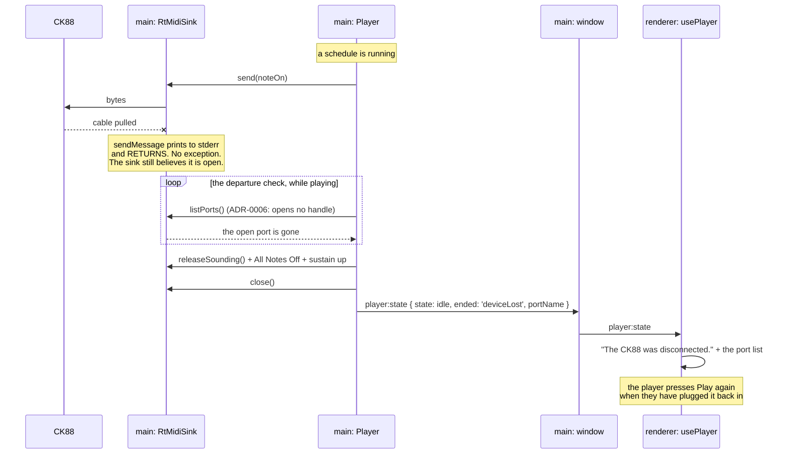

# 0011 — The instrument can leave

> **Status:** draft
> **Created:** 2026-09-11
> **Owner skill(s):** dev, human
> **Related ADRs:** [0019](../adrs/0019-a-device-departure-is-noticed-by-enumeration-not-by-a-failed-send.md)
> (proposed) is this plan's whole design and answers the open question
> [0007](../adrs/0007-playback-is-a-schedule-built-in-core-and-clocked-by-main-behind-a-midisink.md)
> (accepted) left about whether `MidiSink.send` can report failure;
> [0006](../adrs/0006-listing-ports-does-not-touch-the-device.md) (accepted) is what makes the
> detection free
> **NFRs claimed:** 13 in [nfr.md](../nfr.md) — its property re-asserted with a departure as a
> seventh way playback can end, and its magnitude finally exercised at the size the row states
> **Depends on:** Plan [0004](done/0004-the-app-plays-the-piece.md), closed — the sink, the clock,
> the panic path and `player:state` are all shipped

## TL;DR

Pull the USB cable while the app is playing and it tells you the instrument left, instead of
printing an error per event into a console you cannot see and leaving a dead port handle behind
that the next Play will also fail on. Nothing about the silence changes — Plan 0004 measured that
a cable pull already leaves no stuck note, and that property is not at risk here. This plan is
about the seconds *after* the silence. It also closes ADR-0007's own open question with the
measurement rather than with taste: `MidiSink.send` stays fire-and-forget, because on Windows the
platform gives it nothing truthful to return.

## Context & problem

Plan 0004's Phase 7 item 5 pulled the USB cable mid-chord. The instrument fell silent, which is the
property the whole plan was built around. Then:

```
MidiOutWinMM::sendMessage: error sending MIDI message.
MidiOutWinMM::sendMessage: error sending MIDI message.
...one line per event, for the rest of the schedule
```

and playback did not resume on replug.

**The guard that should have caught this is decorative, and the reason is the platform.**
`RtMidiSink.write` already wraps `sendMessage` in a `try`/`catch` with a one-shot `warned` flag,
written for exactly this case. It never fires. RtMidi's C++ layer prints that line to stderr and
**returns**; the failure never crosses into JavaScript as an exception, and `sendMessage` has no
return value to inspect. **Inside the process, a send into a dead port is indistinguishable from a
successful one.**

So the sink goes on believing it is open. `this.output` stays non-null, `openPortIndex` stays set,
nothing in main learns the device left — and on a replug Windows may hand out a different index,
leaving the old handle dead for good. The app is then in a state where every Play silently fails
and nothing on screen says why.

ADR-0007 named this exact uncertainty and left it open: whether `MidiSink.send` should be able to
report failure at all. The measurement answers it. ADR-0019 records the answer and this plan
implements it.

Two facts make the fix small. **Listing costs nothing** — ADR-0006 settled that enumerating ports
opens no handle — so asking "is my port still there" is free. And **the signal is already being
fetched**: `usePlayer` lists outputs every two seconds to decide whether an instrument is
listening, which is how ADR-0008's anti-doubling default knows what to default to. Nobody is acting
on its disappearance.

There is a second, smaller debt this plan is the right place to pay. **NFR 13's stated magnitude is
exercised by nothing.** The row asserts its property "over a 500-event schedule" in three named
places; the largest schedule any of them builds is the C major scale scenario at 29 note-ons. Plan
0004's close carried it as a finding. This plan is already writing tests about how a schedule ends,
so it is the cheapest moment to make the size real.

## Decision

**Main notices, and the renderer is told** — ADR-0019.

`MidiSink.send` keeps its `void` return. A seam that reported success it cannot verify would be
worse than one that reports nothing, and on this platform there is nothing truthful to return.
Instead, while a schedule is running, main checks its open output port against the enumeration; a
port that has stopped being enumerated is gone. On that, main runs **the panic path it already
has** — release everything sounding, All Notes Off, sustain-up, stop, close the sink — and pushes
the reason to the renderer on the existing `player:state` channel, which grows a field. The
renderer renders the message and points at the port list. It decides nothing.

The app **notices and says so**. It does not silently reopen, and it does not resume a schedule
mid-piece: a piece restarting three seconds later in the middle of a phrase is worse than being
told the cable came out. Reopening a port matched **by name** rather than by index — already a
Plan 0004 followup, and the hazard its Risks section named — is left as a followup here too,
because the notice is what removes the broken-feeling failure and the reopen only removes a click.

We rejected giving `send` a status, because the platform provides none; we rejected detecting from
the renderer's poll, because that puts a hardware decision in the process that may not touch
hardware and stops working when the window is hidden or closing; and we rejected having the sink
re-check before each send, because that puts native enumeration on a hot path whose onset error is
measured in tenths of a millisecond.

## Architecture diagram



## Implementation phases

### Phase 1 — The app says the instrument left
- **Owner skill:** dev
- **What:** A departure detected in main, the panic path run, and a message on screen — the whole
  user-visible behaviour, end to end, against a fake that can be made to vanish.
- **Files touched:** `shared/player.ts`, `electron/player/Player.ts`,
  `electron/player/Player.test.ts`, `electron/ipc/playerHandlers.ts`,
  `renderer/hooks/usePlayer.ts`, `renderer/components/Transport.tsx`,
  `renderer/components/Transport.module.css`, `renderer/types/global.d.ts`, `e2e/player.spec.ts`
- **Notes for the implementer:** `PlayerStateSchema` gains an ended-reason field; keep it a closed
  union rather than a free string, so the renderer's message is chosen from a known set and a new
  reason cannot arrive unrendered. Do the check **inside the existing 25 ms tick** rather than on a
  new timer, but not every tick — once or twice a second is the right order, and the interval wants
  a named constant beside `STATE_INTERVAL_MS` with a comment saying why it is not per-tick.
  Compare by the port identity the sink already holds, not by a re-derived index. On a departure,
  call the existing stop path; **do not write a second release**, because the whole point of
  ADR-0007's panic is that there is one. The `Player.test.ts` fake `Output` is what vanishes — give
  it a way to stop being enumerated, in the shape of the existing fakes rather than a new harness
  concept. The e2e case can drive this through the virtual/null path; it does not need hardware
  (ADR-0004).
- **Done when:** With a schedule running and the open port removed from the enumeration, the faked
  `Output` receives a note-off for every note then sounding, followed by All Notes Off and
  sustain-up on every channel used — the same assertion the other six panic paths already make,
  now for a seventh. `player:state` arrives at the renderer carrying the departure reason and the
  port's name, and the transport shows a message naming the instrument. A second Play after a
  departure does not dispatch into the dead handle. `npm run gate` is green.

### Phase 2 — The flood stops, and the guard says what it is for
- **Owner skill:** dev
- **What:** The console stops filling, and the code stops implying a protection it does not give.
- **Files touched:** `electron/midi/RtMidiSink.ts`, `electron/midi/RtMidiSink.test.ts`
- **Notes for the implementer:** The existing `try`/`catch` and `warned` flag are **not removed**
  — they remain correct for a failure that does throw, such as a handle used after `close`. What is
  wrong is that they read as the unplug guard. Fix the comment to say what ADR-0019 records: RtMidi
  prints to stderr and returns, so an unplugged cable never reaches this catch, and the departure
  check in `Player` is what covers that case. The flood itself stops because Phase 1 stops the
  schedule; this phase's job is that the next reader does not re-derive the whole thing from
  scratch. If a cheap way exists to stop sending the moment the sink is closed — a guard on
  `this.output` — assert it, so a close mid-tick cannot leak one more send.
- **Done when:** A test asserts that a `send` after `close` is a no-op rather than a throw or a
  dispatch, and the comment beside the `warned` flag names ADR-0019 and the stderr behaviour it
  cannot see. `npm run gate` is green.

### Phase 3 — NFR 13 at the size the row claims
- **Owner skill:** dev
- **What:** The property the row states, asserted over a schedule of the size the row states.
- **Files touched:** `core/src/player/schedule.test.ts`, `electron/player/Player.test.ts`,
  `e2e/player.spec.ts`
- **Notes for the implementer:** The row says "0 events dropped or reordered, and 0 notes sounding
  once playback ends or is stopped, **over a 500-event schedule**", and names three places that
  assert it: a `core/` test over every schedule the suite builds, a unit test over the bytes handed
  to a faked `Output`, and an e2e run counting `player:event`. The largest any of them builds today
  is 29 note-ons. `dense-2000` already exists as a scenario and is the obvious source. Raise **at
  least the unit test over the faked `Output`**, which is the one that checks bytes and ordering
  and is cheap to run large; judge whether the e2e one can carry the size without making the suite
  slow, and if it cannot, say so in the log rather than quietly leaving it small. This asserts a
  **property**, not a duration — no millisecond figure belongs in a test CI runs.
- **Done when:** A schedule of at least 500 events reaches the faked `Output` complete, in order,
  with nothing sounding at the end, and the same holds when it is stopped halfway. The three places
  NFR 13 names either carry the stated magnitude or the log records which one does not and why.
  `npm run gate` is green.

### Phase 4 — At the piano
- **Owner skill:** human
- **What:** The cable, pulled for real. A fake that stops being enumerated is not the same thing as
  Windows losing a USB device mid-chord.
- **Files touched:** the plan's implementation log
- **Done when:** all of the following are recorded in the log:
  1. **Cable pulled mid-chord.** No stuck note — the Plan 0004 property, re-confirmed, because this
     plan changed the code on that path. The app says the instrument left, naming it.
  2. **How long the console flood actually is now**, in lines, against the "one per event for the
     rest of the schedule" it was. ADR-0019 predicts a short burst rather than none, because
     detection is polled; a figure that is far larger than the check interval implies is a finding.
  3. **Plug it back in.** The port reappears in the list and can be chosen, and a Play after that
     works. Recovery is a click, by decision — confirm it is only a click, and that no stale
     `out:<index>` selection has to be cleared by hand first.
  4. **Pull it while idle**, not playing. Nothing should go wrong; record what the port list does.
  5. **Pull it during the window-close panic**, if it can be provoked — the one moment when a
     departure and a shutdown race. Any stuck note or hang here is worth more than the other four
     items combined.

## Data shapes

```ts
// illustrative — the Zod schemas in shared/player.ts are what is real

/** Why playback is no longer running. A closed union, so the renderer picks
 *  its message from a known set and a new reason cannot arrive unrendered. */
type PlaybackEnded =
  | 'completed'      // the schedule ran out
  | 'stopped'        // the player pressed stop, or started another
  | 'deviceLost'     // the open output port stopped being enumerated

type PlayerState = {
  state: 'idle' | 'playing'
  positionMs: number
  durationMs: number
  bar: number | null
  /** Set when `state` is idle; null while playing. */
  ended: PlaybackEnded | null
  /** The port that went away, for the message. Null unless `ended` is
   *  'deviceLost'. */
  lostPortName: string | null
}
```

## Risks & open questions

- **Detection is polled, so it is late.** Some events still go into a dead port before the check
  fires, and the console still gets a burst — shorter than today's flood rather than absent.
  ADR-0019 accepts this because the only way to make it immediate is a signal the platform does not
  give. Phase 4 item 2 measures how short.
- **A port that disappears and returns inside one check interval is missed entirely**, and the
  handle is dead with nothing having noticed. Rare, real, and left unhandled on purpose; a Play
  that silently does nothing is then still possible, and it is the strongest argument for the
  name-matched reopen followup.
- **The enumeration call is on main's tick**, and it is native. It is called once or twice a second,
  not per tick, precisely so it cannot move NFR 13's onset error — but that is an assumption until
  Phase 3's large schedule runs with the check active. If the figures move, the check goes on its
  own timer instead, which is an implementation change and not a design one.
- **`player:state` grows a field**, and it is the first thing that channel carries which is an error
  rather than a position. Every consumer has to be read. It is also the field Plan 0013's cursor
  will later interpolate around, so keeping it a closed union matters beyond this plan.
- **We are encoding a platform limitation into a seam's shape.** ADR-0019 says so plainly: a future
  `MidiSink` over a transport that *can* report failure will have a real status and no way to give
  it, and that ADR will want superseding rather than extending.
- **Offline and latency are untouched.** No new dependency (NFR 9), no network. The MIDI-in path is
  not on this plan's map at all.

## What this plan does NOT do

- **No name-matched reopen.** Remembering the output port by name so a selection survives a replug
  is a Plan 0004 followup and stays one. This plan makes the departure visible; that one makes the
  return automatic.
- **No resume mid-piece.** Decided against: a phrase restarting three seconds late is worse than a
  message.
- **No fallback to the computer's voice mid-schedule.** `Synth` is constructed inside `play()`, so
  there is no voice to switch to once a schedule is running, and creating an `AudioContext`
  mid-schedule is outside the gesture ADR-0008 relies on. It is a followup below, and it needs a
  decision under that ADR rather than a patch.
- **Nothing about the MIDI *input* half.** A CK88 unplugged while it is being listened to is a
  different path with a different owner (`MidiSource`), and it has its own backlog entry.
- **No change to the four interruptions Plan 0004 already proved.** Stop, output change, second
  play, window close, app quit and a throw in the tick are re-run, not redesigned.

## Implementation log

> Written by `dev`, one row per phase as that phase's commit lands, and the close block after the
> last one. **The phases above are the contract; everything here is what happened.**
> Observations, never conclusions. A deviation from the plan or an unmet done-when is always
> disclosed. Stays shorter than `## Implementation phases`.

**Lane:** _(`main` directly, or the worktree path plus its branch)_

| phase | owner | state | commit |
|---|---|---|---|
| 1 — The app says the instrument left | dev | not started | |
| 2 — The flood stops, and the guard says what it is for | dev | not started | |
| 3 — NFR 13 at the size the row claims | dev | not started | |
| 4 — At the piano | human | not started | |

### Measurements

_(NFR 13: the property at 500+ events from Phase 3; the console-flood line count from Phase 4
item 2, which is an observation of this machine and not a row)_

### Notes

_(deviations, unmet done-whens, followups noticed and not acted on; one line each)_

### Close triggers

- **What shipped:** _(feature / fix-only / docs-chore-only)_
- **User-visible docs touched:** _
- **Full gate at the last phase:** _
- **Outstanding `human` phases:** _

## Followups (after this lands)

- **Remember the output port by name, and reopen it when it comes back.** Carried from Plan 0004.
  The place that now knows the port went away is the place that will recognise it returning.
- **The input half.** A CK88 unplugged while being listened to gets no equivalent notice, and
  `MidiSource` has the same blind spot for the same reason.
- **A voice that can be switched to mid-schedule**, which would make a departure degrade to the
  computer's tone instead of to silence. Needs an `AudioContext` that outlives one `play()`, and
  therefore a decision under ADR-0008.
- **A departure while idle** currently produces nothing but a changed port list. If a selection is
  remembered by name, this becomes the moment to grey it rather than drop it.
