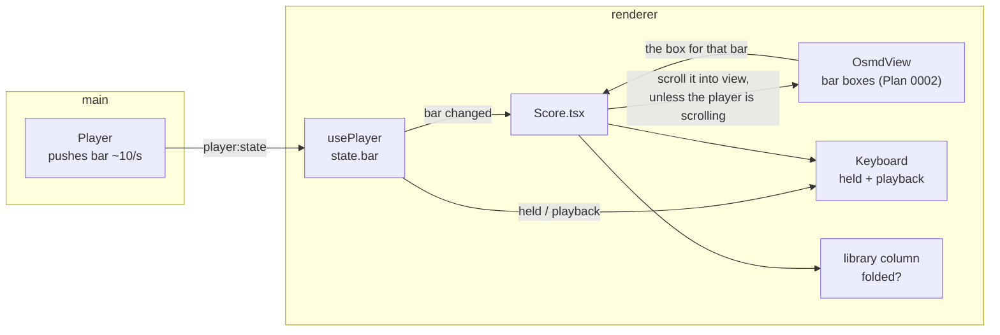

# 0012 — The Score view on a real piece

> **Status:** draft
> **Created:** 2026-09-11
> **Owner skill(s):** dev, human
> **Related ADRs:** none new. [0003](../adrs/0003-two-notation-engines-vexflow-for-the-live-staff-and-osmd-for-the-score.md)
> (accepted) is why the score is an OSMD document rather than something we repaint, and it is what
> makes scrolling the right verb; [0020](../adrs/0020-one-cursor-on-the-score-with-two-position-sources.md)
> (proposed) is what this plan must **not** pre-empt — see `## What this plan does NOT do`
> **NFRs claimed:** 11 in [nfr.md](../nfr.md), re-reported unchanged. This plan adds paint work to
> a view the live path also draws in, and must not cost the frame budget.
> **Depends on:** Plan [0004](done/0004-the-app-plays-the-piece.md), closed — `player:state`
> carries the sounding bar, which is the whole input to the scrolling half

## TL;DR

Three things the user asked for at the piano on 2026-09-11, after using the Score view on a real
piece for the first time. The score **scrolls to keep up** while the app plays, so a piece longer
than the window stops needing a hand on the wheel. A **small keyboard lives in a corner** of the
view, showing the player's hands and the app's playing side by side — the Score view is currently
the one view that draws neither. And the **library list folds away**, so a piece can have the full
width. None of it is clever; all of it is the difference between a demo and something usable on a
real score, and none of it depends on anything still to be built.

## Context & problem

Plan 0004 closed with playback working and the Score view is where it is used. The first session
on a real piece — BWV 555, four pages — produced three complaints in the same evening, all of them
about the view rather than about the music.

**The score does not follow.** `player:state` carries the sounding `bar` and the bar is marked on
the engraving, so the app knows exactly where it is and shows it — on whichever part of the page
happens to be scrolled into view. Playing a piece means watching a marked bar move through a region
you cannot see, or keeping a hand on the scroll wheel while listening. Both halves of the fix
already exist: Plan 0002 maps a bar to the box OSMD drew for it (the `bar-mark` overlay, asserted
in `e2e/score.spec.ts`), and Plan 0004 pushes the bar ten times a second. Scrolling that box into
view is close to the whole feature.

**There is no keyboard.** `Keyboard` takes `held` and `playback` separately — the player's hands
and the app's playing, drawn apart, which was a deliberate choice in Plan 0004 — and the Score view
is the one view that draws neither. When the app demonstrates a passage, the player has the
engraving and nothing showing which physical keys that is. When they then play it themselves,
the same.

**The library column never goes away.** The view is a fixed `280px` list beside the score, at every
width, forever. On a four-page piece the list is the least interesting thing on screen and it is
taking a fifth of it.

These are small and they are not a plan's worth of design. They are a plan's worth of work, they
are independent of everything in flight, and they were asked for directly.

## Decision

Ship all three as plain view work, and take no architectural position while doing it.

The **scroll is at bar resolution and it is not a cursor.** It reuses the `bar-mark` box the
overlay already computes and scrolls the score's own scrolling container so that box is visible. It
fires on the bar *changing*, not on every state push, so a bar's worth of playing is one scroll
rather than ten. It leaves the player's own scrolling alone the moment they touch it: a player
reading ahead is doing something deliberate and the app must not fight them for the scrollbar.

The **keyboard is the existing component at a smaller size**, in a corner, hidden or shown at will
and remembered. Nothing about it is new except where it sits.

The **library folds**, and its folded state is remembered too. Pure layout.

We rejected building a moving cursor here, which is ADR-0020's and Plan 0013's, and we rejected
per-system or page-turn scrolling as the first cut, because bar-into-view is the behaviour whose
failure mode is boring — it scrolls slightly more often than ideal — while a page-turn's failure
mode is the player losing their place.

## Architecture diagram

## Implementation phases

### Phase 1 — The score keeps up
- **Owner skill:** dev
- **What:** While the app plays, the sounding bar is scrolled into view.
- **Files touched:** `renderer/score/OsmdView.tsx`, `renderer/views/Score.tsx`,
  `renderer/views/Score.module.css`, `renderer/hooks/useScrollToBar.ts`,
  `renderer/hooks/useScrollToBar.test.ts`, `e2e/player.spec.ts`
- **Notes for the implementer:** The input is the `bar` already on `player:state`; the geometry is
  the box `OsmdView` already computes for the overlay — **do not compute a second one**, and do not
  reach into OSMD for coordinates here. Fire on the bar **changing**, not on every push, or a bar
  costs ten scrolls. Use the scrolling container the view already has rather than
  `scrollIntoView` on the button, which scrolls every ancestor including the page and will move
  things the player did not ask to move; compute the target offset and set `scrollTop` on the one
  element. **Honour the player.** A scroll the player started must win: watch for a user scroll and
  suspend following until playback next starts, or until the bar they are looking at is the one
  sounding again. Pick one rule, write it in a comment, and make it the thing the test asserts —
  the rule matters more than which rule. `behavior: 'smooth'` is tempting and fights the next
  scroll; prefer an immediate set at bar granularity. Everything created in the effect —
  listeners, any frame — is cancelled in its cleanup.
- **Done when:** Playing a score taller than its container scrolls so the sounding bar is visible,
  asserted end to end by reading the container's scroll offset against the marked bar's box rather
  than by eye. A bar that is already visible causes **no** scroll. Scrolling by hand mid-playback
  stops the app from scrolling, by the rule the comment states, and the assertion names that rule.
  Nothing is left listening after unmount. NFR 11 unchanged: frames p50/p95/max over 500 note-ons
  with a score open and following, reported into the log. `npm run gate:fast` and
  `npm run test:e2e -- e2e/player.spec.ts` are green.

### Phase 2 — A keyboard in the corner
- **Owner skill:** dev
- **What:** The existing keyboard, small, in the Score view, shown or hidden at will.
- **Files touched:** `renderer/views/Score.tsx`, `renderer/views/Score.module.css`,
  `renderer/components/Keyboard.module.css`, `e2e/score.spec.ts`
- **Notes for the implementer:** Reuse `Keyboard` as it stands. It already takes `held` and
  `playback` separately so the player's hands and the app's playing are distinguishable, and
  `usePlayer` already exposes both in this view — this is placement, not a new component. Size it
  through CSS rather than a new prop if the component's layout is percentage-based, which it is
  (`KeyLayout` widths are percentages). Remember shown-or-hidden in `localStorage` beside whatever
  the view already persists; if it persists nothing yet, that is the moment to decide where such
  preferences live and say so in the log rather than scattering keys. Do not let it overlap the bar
  detail or the transport — a corner that covers the thing the player just clicked is worse than no
  keyboard. It must not take the keyboard focus or swallow a click meant for a bar.
- **Done when:** With a score open, the keyboard shows the notes the app is playing during
  playback and the notes the player presses during practice, distinguishably. It hides and shows on
  command and the choice survives a restart. Clicking a bar behind or beside it still marks that
  bar. `npm run gate:fast` and `npm run test:e2e -- e2e/score.spec.ts` are green.

### Phase 3 — The list folds away
- **Owner skill:** dev
- **What:** The library column collapses so the score gets the width.
- **Files touched:** `renderer/views/Score.tsx`, `renderer/views/Score.module.css`,
  `e2e/score.spec.ts`
- **Notes for the implementer:** The view is a two-column grid, `280px minmax(0, 1fr)`. Folding is
  that first track going to a narrow strip with a control to bring it back; the score column must
  actually reflow, which means OSMD has to re-lay-out at the new width — the same path a window
  resize already takes, so reuse whatever triggers the overlay's rebuild on resize rather than
  adding a second trigger. Remember the folded state the same way Phase 2 remembers its own. The
  control needs a real accessible name, not an icon alone.
- **Done when:** Folding the library widens the drawn score and the bar overlay stays aligned with
  the engraving after the reflow — the same property `e2e/score.spec.ts` already asserts for a bar
  mark sitting on the box OSMD drew, now after a fold. The state survives a restart. Unfolding
  restores the list with the same score still selected. `npm run gate` is green.

### Phase 4 — At the piano
- **Owner skill:** human
- **What:** Whether any of it actually helps, on the piece that prompted it.
- **Files touched:** the plan's implementation log
- **Done when:** all of the following are recorded in the log:
  1. **The scroll, judged while listening.** Play BWV 555 through. Does the scrolling help or
     distract? The specific thing to watch for is whether it moves when you are reading ahead of
     it — the rule Phase 1 chose is a guess and this is the only test of it. A "it fights me" is a
     finding and names which rule to try instead.
  2. **Bar granularity, judged.** Does a scroll per bar feel right, or does it want to be per
     system, or a page turn? A product call, and cheap to change now while it is one hook.
  3. **The corner keyboard, judged.** Is it useful during a demonstration, or is it in the way? A
     size and a corner that are wrong are worth saying now.
  4. **The fold, judged.** Is the width worth the click, on a four-page piece?

## Data shapes

No new types. The inputs already exist: `PlayerState.bar` from `player:state`, the bar boxes
`OsmdView` computes for the overlay, and `HeldNotes` for the keyboard.

The only new persisted state is two view preferences — whether the corner keyboard is shown and
whether the library is folded — both per-viewer conveniences in `localStorage`, both safe to lose.

## Risks & open questions

- **The following rule is a guess.** "Stop following when the player scrolls" has several
  reasonable readings and Phase 1 picks one. Phase 4 item 1 is the only real test. This is why the
  rule is a commented constant and the test names it: changing it should be a one-line change and
  a one-line test edit.
- **Bar granularity may be wrong.** A scroll per bar is more motion than a reader wants; a page
  turn is less. Starting at bar resolution is the choice whose failure is boring. Phase 4 item 2
  decides whether to change it, and the change is confined to the hook.
- **NFR 11 is the one number at risk.** This plan adds paint work to a view the live path also
  draws in. Phase 1's done-when reports the frame figures with following active; if they move, the
  scroll is throttled to bar changes only (which it already is) and then to a frame, and the log
  says so.
- **OSMD reflow on fold could be slow on a long piece.** A four-page score re-laid-out on every
  fold is a visible pause. If it is, the fold animates to nothing and re-lays out once at the end
  rather than during — a fix inside Phase 3, but worth knowing before it is a surprise.
- **`localStorage` can throw or come back empty** — a private window, cleared site data. Both
  preferences must render correctly with no stored value, and neither is worth a capability.
- **Nothing here is offline-sensitive or on the MIDI-in path.** No new dependency (NFR 9).

## What this plan does NOT do

- **No moving cursor.** A line travelling through a bar at note resolution is
  [ADR-0020](../adrs/0020-one-cursor-on-the-score-with-two-position-sources.md) and Plan
  [0013](0013-the-travelling-line.md), and it needs Plan 0007's coordinate work underneath it.
  **This plan must not grow one by accident:** scrolling a bar box into view is not a position on
  the engraving, and nothing here should acquire a musical position finer than a bar index. If a
  phase starts wanting one, stop.
- **No follow mode during practice.** Scrolling here is driven by playback only. Following what the
  *player* is doing is score following, which is a backlog item with its own hard problem; the
  metronome's follow is Plan 0006 Phase 3.
- **No change to the bar overlay's colours, states or click behaviour.** Plan 0002 owns those and
  Plan 0007 deepens them.
- **No settings screen.** Two `localStorage` preferences, remembered where the view can reach them.

## Implementation log

> Written by `dev`, one row per phase as that phase's commit lands, and the close block after the
> last one. **The phases above are the contract; everything here is what happened.**
> Observations, never conclusions. A deviation from the plan or an unmet done-when is always
> disclosed. Stays shorter than `## Implementation phases`.

**Lane:** _(`main` directly, or the worktree path plus its branch)_

| phase | owner | state | commit |
|---|---|---|---|
| 1 — The score keeps up | dev | not started | |
| 2 — A keyboard in the corner | dev | not started | |
| 3 — The list folds away | dev | not started | |
| 4 — At the piano | human | not started | |

### Measurements

_(NFR 11 from Phase 1, with following active: frames p50 _ / p95 _ / max _ over 500 note-ons)_

### Notes

_(deviations, unmet done-whens, followups noticed and not acted on; one line each)_

### Close triggers

- **What shipped:** _(feature / fix-only / docs-chore-only)_
- **User-visible docs touched:** _
- **Full gate at the last phase:** _
- **Outstanding `human` phases:** _

## Followups (after this lands)

- **Scroll granularity as a setting**, if Phase 4 item 2 says per-bar is wrong but per-system is
  not obviously right either.
- **Where view preferences live.** Two `localStorage` keys is fine; the fifth will not be. The day
  there is a settings surface, these move into it.
- **The same corner keyboard in the Takes view**, which has the same gap for the same reason.
- **Scroll during practice**, once score following exists to drive it.
