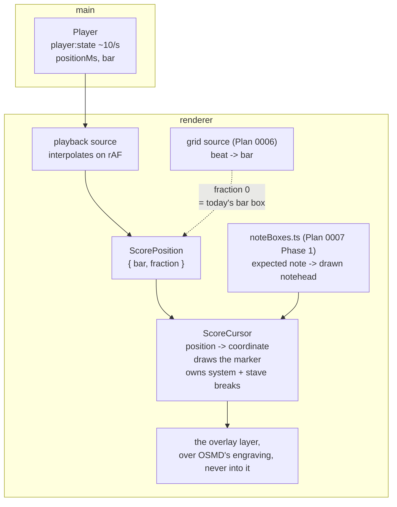

# 0013 — The travelling line

> **Status:** approved
> **Created:** 2026-09-11
> **Owner skill(s):** dev, human
> **Related ADRs:** [0020](../adrs/0020-one-cursor-on-the-score-with-two-position-sources.md)
> (proposed) is this plan's whole design — one cursor, two position sources, built here;
> [0003](../adrs/0003-two-notation-engines-vexflow-for-the-live-staff-and-osmd-for-the-score.md)
> (accepted) is why the score is a laid-out document we draw *over* rather than repaint;
> [0013](../adrs/0013-what-you-played-is-drawn-over-the-engraving-never-into-it.md) (proposed) is
> the same over-never-into rule this plan obeys for a different glyph
> **NFRs claimed:** 11 in [nfr.md](../nfr.md), re-reported unchanged — this plan draws on every
> frame and must not cost the frame budget
> **Depends on:** Plan [0007](0007-what-you-played-drawn-on-the-score.md) **Phase 1**, which builds
> `renderer/score/noteBoxes.ts` and settles whether `sourceNote` identity holds. Not the whole
> plan — just that phase. Plan [0004](done/0004-the-app-plays-the-piece.md) is closed and supplies
> `player:state`.

## TL;DR

A line moves through the bar while the app plays, so you can see exactly which notes are sounding
at this instant instead of which bar they are in. Plan 0004 highlights the bar; this is the finer
thing the user asked for on 2026-09-11 on seeing playback work. The line jumps to the next system
and down the staves OSMD drew, which is the part that is actually hard and the reason this is a
plan rather than a hook. It is built once, as **one cursor that takes a position rather than a
source** (ADR-0020), so that Plan 0006's metronome follow drives the same thing from the beat
instead of growing a second marker that disagrees about where bar 30 is.

## Context & problem

The user watched a piece play on 2026-09-11 and asked for the finer marker immediately: the bar
highlight says *somewhere in these twelve notes*, and the ear is already ahead of it.

Three facts from the shipped code decide how big this is.

**During playback the position is already exact and needs no alignment.** A `PlaybackSchedule`
holds every event's `at` in milliseconds and `player:state` carries `positionMs`. Nothing has to be
inferred from what the player is doing. That is the whole difference from **score following**,
which is a separate backlog item and a genuinely hard problem. The playback line is the cheap half
of what looks like one feature.

**What is missing is a coordinate, not a time.** Turning a note's onset into an `x` on OSMD's
engraving is the `sourceNote`-to-SVG mapping Plan 0007 Phase 1 exists to resolve — it builds
`renderer/score/noteBoxes.ts`, a draw-time index from expected note to drawn notehead, and its
riskiest fact is settled there. This plan is a second consumer of that index and must not build a
third way to ask where a note is.

**`player:state` must not be made a hot channel to feed it.** It is pushed about ten times a second
deliberately (`STATE_INTERVAL_MS` in `Player.ts`); the per-event traffic is `player:event`, which
the recorder never sees. A smooth line interpolates between state pushes on `requestAnimationFrame`
— more traffic would be both more expensive and, because events cluster at onsets and say nothing
between them, a *worse* line.

And there is a collision to avoid. **Plan 0006 Phase 3 also wants to show where you are**: with a
metronome grid running, the bar the click is in, highlighted in real time. As drafted it is a bar
*box* reusing Plan 0002's overlay. Two markers on one page that can disagree about where bar 30 is
would be a bug the user finds in the first minute and neither plan owns. ADR-0020 settles it: one
cursor, two position sources, and the plan with the harder requirement builds it.

## Decision

Build **one cursor on the score that takes a position rather than a source** (ADR-0020).

A single renderer component owns the three things that are the same whoever is driving: resolving a
musical position to a coordinate on OSMD's engraving, drawing the marker, and handling the system
and stave breaks as the layout reflows. **Resolution is a property of the position, not of the
cursor**: a position is a bar plus a fraction through it, and a source that only knows the bar
supplies a fraction of zero and gets a marker at the barline — which is exactly the bar-level
behaviour Plan 0006 drafted, with nothing configured.

Playback drives it from `player:state`, interpolating between the ten-per-second pushes on
`requestAnimationFrame`. The channel keeps its cadence; the smoothness is the renderer's
arithmetic.

**Plan 0006 Phase 3 is amended to consume this component** rather than to build a second way to
mark a position — which that phase's own notes already forbid for bars ("do not add a second way
to mark a bar"). The amendment is written into that plan when this one is approved, not silently
assumed.

We rejected two independent cursors, because the system-break work would be written twice and the
second time under a plan that thought it was easy; we rejected letting whichever plan lands first
design the interface, because a cursor designed for a box that snaps to a barline does not grow
into a line that interpolates through it; and we rejected driving the line from `player:event`.

## Architecture diagram



## Implementation phases

### Phase 1 — A line that sits where a note is
- **Owner skill:** dev
- **What:** The cursor, static: given a bar and a fraction through it, a line is drawn at the right
  `x` on the right stave — proving the coordinate before anything moves.
- **Files touched:** `renderer/score/scoreCursor.ts`, `renderer/score/scoreCursor.test.ts`,
  `renderer/score/OsmdView.tsx`, `renderer/score/OsmdView.module.css`,
  `renderer/views/Score.tsx`, `e2e/score.spec.ts`
- **Notes for the implementer:** Read `noteBoxes.ts` from Plan 0007 Phase 1 and **use the identity
  it settled**. If that phase had to fall back to keying on `(bar, staff, voice, onset, midi)`
  rather than on `sourceNote`, the lookup is coarser and a chord's notes are indistinguishable —
  which is fine for a cursor and is named in ADR-0020, but read the log and know which you have.
  A position between two notes interpolates between their boxes; a position past the last note in a
  bar interpolates to the barline. Use the same unit conversion `OsmdView` already applies
  (`UNIT_IN_PIXELS * osmd.zoom`); do not invent a second one. Draw into the existing overlay layer
  beside the bar boxes — over the engraving, never into it, which is
  [ADR-0013](../adrs/0013-what-you-played-is-drawn-over-the-engraving-never-into-it.md)'s rule for a
  different glyph and holds for this one. Rebuild on the triggers the overlay already rebuilds on:
  re-render, resize, zoom. **Do not add a position source in this phase** — drive it from a number
  in the view so the geometry is testable alone.
- **Done when:** For every committed fixture score, a position at a note's own onset draws the line
  within the drawn notehead's box for that note, and a position halfway between two notes draws
  between them — asserted end to end in the real app, since OSMD does not lay out under jsdom. A
  position in bar 0 of `pickup-two-hands` lands in the pickup, not in bar 1. The line spans the
  staves of its system and stops there. `npm run gate:fast` and
  `npm run test:e2e -- e2e/score.spec.ts` are green.

### Phase 2 — It moves, and it turns the corner
- **Owner skill:** dev
- **What:** The line follows playback smoothly, and crosses system and stave breaks correctly.
- **Files touched:** `renderer/score/scoreCursor.ts`, `renderer/hooks/useCursorPosition.ts`,
  `renderer/hooks/useCursorPosition.test.ts`, `renderer/views/Score.tsx`, `e2e/player.spec.ts`
- **Notes for the implementer:** The playback source converts `player:state` into a
  `ScorePosition`. Interpolate between pushes on `requestAnimationFrame` using `positionMs` and the
  schedule's own tempo mapping — **not** a wall clock started independently, or the line drifts
  from the sound over a long piece. A state push that arrives while interpolating corrects the
  position; it must not visibly jump backwards, so clamp rather than snap. **The break is the
  phase's real content:** when the position crosses into a bar on the next system the line must
  appear there, not slide across the page, and the fixtures with more than one system are what
  prove it. Cancel the frame in the effect's cleanup; a cursor still animating after unmount is the
  exact failure the close review looks for. When playback ends or is stopped, the line clears —
  including on the `deviceLost` path Plan 0011 adds, which is an ordinary idle as far as this is
  concerned.
- **Done when:** Playing a multi-system score moves the line through each bar and it **appears** at
  the start of the next system rather than travelling across the page — asserted by reading the
  line's coordinates at two positions either side of a break. The line's position at a note's onset
  matches that note's box within a tolerance stated in the test as a property of the layout, not a
  pixel count tuned to one machine. Stopping clears it. Nothing is left animating after unmount.
  NFR 11 unchanged: frames p50/p95/max over 500 note-ons with the cursor running, reported into the
  log. `npm run gate:fast` and `npm run test:e2e -- e2e/player.spec.ts` are green.

### Phase 3 — Plan 0006's follow consumes the same cursor
- **Owner skill:** dev
- **What:** The second position source exists and is proven, so the amendment to Plan 0006 is a
  real thing rather than a promise.
- **Files touched:** `renderer/hooks/useCursorPosition.ts`, `renderer/score/scoreCursor.ts`,
  `docs/plans/0006-the-metronome-and-the-score-follows.md`
- **Notes for the implementer:** This phase adds the **seam**, not the metronome. Make the cursor's
  position input source-agnostic and demonstrate the second source with the one that exists today:
  a bar index and a fraction of zero, which is the shape Plan 0006 Phase 3 will supply from its
  beat, and which reproduces today's bar-level behaviour exactly. Then edit Plan 0006 Phase 3 — its
  **What**, its file list and its **Notes for the implementer** — to drive this component instead of
  building a highlight path, keeping its done-when about landing on the correct bar across a metre
  change, which is unchanged and is still the right test of *its* half. **A plan edit is an
  architect-owned act:** make it, and say in the log that it was made, so the close review reads
  the edit rather than discovering it.
- **Done when:** A position supplied as `{ bar, fraction: 0 }` draws the cursor at that bar's
  barline, for a pickup bar and across a metre change, over `key-and-time-change`. Plan 0006 Phase
  3's text names this component and no longer describes a second highlight path. `npm run gate` is
  green.

### Phase 4 — At the piano
- **Owner skill:** human
- **What:** Whether a line at note resolution is actually better than a box, on a real piece.
- **Files touched:** the plan's implementation log
- **Done when:** all of the following are recorded in the log:
  1. **Play BWV 555 and watch the line.** Does it track what you hear? The specific thing to catch
     is *drift* — a line that is right at the start of a page and late by the bottom of it means
     the interpolation is running off the wrong clock, and it is the failure this phase exists to
     find.
  2. **The break.** Does it appear on the next system at the right moment, or is there a visible
     stumble at every line end? A four-page piece has a lot of line ends.
  3. **Is it better than the bar box?** A product call. They can coexist, and the honest answer may
     be that the box is enough and the line is noise — in which case the cursor still earned its
     keep as Plan 0006's mechanism, and that is worth saying rather than hiding.
  4. **With the corner keyboard from Plan 0012 showing**, if it has landed, is the combination
     useful or is it two things competing for attention?

## Data shapes

```ts
// illustrative — this is renderer-internal and has no Zod schema; nothing
// here crosses IPC.

/** Where we are in the music, independent of who knows it. `fraction` is the
 *  way through the bar, 0 at the barline and 1 at the next one. A source that
 *  only knows the bar supplies 0 and gets today's bar-level marker. */
type ScorePosition = { bar: number; fraction: number }

/** Where that is on the page, after the lookup. `system` is carried so a
 *  consumer can tell a break from a large horizontal move. */
type CursorCoordinate = {
  x: number
  top: number
  height: number
  system: number
}
```

## Risks & open questions

- **Interpolation drift is the likeliest defect and the hardest to see in a test.** A line driven
  from a wall clock started at the first push will be visibly late by the end of a page while every
  unit test passes. Phase 2 says to derive position from `positionMs` and correct on each push;
  Phase 4 item 1 is what actually catches it.
- **This depends on Plan 0007 Phase 1 and inherits its answer.** If `sourceNote` identity does not
  hold and the index is keyed on `(bar, staff, voice, onset, midi)`, a chord's notes become
  indistinguishable. Acceptable for a cursor — it wants an `x`, and a chord's notes share one —
  but it must be read from that plan's log rather than assumed.
- **It couples two plans that were independent, backwards through the roadmap.** Plan 0006 sits
  earlier in the order than the plan that now owns its cursor. **If Plan 0006 runs first**, its
  Phase 3 ships the bar box as drafted and this plan absorbs it instead; ADR-0020 says that
  ordering is worse but not wrong, and Phase 3 here becomes a consolidation rather than a seam.
  Check which happened before starting.
- **NFR 11 is the number at risk**, because unlike Plan 0012's scroll this draws on every frame.
  If the figures move, the line updates on a coarser cadence than every frame before it updates
  less accurately — and the log says which was chosen.
- **A position finer than a bar is new to the renderer**, and it is exactly what Plan 0012 was told
  not to grow. If both are in flight, the cursor is this plan's and the scroll stays bar-indexed.
- **ADR-0018's expanded ornaments are not a problem here**, and this is worth stating because it
  looks like one: the cursor resolves a *position*, not a note, and a position inside an ornament is
  a fraction through a bar like any other.
- **Nothing here is offline-sensitive or on the MIDI-in path.** No new dependency (NFR 9).

## What this plan does NOT do

- **No score following.** Driving the cursor from what the *player* is playing means inferring
  position from a performance, which is a different and much harder problem with its own backlog
  entry. This plan's sources both *know* where they are.
- **No metronome.** Phase 3 builds the seam and edits Plan 0006's text; Plan 0006 builds the grid
  and the click.
- **No autoscroll.** Keeping the cursor on screen is Plan [0012](0012-the-score-view-on-a-real-piece.md)'s
  scroll, at bar resolution. If both have landed, they compose; this plan does not scroll anything.
- **No ghost noteheads.** Plan 0007 draws what was played. This draws where the music is.
- **No cursor in the Takes view**, and none on the live staff — VexFlow repaints on every event and
  has no document to travel along (ADR-0003).

## Implementation log

> Written by `dev`, one row per phase as that phase's commit lands, and the close block after the
> last one. **The phases above are the contract; everything here is what happened.**
> Observations, never conclusions. A deviation from the plan or an unmet done-when is always
> disclosed. Stays shorter than `## Implementation phases`.

**Lane:** _(`main` directly, or the worktree path plus its branch)_

| phase | owner | state | commit |
|---|---|---|---|
| 1 — A line that sits where a note is | dev | not started | |
| 2 — It moves, and it turns the corner | dev | not started | |
| 3 — Plan 0006's follow consumes the same cursor | dev | not started | |
| 4 — At the piano | human | not started | |

### Measurements

_(NFR 11 from Phase 2, with the cursor running: frames p50 _ / p95 _ / max _ over 500 note-ons)_

### Notes

_(deviations, unmet done-whens, followups noticed and not acted on; one line each. The Plan 0006
Phase 3 edit made in Phase 3 is recorded here.)_

### Close triggers

- **What shipped:** _(feature / fix-only / docs-chore-only)_
- **User-visible docs touched:** _
- **Full gate at the last phase:** _
- **Outstanding `human` phases:** _

## Followups (after this lands)

- **A third position source: score following**, the day position can be recovered from a
  performance. The cursor would need nothing.
- **A marker style beyond a line** — a band covering the whole bar, for the bar-level source, if
  "fraction 0 draws at the barline" turns out to read as wrong rather than as minimal. ADR-0020
  names this as a change to the one component, never a second cursor.
- **The cursor during practice**, driven by the metronome grid, which is Plan 0006's to switch on
  once its Phase 3 consumes this.
- **Turn the page rather than scroll**, if Plan 0012's Phase 4 found per-bar scrolling wrong and
  the line makes a page turn legible.
