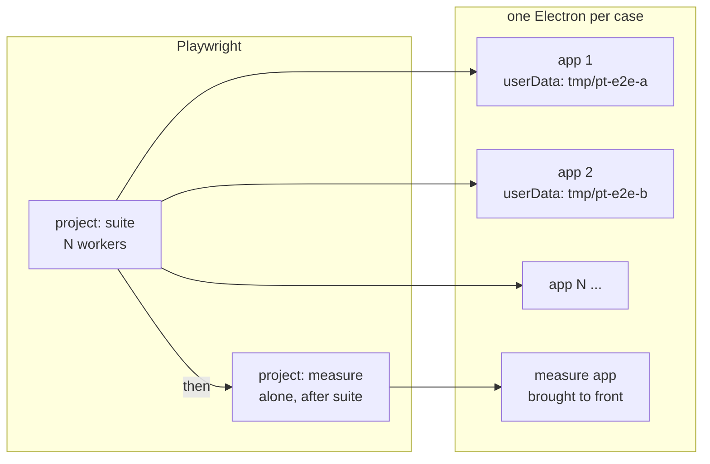

# 0014 — The end-to-end suite runs in parallel

> **Status:** in-progress
> **Created:** 2026-09-11
> **Owner skill(s):** dev
> **Related ADRs:** [0022](../adrs/0022-the-per-phase-gate-is-the-fast-gate-and-the-end-to-end-suite-is-owed-once-per-plan.md)
> (proposed) decides when the suite runs, and this plan makes the run cheaper;
> [0004](../adrs/0004-the-app-plays-itself-virtual-ports-not-an-injection-channel.md) (accepted)
> provides the harness gate every change here sits behind
> **NFRs claimed:** 4 and 11 in [nfr.md](../nfr.md), re-reported unchanged from cases that now run
> alone; 12 likewise, where its report moves
> **Depends on:** nothing. It is best landed before the next feature plan, so that plan's close
> pays the cheaper suite.

## TL;DR

The whole e2e suite takes 277 s on one worker. Almost all of that is playback running in real
time, so the only lever that shortens the run without shortening what it proves is running cases
side by side. Two things stop that today. Every launch shares the developer's `userData`
directory, so one case's scores and takes are visible to the next. And the windows depend on
being on screen, since Chromium throttles a window it cannot see. This plan gives every launch its
own state, stops windows depending on visibility under the harness, and then runs several
workers. The timing-sensitive cases run alone afterwards. It also adds the `gate:fast` script
that ADR-0022 makes the per-phase gate.

## Context & problem

ADR-0022 moves the whole suite to once per plan. That run still costs about five minutes, it
grows with every playback case, and it is also the run a flake costs a rerun of.

Measured 2026-09-11, one worker: the score cases each take about 1 s, so starting the app is cheap.
The player and practice cases take 8 to 20 s each, and they are waiting on real time. Adding
workers is the only way to shorten that without playing faster than the music is written.

**What pins `workers: 1` today is state, not CPU.** `e2e/harness.ts` launches Electron with the
default `userData`, so every case reads and writes the same score library, takes directory and
settings, and so does the developer's own `npm run dev`. Two cases running at once would see each
other's imports. Two recorded flakes already look like this: a score row carrying another score's
title, and a drawn score id that belongs to a different score (`e2e/score.spec.ts:313`, red in
the 2026-09-11 run). Both are consistent with a previous case's state still being present. That is
a hypothesis, and Phase 1 tests it.

**The windows depend on being seen.** `bringToFront` exists because Chromium throttles
`requestAnimationFrame` for a hidden or covered window, and `openScenario` waits on animation
frames. With several windows open at once, all but one are covered.

**Three cases measure, so they cannot share the machine.** `app.spec.ts:123` asserts NFR 11's
frame bound, `app.spec.ts:175` reports NFR 4's startup figure, and `practice.spec.ts:116` reports
NFR 12. A frame bound asserted while three other Electron instances compete for the CPU is a
flake by construction.

## Decision

Isolate state first, then remove the dependence on visibility, then parallelise. That order
means each step is valuable on its own if the next one fails. Every change to the app sits
behind the one harness decision ADR-0004 already makes (`virtualPortsEnabled` in
`electron/midi/virtualPorts.ts`) and never forks a second one, so a packaged build is untouched.
The measuring cases move to their own project and run after the parallel ones, with no other app
open.

We rejected sharding the suite across machines, because this is one developer's machine with no
CI runner. We rejected speeding up playback in the harness, because it changes what the
playback cases prove; it is kept as a followup. We rejected leaving `userData` shared and
serialising only the cases that collide, because deciding which cases collide is exactly the
analysis that the recorded flakes show nobody gets right.

## Architecture diagram

## Implementation phases

The first phase of this plan shows its result in the suite's output rather than on screen: it is a
test-infrastructure plan and has no player-visible behaviour.

### Phase 1 — Every launch has its own state, and the fast gate has a name
- **Owner skill:** dev
- **What:** Each launched app reads and writes a `userData` directory created for that launch and
  removed after it; `npm run gate:fast` exists.
- **Files touched:** `package.json`, `e2e/harness.ts`, `e2e/app.spec.ts`; and only if Electron does
  not honour the command-line switch below: `electron/main.ts`, `electron/harness.ts`,
  `electron/harness.test.ts`
- **Notes for the implementer:** First try Chromium's `--user-data-dir=<dir>` passed in `args` to
  `electron.launch`. If `app.getPath('userData')` inside the launched app then reports that
  directory, no main-process change is needed and the three conditional files stay untouched. If
  it does not, main reads a `PT_USER_DATA` directory **only when the harness gate is open** and
  calls `app.setPath('userData', …)` before `whenReady`. The decision lives in a pure function of
  the same `HarnessGate` shape `virtualPortsEnabled` takes, unit tested with the gate shut and
  open, so a packaged build cannot be pointed at another directory. The harness creates the
  directory with `mkdtemp` under the OS temp dir and removes it after `app.close()` resolves.
  On Windows a just-closed Electron can still hold a file, so the removal retries (`rmSync`'s
  `maxRetries`), and a directory left behind is harmless. Scripts: `gate:fast` is
  typecheck, lint, test and the two Node gates, in that order; `gate` becomes
  `npm run gate:fast && npm run test:e2e`, which is the same steps it runs today.
- **Done when:** A case asserts, through `app.evaluate`, that the launched app's `userData` is a
  directory that did not exist before this launch. It also asserts the directory is gone once
  the case has closed the app. Two apps launched one after the other report different
  directories. `npm run gate:fast` runs the five fast steps, and `npm run gate` runs it and then the
  suite. Still at one worker, the full `npm run test:e2e` is green **three consecutive times**, with
  each run's wall time in the log. A red in any of them is logged with the case name, and the
  count restarts. If a main-process function was needed, its test shows the gate shut ignores
  `PT_USER_DATA`. `npm run gate:fast` is green.

### Phase 2 — No window depends on being seen
- **Owner skill:** dev
- **What:** Under the harness gate, a window is not throttled when covered or hidden, and it stays
  hidden unless a case brings it to the front.
- **Files touched:** `electron/window.ts`, `electron/window.test.ts`, `electron/main.ts`,
  `e2e/harness.ts`, `e2e/app.spec.ts`
- **Notes for the implementer:** **This phase opens with a spike, and its outcome is allowed to
  go either way.** Set `webPreferences.backgroundThrottling: false` and skip the `ready-to-show`
  `show()` when the harness gate is open. Then find out, on Electron 44, whether a window that has
  never been shown still fires `requestAnimationFrame` and still lays OSMD out. If it does, windows
  stay hidden. If it does not, windows are shown but unthrottled, and the log names the case that
  needed a painted frame. Either way the property is the same: no case depends on being the
  focused or front window, except the measuring ones, which call `bringToFront`. That function
  already calls `win.show()`. Make the choice a pure function from the gate to the two window
  options, unit tested both ways, so `createWindow` stays one code path. `backgroundThrottling` is
  not one of the security defaults, and none of those lines change. Say so in a comment beside
  it.
- **Done when:** With the gate open, a launched window reports background throttling off, and
  reports hidden (or shown, per the spike's recorded outcome) until a case calls `bringToFront`.
  Both are read through `app.evaluate`. With the gate shut (`PT_HARNESS=0`, the existing case at
  `e2e/app.spec.ts:153`), the window shows on `ready-to-show` exactly as before, and that case
  asserts it. The pure function is tested with the gate shut and open. The full `npm run test:e2e`
  is green, because this phase changes the launch path (ADR-0022).

### Phase 3 — Several apps at once
- **Owner skill:** dev
- **What:** The suite runs on several workers; the measuring cases run afterwards, alone.
- **Files touched:** `playwright.config.ts`, `e2e/measure.spec.ts`, `e2e/app.spec.ts`,
  `e2e/practice.spec.ts`
- **Notes for the implementer:** Move every case that asserts or reports a timing figure into
  `e2e/measure.spec.ts`: today that is `app.spec.ts:123` (NFR 11 and NFR 2), `app.spec.ts:175`
  (NFR 4) and `practice.spec.ts:116` (NFR 12). Their bodies move unchanged. The configuration has
  two projects: `suite`, fully parallel, and `measure`, which runs after it with no other app
  open. Two properties must survive, whatever mechanism provides them:
  `npm run test:e2e -- e2e/player.spec.ts` still runs that file and only that file, and a
  red suite still fails the run. Beware Playwright's project `dependencies` there: a dependency
  project can run its whole set even when a file filter is given, and that would break the first
  property. Check it rather than assume it. **Choose the worker count from a measurement:** run the
  full suite at 1, 2, 3 and 4 workers, write each wall time into the log, and take the fastest
  count that then comes back green three consecutive times. The config names it, in a comment
  giving the machine and the date. A case that goes red only in parallel is fixed, or moved to
  `measure` with a line in the log saying why. Its timeout is never raised to make it pass.
- **Done when:** The log records the wall time at each worker count tried, and the count chosen.
  At that count, `npm run gate` is green three consecutive times. The measuring cases run only
  after the parallel ones finish, with no other app open, and a run shows it in its output order.
  `npm run test:e2e -- e2e/player.spec.ts` runs only that file's cases. NFR 4, 11 and 12 are
  re-reported from the `measure` project beside the figures from the one-worker run in Phase 1,
  with any move called out.

## Data shapes

No new types cross a boundary. The one new configuration value, if Phase 1 needs it, is
`PT_USER_DATA`: a directory path, read only when the harness gate is open.

## Risks & open questions

- **A hidden window may not paint.** Phase 2's spike is the whole answer, and both outcomes are
  allowed. What matters is that the log says which one this machine gave.
- **Parallel cases may expose timing assumptions.** Cases that wait on real-time playback could
  get slower under contention and hit a timeout. The rule in Phase 3 is to fix the case or move it
  to `measure`, never to relax it. If more than a couple need moving, the gain shrinks, and the
  log should say so rather than hide it.
- **The fallback voice.** Cases that play with no output port open sound the synthesised voice
  (ADR-0008). Four at once is louder, not wrong. If it turns out to matter at the desk, muting under
  the harness is a followup, not a change to this plan.
- **The hypothesis about the flakes may be wrong.** If the id and title flakes survive Phase 1,
  their cause is the race Plan 0010's log names in `renderer/views/Score.tsx`, not shared state. The
  log says which, and the fix belongs to whichever plan owns that file.
- **This adds harness behaviour to a shipped binary**, gated shut there. Roadmap item 10, the
  first release, already verifies that every harness behaviour is absent from the packaged
  build, and this plan's two join that list.
- **Offline, latency and the MIDI path are untouched.** No new dependency (NFR 9).

## What this plan does NOT do

- **It does not decide when the suite runs.** ADR-0022 does, and the skills and the plan template
  carry it.
- **No faster-than-written playback in the harness.** It would halve the real-time waits and
  change what the playback cases prove. That is a followup with its own decision.
- **No change to what any case asserts.** Cases move between files unchanged.
- **No sharding and no CI.** One machine, one developer.
- **No change to the pre-push hook**, which already runs only the fast half.

## Implementation log

> Written by `dev`, one row per phase as that phase's commit lands, and the close block after the
> last one. **The phases above are the contract; everything here is what happened.**
> Observations, never conclusions. A deviation from the plan or an unmet done-when is always
> disclosed. Stays shorter than `## Implementation phases`.

**Lane:** `main` directly. Plan 0010 closed before this started; nothing else is in flight.

| phase | owner | state | commit |
|---|---|---|---|
| 1 — Every launch has its own state, and the fast gate has a name | dev | done | 9f734e3 |
| 2 — No window depends on being seen | dev | done | 0ceb7bf |
| 3 — Several apps at once | dev | done | committed with this row |

### Measurements

**The one-worker baseline, Phase 1**, on the development machine, 2026-09-12, 39 cases, each run
`npm run test:e2e` (the `npm run build` in front of it included in the wall time):

| run | wall | result |
|---|---|---|
| 1 | 208 s | 39 passed |
| 2 | 241 s | 39 passed |
| 3 | 234 s | 39 passed |

Three consecutive green, no red in any of them. The suite is 39 cases here, not the 34 ADR-0022
measured at 277 s on 2026-09-11: Plans 0010 to 0013 added cases, and Phase 1 adds one.

**NFR 4, 11 and 12 at one worker**, reported by the cases that will move to `measure` in Phase 3:

| run | NFR 11 frames (p50/p95/max) | NFR 11 ms (p50/p95/max) | NFR 4 | NFR 12 |
|---|---|---|---|---|
| 1 | 1 / 1 / 1 | 7.9 / 9.8 / 10.1 | 640 ms | 4 ms |
| 2 | 1 / 1 / 1 | 4.8 / 7.4 / 13.2 | 1164 ms | 9 ms |
| 3 | 1 / 1 / 1 | 5.3 / 7.3 / 8.0 | 670 ms | 12 ms |

**The worker count, Phase 3**, same machine and day, `npm run test:e2e -- --workers=N`, 40 cases,
the `npm run build` in front of it included:

| workers | wall | result |
|---|---|---|
| 1 | 173 s | 1 red, see below |
| 2 | 124 s | 40 passed |
| 3 | 99 s | 40 passed |
| 4 | 84 s | 40 passed |

**Four is the count in `playwright.config.ts`.** At four, `npm run gate` came back green three
consecutive times: 146 s, 148 s, 159 s, 822 unit tests and 40 cases each. Against the Phase 1
baseline of 208 / 241 / 234 s that is the suite at about 40% of its wall time, and the whole gate
now costs less than the suite alone did.

The curve was still falling at four, and this machine has sixteen logical cores, so the plan's
range did not reach the floor. Four is the fastest of the counts the plan named and it is what
the config takes.

**NFR 4, 11 and 12 from the `measure` project**, beside the Phase 1 one-worker figures. All three
cases moved: NFR 11 and NFR 4 out of `app.spec.ts`, NFR 12 out of `practice.spec.ts`, bodies
unchanged.

| | NFR 11 frames (p50/p95/max) | NFR 11 ms (p50/p95/max) | NFR 4 | NFR 12 |
|---|---|---|---|---|
| Phase 1, one worker, in `app.spec.ts` | 1 / 1 / 1 | 4.8–7.9 / 7.3–9.8 / 8.0–13.2 | 640–1164 ms | 4–12 ms |
| Phase 3, `measure`, after the suite | 1 / 1 / 1 | 3.7–9.1 / 6.3–13.6 / 48.7–68 | 1070–1196 ms | 8–10 ms |

NFR 11's frame bound, which is the part the case asserts, is 1 / 1 / 1 in every run of both. NFR
12 is unchanged. The two figures that did move are reports, not assertions, and both are
explained in the notes.

### Notes

- **Phase 1 needed no main-process change.** Spiked first, as the phase asks: Electron 44 honours
  Chromium's `--user-data-dir` for `app.getPath('userData')`, which reported the passed directory
  exactly (`sessionData` too; `appData` unchanged). So `PT_USER_DATA`, `electron/harness.ts` and
  `electron/harness.test.ts` were not written, `electron/main.ts` was not touched, and there is no
  new harness-gated path into the state directory to keep shut in a packaged build.
- **The two flakes the plan names did not appear** in the three one-worker runs:
  `e2e/score.spec.ts` drew the right id each time and no take row carried another take's title.
  At one worker that is not yet evidence either way for the shared-state hypothesis — the runs
  before this change were also usually green.
- **Phase 2's spike came out the other way: a window that is never shown does not lay out.**
  Electron 44, 2026-09-12, `backgroundThrottling: false` and no `ready-to-show` `show()` under the
  gate: 11 of 40 cases red, 491 s. Eight in `player.spec.ts` sample the keyboard across animation
  frames and saw a partial passage (`player.spec.ts:72` expected the lowest lit key 60 and got
  65). Three in `score.spec.ts` are **the two flakes this plan names, deterministic**:
  `score.spec.ts:75` found a row already carrying the new score's `data-score-id` and still
  showing the previous score's title, and `score.spec.ts:214` drew a different score's id on the
  paper. So windows are shown and unthrottled, `harnessWindowOptions` decides throttling alone,
  and `show()` on `ready-to-show` stays unconditional. Green again at 40 of 40, 202 s.
- **The id and title flakes are not shared state.** Phase 1 gave every launch its own `userData`
  and they still appeared, which is the branch the plan's risk section names: the cause is the
  race Plan 0010's log names in `renderer/views/Score.tsx`, and the fix belongs to whichever plan
  owns that file. Hiding the window did not introduce them — it made a race that is usually won
  lose every time, which is a cheap way to reproduce it if that plan wants one.
- **One case leaks its state directory by construction.** `e2e/player.spec.ts:496` ("closing the
  window mid-playback exits without an error") ends by closing the window and sets `launched =
  null`, so the harness's `close()` never runs. The launch registers removal on the Electron
  process's own `exit` as well, which covers it; that file is outside Phase 1's list and was not
  touched.
- **One red in the worker sweep, at one worker, and it is not about parallelism.**
  `e2e/player.spec.ts:256` "the page's pedal marks reach the player:event stream as CC 64" expected
  sustain values `[127, 0, 127, 0]` and got `[127, 127, 0, 0]` (`player.spec.ts:271`). It is red in
  the *least* contended configuration of the four and green at two, three and four workers and in
  all three `npm run gate` runs after them, so it is logged as a flake rather than counted as a
  pass (ADR-0022). Two CC 64 events arriving out of order in the `player:event` stream is what the
  values say; nothing in this plan touches that path.
- **No case had to be moved to `measure` to survive parallelism, and no timeout was raised.**
  The only cases in `measure` are the three the plan named.
- **The `measure` project's NFR 11 millisecond figure gained an intermittent 1 Hz outlier.** Two
  of nine runs with the harness's `backgroundThrottling: false` reported a frame interval of about
  1000 ms (`ms p50 521.3 p95 969.8 max 1004.6`, and again `496.3 / 949.4 / 1003.5`); the other
  seven were 3.7 to 9.5 ms. Three runs with throttling forced back on were 4.9, 6.1 and 5.3 ms.
  Nine against three is too small to attribute, and the suspicion is only that turning the throttle
  off changes which frame source the window gets. What it does **not** touch: the frame bound the
  case asserts was 1 / 1 / 1 in all twelve runs, so the app still paints on the very next frame
  whatever that frame costs. The steady `max` of 48 to 68 ms in the gate runs, against 6 to 13 ms
  at one worker, is the other half of the same thing.
- **Followup noticed, not acted on: let a launch ask for the throttle back.** The three `measure`
  cases run alone and call `bringToFront`, so they never needed an unthrottled window; only the
  parallel ones do. A `launchApp({ throttling: true })` would take the outlier above out of the
  one place a millisecond figure is read. It needs `e2e/harness.ts` and a main-side option, both
  outside Phase 3's file list.
- **Followup noticed, not acted on: the practice helpers are duplicated.** `heard`,
  `waitForPassage` and `practise` are copied from `practice.spec.ts` into `measure.spec.ts`.
  Importing them from a spec file would register that file's whole set of tests in the new one,
  and `e2e/harness.ts`, where they belong, is outside Phase 3's list.
- **Followup noticed, not acted on: measure past four workers.** The wall time was still falling
  at the top of the range the plan named.
- **Followup noticed, not acted on: `README.md` still documents `npm run gate` only.** The
  `gate:fast` script this plan adds is cited by both skills and by `CLAUDE.md`, but the README's
  gate paragraph does not mention it. `README.md` is outside every phase's file list.

### Close triggers

- **What shipped:** test infrastructure. No player-visible behaviour, and no new dependency
  (NFR 9). The only production code touched is `electron/window.ts` and the one line in
  `electron/main.ts` that calls it: `webPreferences.backgroundThrottling` now follows ADR-0004's
  gate, so a packaged build with `PT_HARNESS` unset is throttled exactly as before. The suite went
  from about 3.5 minutes to about 1.4, and the whole gate to about 2.5.
- **User-visible docs touched:** none. `README.md`'s gate paragraph does not yet mention
  `gate:fast`; it is outside every phase's file list and is noted above as a followup.
- **Full gate at the last phase:** `npm run gate` at four workers, exit 0 three consecutive
  times — 822 unit tests and 40 e2e cases each, 146 s, 148 s, 159 s. `npm run gate:fast` exit 0.
  `npm run test:e2e -- e2e/player.spec.ts` lists and runs 15 tests in 1 file, `[suite]` only, so a
  file filter still runs that file alone. A red in `suite` skips `measure` and fails the run, seen
  at the one-worker sweep: exit 1, 36 passed, 1 failed, 3 did not run.
- **Outstanding `human` phases:** none by construction

## Followups (after this lands)

- **Playback at a multiple of written tempo under the harness**, for the cases whose claim does not
  depend on the tempo. It would cut the largest remaining cost, and it needs a decision about which
  claims survive a faster clock.
- **Mute the fallback voice under the harness**, if parallel cases at the desk turn out to be a
  nuisance.
